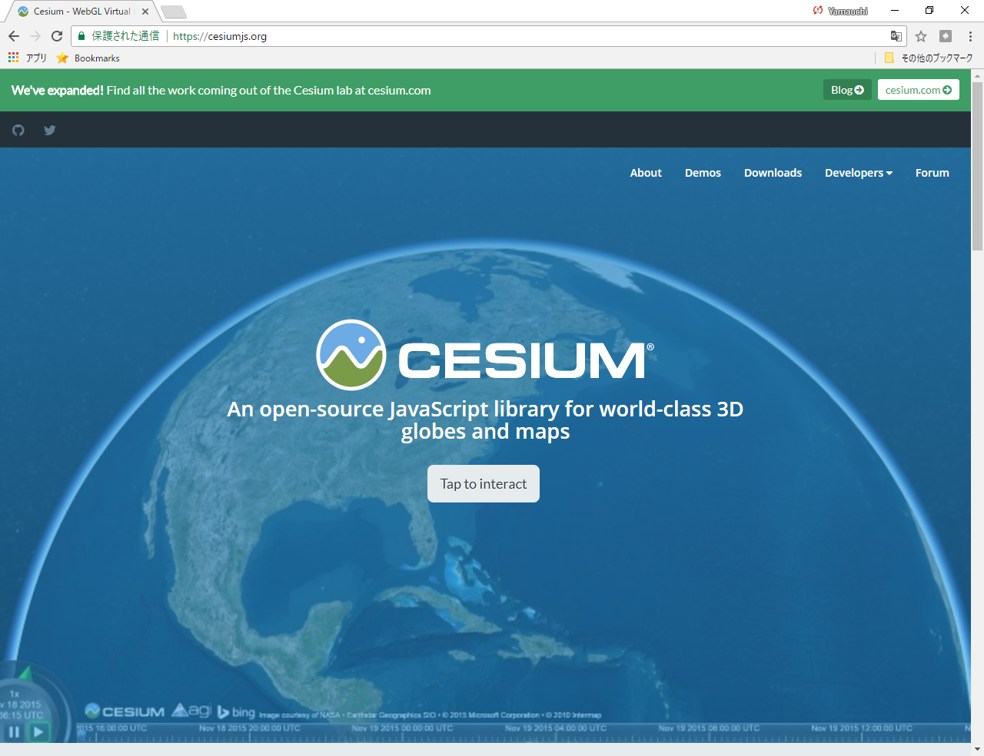
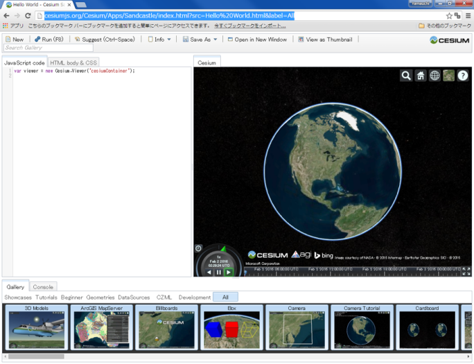
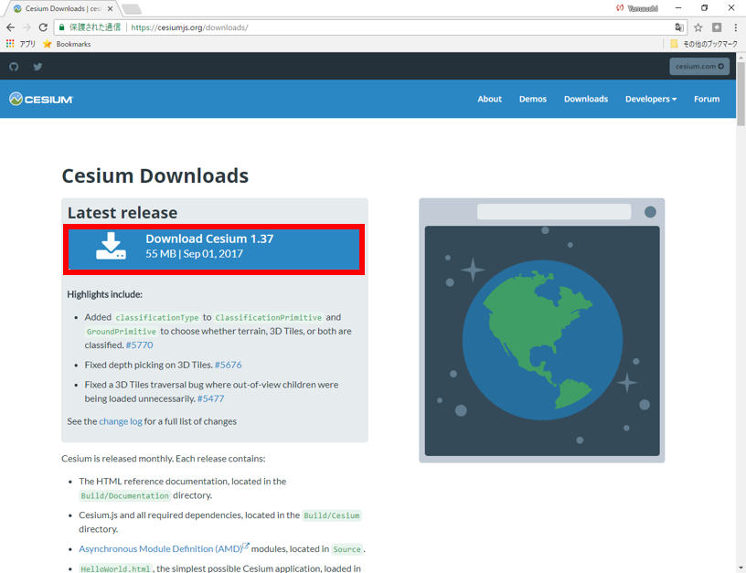
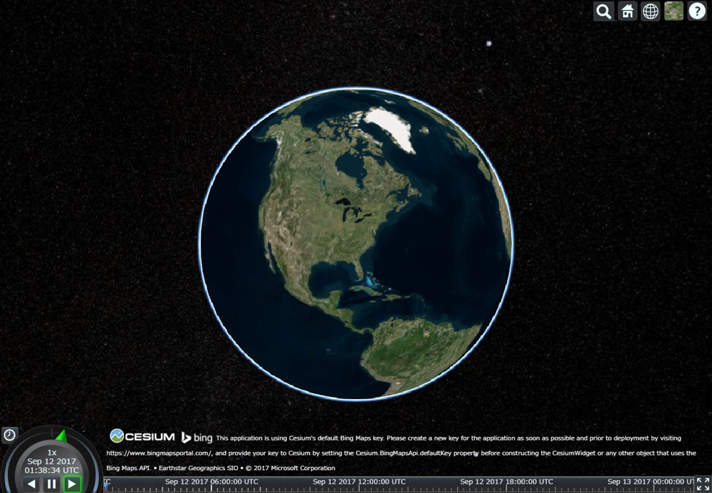
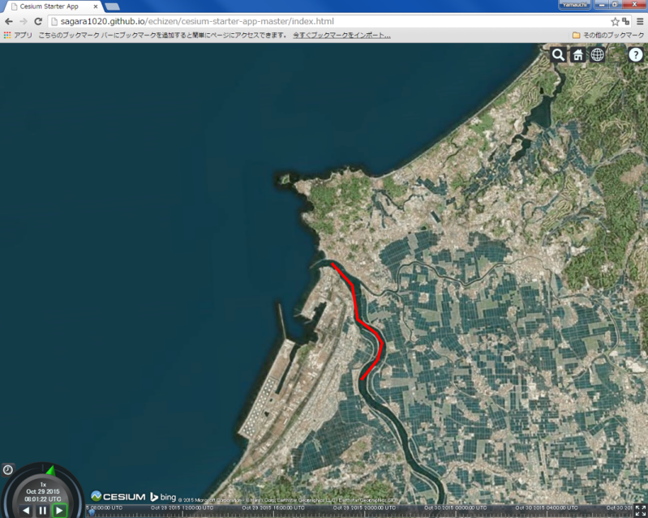
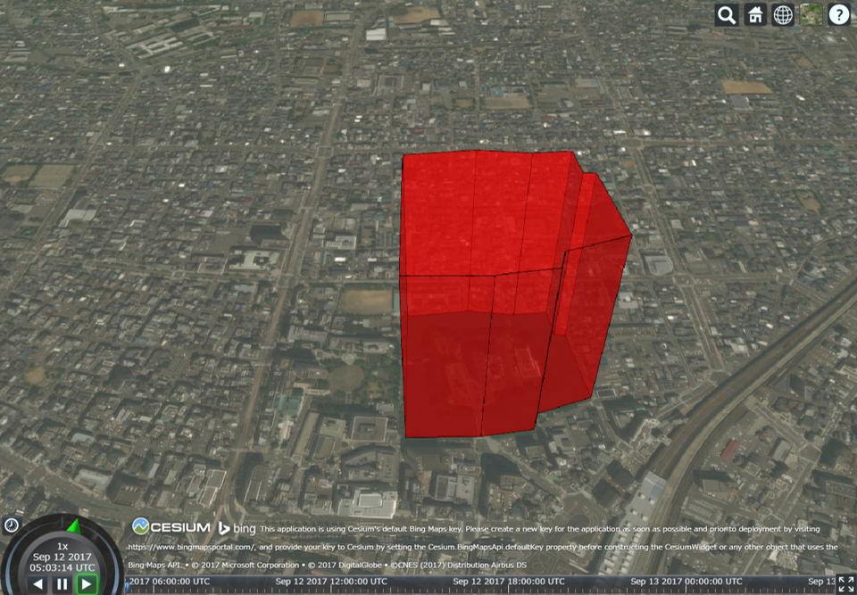
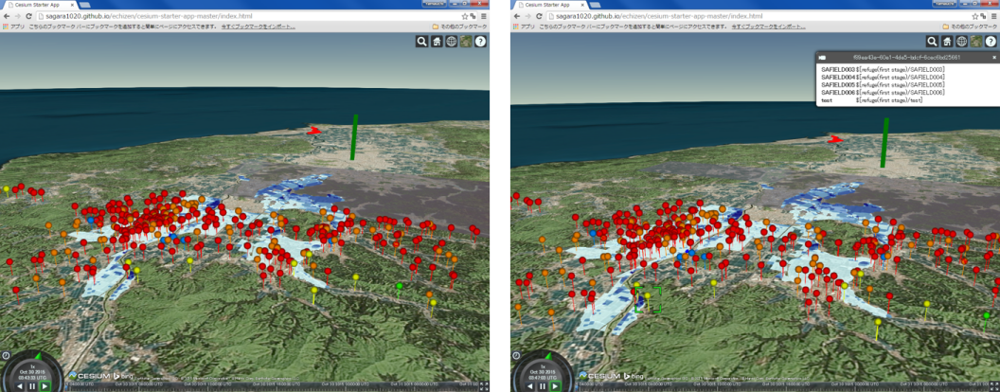
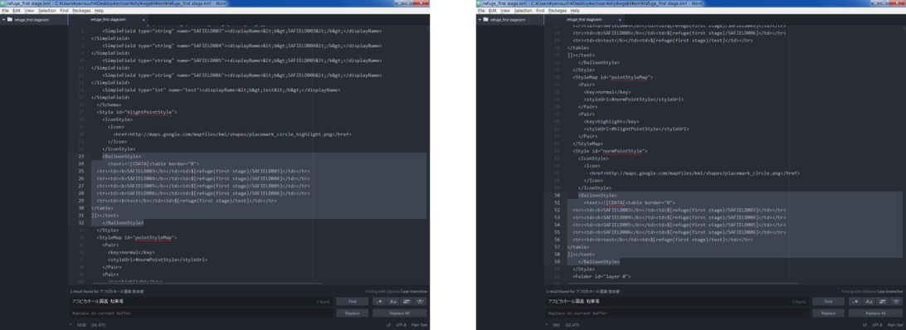
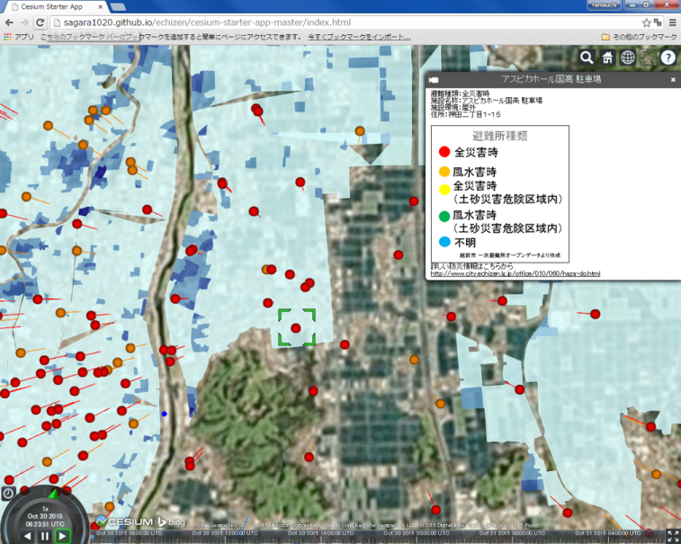

# Cesium入門
　本教材は、Cesiumを用いて空間データを表示する手法について解説しています。Cesiumの機能の呼び出しやKMLデータの表示などを行います。Cesiumの表示には、GitHubとクライアントソフトを用いて行います。GitHub等の基本的な操作法についての解説はしていません。CZMLについての解説は、[CZML]の教材を参照ください。本教材を使用する際は、[利用規約]をご確認いただき、これらの条件に同意された場合にのみご利用下さい。

[利用規約]:../../../../master/利用規約.md
[CZML]:../../インターネットの活用に関する教材/czml/czml.md

**Menu**
------
* [Cesiumとは](#Cesiumとは)
* [Cesiumを体験する](#Cesiumを体験する)
* [ダウンロード](#ダウンロード)
* [レイヤを追加する](#レイヤを追加する)
* [視点を変更する](#視点を変更する)
* [kmlの作成と読み込み](#kmlの作成と読み込み)

**使用データ**

* [KMLサンプル]()

> [越前市オープンデータ] 越前市防災安全課　一次避難場所（風水害）、浸水想定区域（風水害）のデータを加工し、利用。

[越前市オープンデータ]:http://www.city.echizen.lg.jp/office/010/021/open-data-echizen.html

**スライド教材**

スライドのダウンロードは[こちら](../../../../../raw/master/GISオープン教材/インターネットの活用に関する教材/Cesium/Cesium.pptx)

--------

## Cesiumとは
- CesiumはWebGLを用いたライブラリ
- 2Dだけでなく、3D表示ができる
- 球体のため、世界規模のデータの表示に適している
- 時系列データの表示も可能

[▲メニューへもどる]

## Cesiumを体験する
[Cesiumの公式サイト]をブラウザで開き、ページ下段のGet HelloWorld.jsの[PLAY WITH THIS CODE]クリックし、Cesium画面を表示する。




右上のボタンから、複数BaseMapを選択することができる。


右上のボタンから、球体、平面、角度つき平面の３つで地球を表現できる。


[▲メニューへもどる]

## Cesiumのダウンロード
Cesiumのホームページの`Downloads`から、ダウンロードする。


以下では、GitHubでリポジトリを作成して、ダウンロードしたCesiumをローカルからPushして、webで表示しています。


GitHubに新規のリポジトリを作成し、解凍した「cesium」をアップロードする。リポジトリのgh-pagesを設定し、インターネット上でダウンロードしたCesiumを表示する（下記のアドレスにアクセスする）。

```
http://（ユーザー名）.github.io/gis-oer_cesium/Apps/HelloWorld.html
```



[▲メニューへもどる]


## レイヤを追加する
以下では、Cesiumにデータを追加する手法について、'Apps>HellowWord.html'を編集します。また、以下のレイヤの追加は、越前市の周辺で行っています。

### ポイントを追加する
以下のコードのように、ポイントの色や位置が設定できる。

```JavaScript
<script>
var viewer = new Cesium.Viewer('cesiumContainer');　//Cesiumの読み込み

var point = viewer.entities.add({
      name:"福井市", //レイヤ名
      description:"ここは福井市です。",　//レイヤの説明
        position : Cesium.Cartesian3.fromDegrees(136.223554,36.061957,0), //経度,緯度,高さ
        point : {
            pixelSize : 10, //ポイントのサイズ
            color : Cesium.Color.BLUE //ポイントの色
        }
    });

    viewer.zoomTo(viewer.entities);　//レイヤにズーム
</script>
```

青い円形のポイントが、越前市のあたりに追加された。


### ラインを追加する
ポイントの追加を参考に、以下のように記載するとラインが作成できる。

```JavaScript
var viewer = new Cesium.Viewer('cesiumContainer');

var redLine = viewer.entities.add({
    name:"九頭竜川",
    description:"ここは九頭竜川です。",　
    polyline : {
        positions : Cesium.Cartesian3.fromDegreesArrayHeights([136.137600,36.218795,0,
          136.146183,36.210070,0,
          136.147385,36.197465,0,
          136.155109,36.191923,0,
          136.157513,36.188183,0,
          136.154938,36.182364,0,
          136.146870,36.175574,0]),
        width : 5,
        material : Cesium.Color.RED,
    }
});

viewer.zoomTo(viewer.entities);

```




### ポリゴンを追加する
ポイントの追加を参考に、以下のように記載するとポリゴンが作成できる。

```JavaScript
var polygon = viewer.entities.add({
    name:"福井県庁",
    description:"ここは福井県庁です。",　
    polygon : {
        hierarchy : Cesium.Cartesian3.fromDegreesArrayHeights([
          136.220266, 36.066095,0,
          136.220287, 36.063848,0,
          136.221542, 36.063857,0,
          136.222444, 36.063978,0,
          136.222529, 36.064239,0,
          136.223495, 36.064516,0,
          136.223238, 36.065704,0,
          136.223034, 36.065722,0,
          136.222948, 36.066190,0,
          136.222315, 36.066138,0,
          136.221435,36.066216,0]),
        extrudedHeight: 333.0,
        width : 5,
        material : Cesium.Color.RED.withAlpha(0.5),
        outline : true,
        outlineColor : Cesium.Color.BLACK
    }
});
```




[▲メニューへもどる]


## 視点を変更する
ビューワーの視点を変更するコードを追加（経度、緯度、視点の高さを入力する）し、再読み込みを行うと視点が変更される。

```JavaScript
viewer.camera.flyTo({   
     destination : Cesium.Cartesian3.fromDegrees(136.194763, 36.047711, 45000.0)});
```


[▲メニューへもどる]


## KMLの作成と読み込み
以下では、KMLを作成し、Cesiumで表示する手法について解説しています。KMLの作成は、GoogleEarthで行っています。

### Google EarthでKMLを作成
1. Google Earth proでシェープファイルを読み込む。
ファイル＞開く　（想定浸水区域と一次避難所のshape）

2. 取得したアイテムにスタイルテンプレートを適用（スタイルを調整）。
名前を指定する：「名前フィールド」を設定する。
色を指定する：「フィールドから色を設定する」を選択する。
設定ができたらOKをクリックし、テンプレートを保存する。

3. レイヤの上で右クリックし、プロパティから、ポリゴンの透過度を変更する。想定浸水区域のポリゴンと同じく、名前、色、アイコン、高さなどを設定する。

4. レイヤの上で右クリックし、追加→フォルダを選択し、フォルダ名を入力する。
フォルダーを移動して、フォルダの中にポリゴンとポイントのデータをまとめる。

### KML読み込み
KMLをCesiumのディレクトリに移動し、下記のように、HellowWord.htmlの一部を編集する。

```JavaScript
viewer.dataSources.add(Cesium.KmlDataSource.load("./KML/echizen_map.kmz"));
```



クライアントソフトを通してアップロードし、Webで確認すると↑のように表示される。
ポイントをクリックすると、KMLの属性データが反映されていない。

### KMLの書き換え
GoogleEarthから、ポイントレイヤの上で右クリックし、名前をつけて場所を保存から新規にKMLを保存する。

<BalloonStyle></BalloonStyle>を削除する（2箇所）。


<description></description>を右のように書き換える。


5. Google Earthからポイントレイヤの上で右クリックし、名前をつけて場所を保存から新規にKMLを保存する。

6. テキストエディタを開き、KMLを書き換える。

7. KMLをもう一度読み込み、表示を確認する。プロパティを開きその他の情報を追加する。

8. バルーンの設定:リンクを追加をクリックしURLを追加する（越前市の防災課）。
アイコンの設定：ラベルの縮尺を0.0にする。

9. 凡例画像を作成し、GitHubにアップロードし、Google Earthでレイヤのプロパティから、画像を追加する。
アップロードしたURLを指定すると、Cesiumで画像を表示できる。

凡例の画像は[ここをクリック](./pic/cesiumpic_hanrei.png)


Cesiumで表示すると、ポイントの情報が表示できる。


ポイントをクリックすると凡例も表示できるようになった。


[▲メニューへもどる]

#### ライセンスに関する注意事項
本教材で利用しているキャプチャ画像の出典やクレジットについては、[その他のライセンスについて]よりご確認ください。

[その他のライセンスについて]:../../その他のライセンスについて.md
[▲メニューへもどる]:Cesiumによるデータの可視化.md#menu
[Cesiumの公式サイト]:http://cesiumjs.org
[PLAY WITH THIS CODE]:http://cesiumjs.org/Cesium/Apps/Sandcastle/index.html?src=Hello%20World.html&label=All
