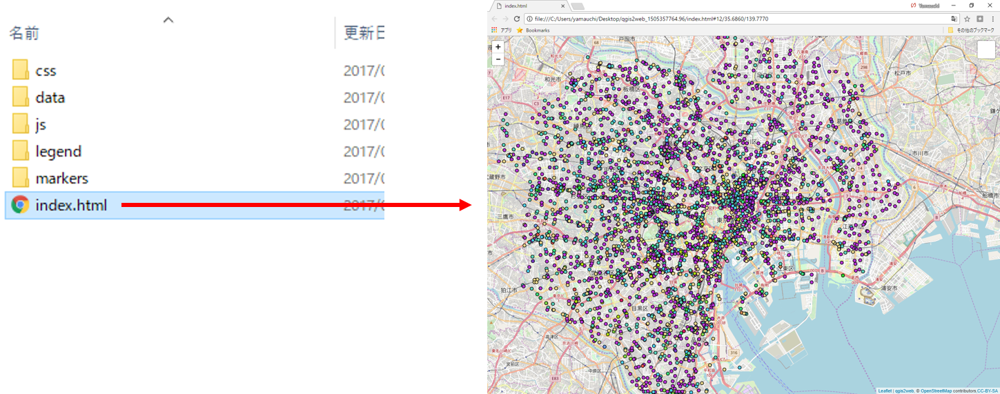

# Leaflet入門
本教材は、QGISのプラグインであるQGIS2WEBを用いて、LeafletでWEB地図を作成するための実習用教材です。以下の教材に従って、[完成例](https://yamauchi-inochu.github.io/leaf-test/index.html)のようなWEB地図が作成できれば実習完了です。この実習には、Atom等のテキストエディタが必要です。

本教材を使用する際は、[利用規約]をご確認いただき、これらの条件に同意された場合にのみご利用下さい。


[利用規約]:../../../../master/利用規約.md
**Menu**
------
* [Leafletとは？](#Leafletとは)
* [レイヤのスタイル調整とプラグインのインポート](#レイヤのスタイル調整とプラグインのインポート)
* [qgis2webを起動する](#qgis2leafを起動する)
* [index.htmlを編集する](#index.htmlを編集する)

**使用データ**
実習をはじめる前に以下のデータをダウンロードしてください。

* [東京23区のコンビニエンスストア (c) OpenStreetMap Contributors](https://github.com/gis-oer/datasets/blob/master/vector/tokyo23ku-cvs.zip?raw=true)
> OpenStreetMapから取得したデータを加工し利用


**スライド教材**

スライドのダウンロードは[こちら](../../../../../raw/master/GISオープン教材/インターネットの活用に関する教材/Leaflet/leaflet.pptx)

---

## Leafletとは？
Leafletは、WEB地図の作成のためのオープンソースJavaScriptライブラリです。シンプルなコーディングで容易に、モバイルやデスクトップの表示に対応したWEB地図が作成できます。全体のファイルサイズが軽いことや様々な地図表現（マーカやタイル読み込み）ができることが特徴です。Leafletに関する詳しい解説は、以下のリンクを参照してください。

> [LeafLet公式](http://leafletjs.com/)
> [Wikipedia](https://ja.wikipedia.org/wiki/Leaflet)


[▲メニューへもどる]

## レイヤのスタイル調整とプラグインのインポート
QGISに実習用データを読み込み、スタイルを調整する。次に、プラグインの管理とインストールから、「QGIS2WEB」を検索し、インストールする。


[▲メニューへもどる]

## qgis2webを起動する
`Web(W)>qgis2web`をクリックする。以下のような設定を行い、`Update preview`をした後、`Export`をクリックする。


①　レイヤをクリックしたときのポップアップの設定を行う。②　ズームレベルや計測機能などを設定する。ここで、ファイルの出力先を変更しておくと良い。　③　Basemapを選択する（複数選択は、 Ctrlキーを押しながら行う）

ローカルで、index.htmlファイルを開き中身を確認する。


[▲メニューへもどる]

## index.htmlを編集する
以下では、エクスポートしたindex.htmlを編集し、ベースマップ、スケール、タイトルを追加する手法について解説します。各機能の詳しい解説は、[完成例](https://yamauchi-inochu.github.io/leaf-test/index.html)のコードを参考にしてください。

### ベースマップ（地理院地図）の追加
index.htmlを開き文を開き、var basemap1の直後に以下を付け加える。

```JavaScript
var basemap2 = L.tileLayer('https://cyberjapandata.gsi.go.jp/xyz/std/{z}/{x}/{y}.png', {
    attribution: '&copy; <a href="https://maps.gsi.go.jp/development/ichiran.html#std">国土地理院</a>',
    maxZoom: 18
});

```
var baseMapsに'GSImap':basemap2を付け加える。

```JavaScript
var baseMaps = {'OSM': basemap0, 'Stamen Terrain': basemap1,'GSImap':basemap2};
```

### スケールの追加
レイヤのスタイル設定の後に、以下を記載する

```JavaScript
L.control.scale().addTo(map);//スケールを挿入
```

### タイトルの追加
スケールを追加した直後に、以下を記述する。

```JavaScript
var title = new L.Control();//タイトルを追加(以下の記述は、QGIS2leafを参考にした)
title.onAdd = function (map) {
  this._div = L.DomUtil.create('div', 'info');
  this.update();
  return this._div;
};
title.update = function () {
  this._div.innerHTML = '<h2>タイトル</h2>サブタイトル'
};
title.addTo(map);
```

### 表示の確認
index.htmlをブラウザで開き、編集内容を確認する。


[▲メニューへもどる]

#### ライセンスに関する注意事項
本教材で利用しているキャプチャ画像の出典やクレジットについては、[その他のライセンスについて]よりご確認ください。

[その他のライセンスについて]:../../その他のライセンスについて.md
[▲メニューへもどる]:QGISとLeafletの連携.md#menu
