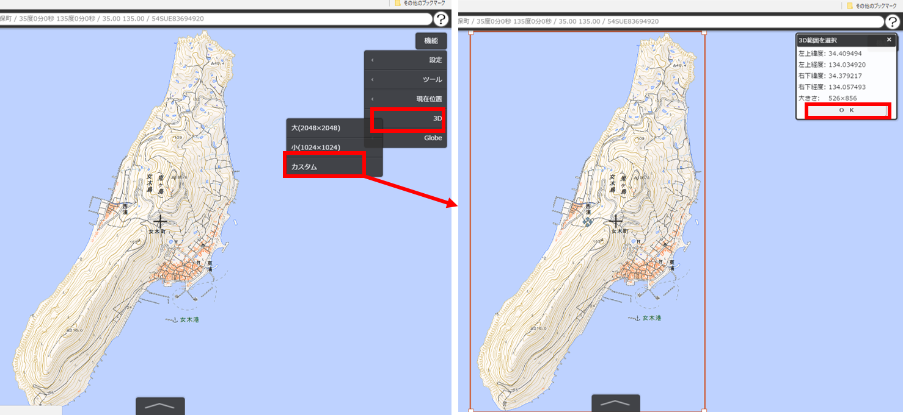
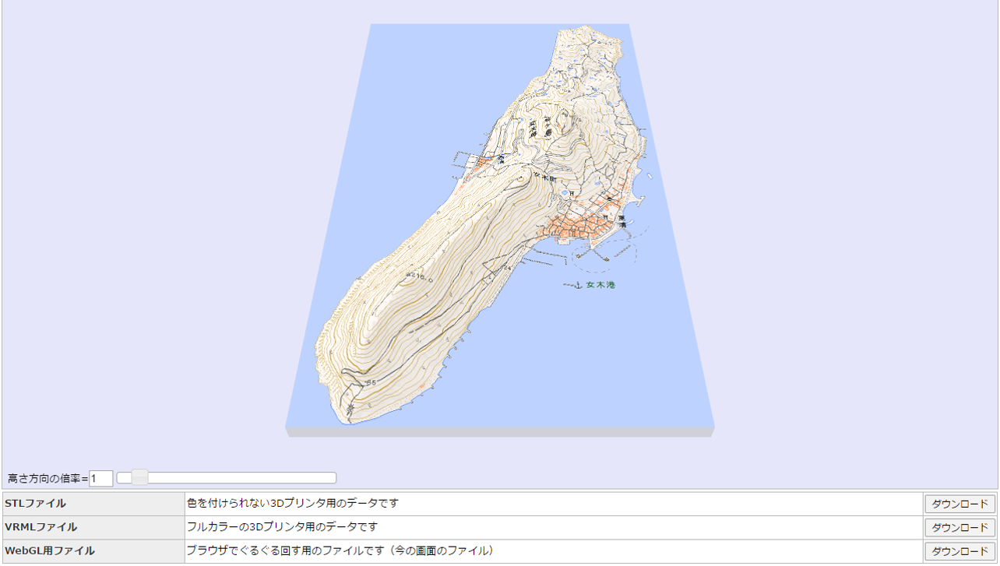
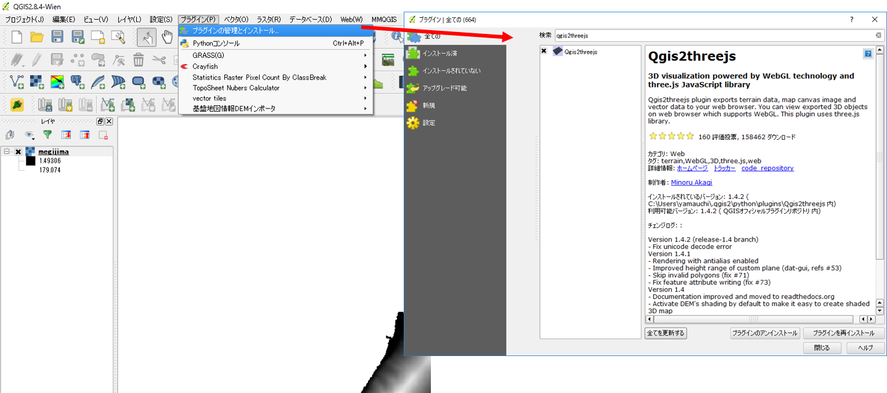
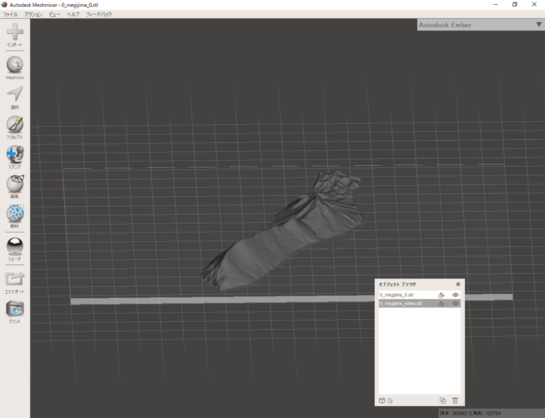
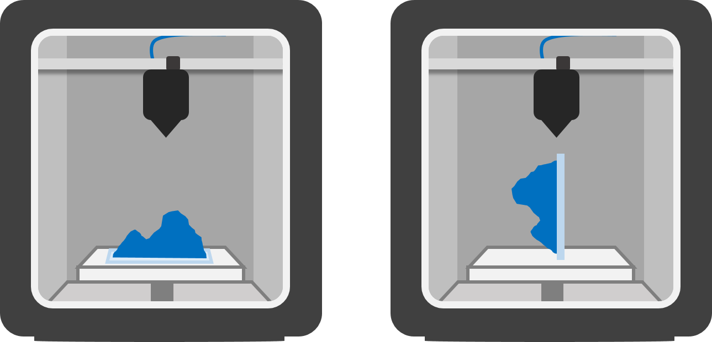

# 3Dプリンタ
この教材では、3Dプリンタによる地形模型の出力手法について解説しています。3Dプリンタの概要や地理院地図とQGISで地形模型（STLファイル）を作成する手法およびSTLファイルの簡単な編集手法について解説しています。また、3Dプリントのデモ動画やプリント時の注意点なども解説しています。

**Menu**
----
- [3Dプリンタとは](#プリンタ)
- [地理院地図でモデルの作成](#地理院地図でモデルの作成)
- [QGISでモデルの作成](#QGISでモデルの作成)
- [STLの編集](#STLの編集)
- [プリントデモ](#プリントデモ)
- [地形モデルの印刷](#地形モデルの印刷)

※　この教材を作成する過程で、三好由起（東京大学空間情報科学研究センター） 氏と田村賢哉（ 首都大学東京大学院 システムデザイン研究科インダストリアルアート学域 博士課程 / NPO法人伊能社中 理事長 ） 氏に協力を頂きました。

> 三好由起 氏には、プロトタイプの3Dモデル作成や機器および原料の選定に関するアドバイスをいただきました。

> 田村賢哉 氏には、自身の博士研究の成果の一部である地形モデルの効果的な見せ方や印刷手法に関するアドバイスをいただきました。

## <a name="プリンタ">3Dプリンタとは</a>
 3Dプリンタは、原料を一定の厚みで積層し、立体的な模型を出力する装置です。原料は、プリンタの積層方法によって異なります。熱溶解積層法式では、ABS樹脂、PLA樹脂が用いられ、光造形では、光硬化性樹脂が用いられます。その他に、紙や石膏を原料としたものなどがあります。また、モデルに着色ができるかは、使用している原料やプリンタの種類によって変わります。

> 3Dプリンタの種類や原料については、国土地理院HPの[立体模型をつくるのページ](http://cyberjapandata.gsi.go.jp/3d/creating.html)が詳しい。

[▲ menuへもどる]

## 地理院地図でモデルの作成
以下では、地理院地図で3Dモデル（STLファイル）を取得または作成する手法について解説します。簡単に3Dモデルを作成する際に利用できます。

[地理院地図]を開き、モデルを作成したい範囲を選択し、3Dボタンをクリックする。
カスタムから範囲を指定し、OKをクリックする。

STLファイルをクリックのダウンロードボタンから、データを保存する。

[▲ menuへもどる]

## QGISでモデルの作成
以下では、QGISで3Dモデル（STLファイル）を作成する手法について解説します。以下の教材では、基盤地図情報の5ｍDEM（高松市周辺）を利用しています。

QGISで平面直角座標系に、変換したラスタデータを読み込む。
プラグインからプラグインの管理とインストール＞Qgis2threejsを読み込む。

① Qgis2threejsのアイコンをクリックする。② FileExport.htmlを選択する。 ③ STL化するDEMを指定する。 ④ Runをクリックするとhtmlファイルが開くため、そこからSTLをダウンロードする。htmlが開かない場合は、Resamplingのバーを左に動かす。デフォルトで作成するモデルは、QGISで表示している範囲と関係する。

sidesやframeにチェックを入れると土台を付けることができる。

※土台の結合には、STLを編集するソフトウェアが必要。

[▲ menuへもどる]

## STLの編集
作成したモデルに土台を作成したり、範囲の切断などの編集をするには、STLモデルを編集するソフトウェアを利用します。以下では、フリーで利用できるoutodesknのMeshmixerを利用して、STLモデルを編集する手法について解説します。

Meshmixerは利用環境によって安定しないことや処理速度が低いことがあるため、有償ソフトウェアの日本ユニシス・エクセリューションズ株式会社のPOLYGONALmeister等と連携して使用するとことが望ましい。

### Meshmixerのインストール
[Meshmixerの提供ページ](http://www.meshmixer.com/)からMeshmixerのインストーラーをダウンロードする。インストーラーに従い、Meshmixerをインストールする。

### モデルのインポート

Meshmixerを起動し、インポートからQGISで作成したSTLを読み込む。

※QGISで土台を作成した場合などモデルが2つある場合は以下のように結合する。

### モデルの結合
QGISで土台を作成している場合は、2つモデルができるため、片方のファイルを先に読み込んだ後に、もう片方のファイルをドラックアンドドロップする。「追加」と「置き換え」のうち、「追加」をクリックする。オブジェクトブラウザに２つレイヤが追加されていれば、読み込みができている。オブジェクトブラウザが表示されない場合は、ビュー＞オブジェクトブラウザを表示をクリックする。

①片方のファイルをオブジェクトブラウザで選択（クリック）する。②次に結合するファイルをShiftキーを押しながら選択する。③メニューが表示されるため、結合をクリックする。

### モデルの切断
Meshmixerでモデルの切断をする場合、以下のように行う。

① 編集＞面でカットを選択する。② モデル上で切り取りたい方向にドラックしてラインを作成する。作成したラインの微調整は、赤、緑、青の矢印をドラッグして行う。この画面の場合、縦方向への移動は赤、横方向の移動が緑となる。青は切り取る面の角度を調整できる。

③ 切り取る面（破棄する面）を選択する。④ 適用をクリックすると切断することができる。

※　この時、切断面の穴埋めがうまくいかない場合がある。その場合は事前にソリッドを作成し、切断後に中穴を作成するなどの処理が必要になる。

### STLの書き出し
エクスポートをクリックして、STLファイルを任意の場所に出力する。3Dプリントする際に、出力したファイルを用いる。ソフトウェアを閉じる際に作業ファイルを保存しておくと良い。

[▲ menuへもどる]

## プリントデモ
以下では、UP BOX+を用いて地形模型出力する様子を動画教材で解説しています。この教材では、出力した模型が分かりやすいように高さ倍率を2倍にしています。

※　この下に動画が表示されない場合は、[動画を表示する](https://www.youtube.com/embed/cH0pr-dIQkc)をクリックするか、Gitbookページの[UAVデモフライト](https://gis-oer.github.io/gitbook/book/GISオープン教材/野外/3Dプリンタ/3Dプリンタ.html#プリントデモ)で閲覧してください。

<iframe width="560" height="315" src="https://www.youtube.com/embed/cH0pr-dIQkc" frameborder="0" allowfullscreen></iframe>

[▲ menuへもどる]

## 地形モデルの印刷
3Dプリントでは、印刷時に層の厚みを設定し、それに応じてモデルをスライスします。印刷は層ごとに実行され、出力した層の上に次の層が積層されます。モデルの精巧さは、スライスした層の厚みと数によって決まります。層の厚みは、プリンタの種類によってかわります、上記で利用しているUP BOX+では、0.1mmまでの積層が可能です。一方で、層の厚みを薄くするほど印刷に時間がかかり、ノズル詰まりが起きやすくなります。そのため、3Dプリントでは、スライス数が増えるようにモデルを印刷する必要があります。

地形模型の印刷では多くの場合、データの範囲に対して標高の値が小さくなるといったことがおきます。例えば、富士山で模型を作るとして、何km×何kmの範囲でデータをとるかを考えてみてください（地理院地図の計測機能を利用するとわかりやすいです）。ほとんどの人が、富士山の最大標高値が3.3km程度なのに対して、その倍以上の広い範囲を選択します。この場合、地形模型は範囲（XY）よりも標高の値（Z）が小さくなります。

そうなると、モデルを印刷台に設置するときの向きによって、地形面を滑らかに表現するスライス数の数が変わってきます。図A,Bでは、地形面を印刷台に水平に設置した場合（下図左）と、地形面に対して垂直にモデルを設置（下図右）した場合を比較しています。下図左では、右に比べスライス数が小さくなります。そのため、等高線を切り抜きそれを積み上げたように造形されます。スライス数は標高値によるため、スライス数を増やさない限り起伏の小さい波食台を滑らかに表現できません。一方で、下図右をみるとスライス数が増えたことにより、波食台が滑らかに表現できていることがわかります。以上のことから、地形模型の印刷では、よりスライス数の多くなるようにモデルを印刷台に設置することが重要になります。

図A モデルの設置方向の比較(上記の場合、右の方がスライス数が多くなる)

図B 0.3mmで積層した雀島の地形模型(左:地形面水平設置法:124スライス　右:地形面垂直設置法:273スライス)

※　地形の滑らかさには、印刷している層と次層との範囲の差も影響する。印刷台に地形面を水平に設置した場合でも、印刷している層と次層との範囲が大きく変わらない急峻な山地部等では、比較的滑らかに地形が造形できる。

[▲ menuへもどる]

[地理院地図]:https://maps.gsi.go.jp
[▲ menuへもどる]:3Dモデルの作成.md#menu
