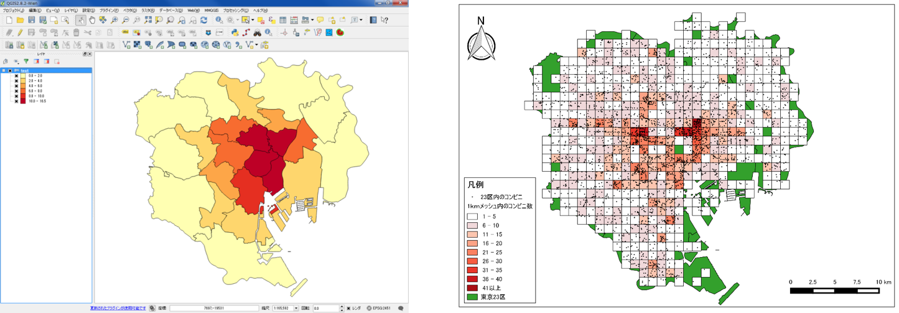
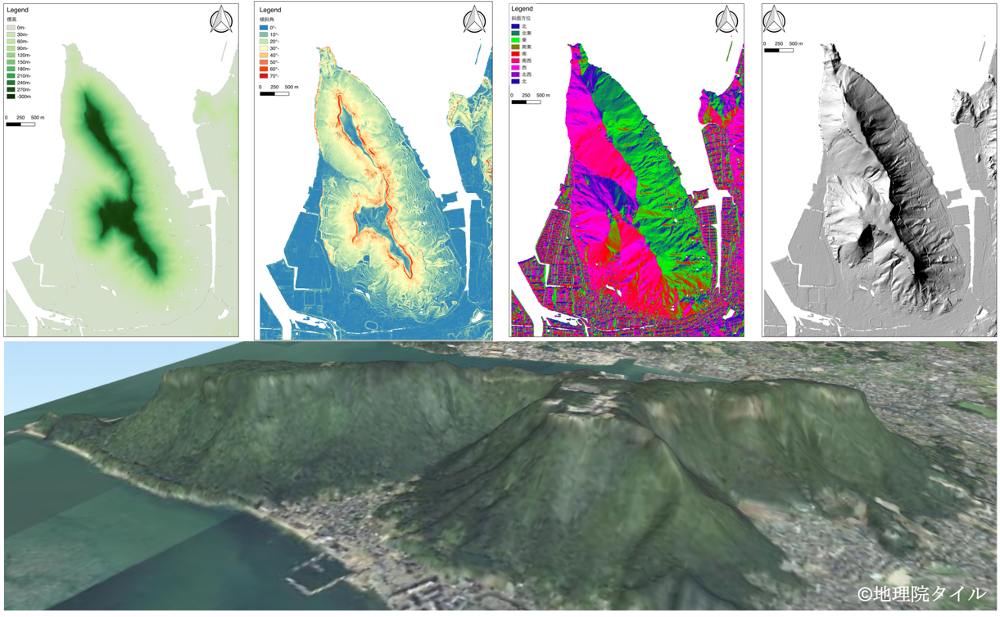

# GISの基本概念
　本教材は、初学者向けにGISの基本概念や用語を簡単にまとめたものです。GISに関する基本的な知識や、各項目に関する詳しい解説は、[地理情報科学教育用スライド（GIScスライド）]が参考になります。本教材を使用する際は、[利用規約]をご確認いただき、これらの条件に同意された場合にのみご利用下さい。

**Menu**
------
- [地理情報システムとは](#地理情報システムとは)
- [ソフトウェア](#ソフトウェア)
- [地理情報データ](#地理情報データ)
- [ベクトルデータ](#ベクトルデータ)
- [ラスタデータ](#ラスタデータ)
- [地物とレイヤ構造](#地物とレイヤ構造)
- [測地系と座標系](#測地系と座標系)
- [ウェブと地理情報システム](#ウェブと地理情報システム)

**スライド教材**

　本教材は、スライド形式([スライド_GISの基本概念])としても、ご利用いただけます。

----------

## 地理情報システムとは

- 地理情報システムは、コンピューターを用いて、地理空間情報（地理空間データ）を、可視化、作成、編集、検索、分析するシステムをさす。
- 一般的に、英語表記のGeographic Information System の頭文字をとり、GISと略される。
- 地理空間情報とは、位置情報をもった、人間（社会・経済・文化等）及び自然環境に関する情報のことである。
- GISでは、地理空間情報をデータとして表現し、コンピューターで処理を行う。

### 地理情報システムの活用例
空間に存在する物や現象の大半は、GISで処理できる情報として表現できる。そのため、GISは、自然から人文まで、幅広い分野で利用されている。以下の1～6は、GISの活用例を示したものである。

#### 1.最短経路や特定の領域の算出
GISでは、2点間の最短経路の検索や、駅や商店等からの特定の範囲の算出ができる。左図は、[ネットワーク分析]、右図は、[領域分析]にて詳しく解説している。

>国土数値情報の道路、鉄道、行政界のデータを利用し作成

#### 2.建物等の分布密度の可視化
GISでは、領域内の点（商店、駅、公園等）を密度で示すことができる。以下の手法は、[点データの分析]で詳しく解説している。

>国土数値情報の行政界のデータとOpenStreetMapのデータ（右図のコンビニ情報(c)OSM contributors）を利用し作成

#### 3.古地図の位置あわせ
GISを用いることで、データに位置情報を付与することができる。以下はその一例として、スキャナで取り込んだ古地図に位置情報を付与し、現代の地図に重ねて表示したもの。この手法は、[空間データ]の教材で解説している。

>鯖江市オープンデータと地理院タイル（標準地図）を利用し作成

#### 4.環境変化の可視化と面積計算
GISでは、データの作成や、領域に応じた面積の算出ができる。以下は、その一例としてアラル海の領域を作成し、面積を計算したもの。データ作成の手法は、[空間データの統合・修正]、面積計算の手法は、[基本的な空間解析]で解説している。

>Landsat4-5TMとLandsat8のデータを利用し作成

#### 5.標高データから地形情報を算出、可視化
GISでは、標高データを用いて地形を分析できる。地形分析の手法は、[ラスタデータの分析]で解説している。

>基盤地図情報5ｍDEMを利用し作成

#### 6.写真の撮影地点を地図で表示
GISでは、データと外部ファイルを関連して、管理することができる。以下は、その一例として、地点と対応する写真を表示したもの。

[▲メニューへもどる]

## ソフトウェア

- GISソフトウェアは、有償のものから無償で利用できるオープンソースのものまで様々あり、用途によって選択することが一般的である。

- 本教材は、Free Open Source for GeoSpatial（FOSS4G）とよばれる無償利用できるオープンソースのGISを中心に構成している。

- オープンソースのGISは、世界中の開発者により、開発が進められている。

[▲メニューへもどる]

## 地理情報データ
　GISでよく利用するデータとしてベクトルデータとラスタデータがある。

| データ|特徴|代表的なファイル|
|---|---|---|
|ベクトル|・座標値で表現するため拡大縮小による劣化がない ・細かい形状を表現するのに適している ・属性データを複数保持できるが管理が煩雑|SHAPE, KML, GeoJSON |
|ラスタ|・解像度は、ピクセルの大きさに依存するため拡大縮小で劣化する ・地形や気温のような連続性のあるデータに適している ・構造が単純なため計算や比較がしやすい(1ピクセルに1つの値を保持)|GeoTIFF, PNG, JPEG |

## ベクトルデータ

- ベクトルデータとは、座標値を持った点のデータである。

- 地物は、ポイント（点）、ライン（線）、ポリゴン（面）で表現される。

- 座標値で位置が決まるため、拡大縮小しても劣化しない。

- 位置情報の他に、複数の属性情報をもつことができる。

  例）店舗データの場合
  店舗名、住所、業種、店舗の面積、階数、従業員数、定休日など

- 代表的なファイル形式として、ESRIのシェープファイル（Shapefile）がある。

### シェープファイルとは
 ESRI社の提唱したファイル形式で、多くのGISソフトウェアがサポートしている。シェープファイル(Shapefile)は、.shp、.shx、.dbfなど複数からなる。データの移動時に.shpのみを移動してしまっために、データが表示されないというミスがよく見られる。

[▲メニューへもどる]

## ラスタデータ

- ラスタデータとは、ピクセル（画素）で区分されたデータである。

- ピクセルごとに付与された値を用いて地物を表現する。

- 拡大するとモザイクのようになり画像としての荒さが目立つようになる。高解像度のラスタデータであれば拡大しても粗が目立たなくなるが、ファイルのサイズが大きくなる。

- 地表面の標高値を保持したDEM（Digital Elevation Model）のような地形の可視化に用いられることが多い。

- 位置情報を保持した代表的なファイル形式として、GeoTIFFがある。

[▲メニューへもどる]

## 地物とレイヤ構造

- GISではデータ（レイヤ）を重ね合わせて地物を表現する。

- 地物(Feature)は、道路、河川、建物、境界、線路など、地球上にあるすべてのものを示す概念です。

面の下に点や線を配置すると面で隠れてしまうため、複数のレイヤを用いて重ね合わせする際には、注意が必要である。

[▲メニューへもどる]

## 測地系と座標系
地理空間データには、位置を示すため座標系が定義されている。GISでデータを処理する際は、座標系に注意する必要がある。
測地座標系の変換手法については、[空間データ]の教材で詳しく解説しているが、事前に以下の内容を把握しておくとよい。

- 空間データは、座標系に基づいた位置情報および関連した情報を保持している。

- 地球のある一点の位置を表す手段として座標系がある。座標系は大別して緯度経度で定義された緯度経度座標系（球形座標系）と平面上で定義されたXY座標系（数学座標系・投影座標系）がある。

- 測地系とは、測量をする際にある基準にもとづいて、経緯度の基準点となる場所をきめて測量された緯度経度座標系のことである。様々な測地系があり、異なる基準に基づく測地系においては、同じ場所であっても異なる緯度経度になる。そのため、GIS上で同一地域のデータが異なる場所として表示される場合は測地座標系が異なっていないかを確認する。

**※ QGISでは、オンザフライCRS変換（オンザフライ投影）という機能があり、異なる測地座標系のデータをシステム内で変換し表示する。デフォルトでは、その機能が有効になっている点に注意が必要となる。**

【註】CRS: 座標参照系 Coordinate Reference System

[▲メニューへもどる]

## ウェブと地理情報システム

- WebGISとは、Web上で動作するGISのことである。
- 大きく分けるとサーバーでGISの処理を行い結果を提示するなどして、GISアプリケーション相当の機能をWebブラウザ上で実現するものと地図や空間データを配信するものに分けられる。
- Web GISの利点として、GISソフトウェアのインストールが不要であることがあげられる。
- 最近では、行政や企業が情報を発信する以外に、個人レベルで地図を作成しWebで配信する事例もみられる。

※WebGISの活用については、[インターネットにおけるGIS技術の活用の教材]で解説している。

[▲メニューへもどる]

#### ライセンスに関する注意事項
　本教材で利用しているキャプチャ画像の出典やクレジットについては、[その他のライセンスについて]よりご確認ください。

[▲メニューへもどる]:00.md#menu
[地理情報科学教育用スライド（GIScスライド）]:http://curricula.csis.u-tokyo.ac.jp/slide/0.html
[利用規約]:../../policy.md
[その他のライセンスについて]:../license.md
[よくある質問とエラー]:../questions/questions.md

[GISの基本概念]:../00/00.md
[QGISビギナーズマニュアル]:../QGIS/QGIS.md
[GRASSビギナーズマニュアル]:../GRASS/GRASS.md
[リモートセンシングとその解析]:../06/06.md
[既存データの地図データと属性データ]:../07/07.md
[空間データ]:../08/08.md
[空間データベース]:../09/09.md
[空間データの統合・修正]:../10/10.md
[基本的な空間解析]:../11/11.md
[ネットワーク分析]:../12/12.md
[領域分析]:../13/13.md
[点データの分析]:../14/14.md
[ラスタデータの分析]:../15/15.md
[傾向面分析]:../16/16.md
[空間的自己相関]:../17/17.md
[空間補間]:../18/18.md
[空間相関分析]:../19/19.md
[空間分析におけるスケール]:../20/20.md
[視覚的伝達]:../21/21.md
[参加型GISと社会貢献]:../26/26.md
[インターネットにおけるGIS技術の活用の教材]:../web_gis/README.md

[地理院地図]:https://maps.gsi.go.jp
[e-Stat]:https://www.e-stat.go.jp/
[国土数値情報]:http://nlftp.mlit.go.jp/ksj/
[基盤地図情報]:http://www.gsi.go.jp/kiban/
[地理院タイル]:http://maps.gsi.go.jp/development/ichiran.html

[スライド_GISの基本概念]:https://github.com/gis-oer/gis-oer/raw/master/materials/00/00.pptx
[スライド_QGISビギナーズマニュアル]:https://github.com/gis-oer/gis-oer/raw/master/materials/QGIS/QGIS.pptx
[スライド_GRASSビギナーズマニュアル]:https://github.com/gis-oer/gis-oer/raw/master/materials/GRASS/GRASS.pptx
[スライド_リモートセンシングとその解析]:https://github.com/gis-oer/gis-oer/raw/master/materials/06/06.pptx
[スライド_既存データの地図データと属性データ]:https://github.com/gis-oer/gis-oer/raw/master/materials/07/07.pptx
[スライド_空間データ]:https://github.com/gis-oer/gis-oer/raw/master/materials/08/08.pptx
[スライド_空間データベース]:https://github.com/gis-oer/gis-oer/raw/master/materials/09/09.pptx
[スライド_空間データの統合・修正]:https://github.com/gis-oer/gis-oer/raw/master/materials/10/10.pptx
[スライド_基本的な空間解析]:https://github.com/gis-oer/gis-oer/raw/master/materials/11/11.pptx
[スライド_ネットワーク分析]:https://github.com/gis-oer/gis-oer/raw/master/materials/12/12.pptx
[スライド_領域分析]:https://github.com/gis-oer/gis-oer/raw/master/materials/13/13.pptx
[スライド_点データの分析]:https://github.com/gis-oer/gis-oer/raw/master/materials/14/14.pptx
[スライド_ラスタデータの分析]:https://github.com/gis-oer/gis-oer/raw/master/materials/15/15.pptx
[スライド_空間補間]:https://github.com/gis-oer/gis-oer/raw/master/materials/18/18.pptx
[スライド_視覚的伝達]:https://github.com/gis-oer/gis-oer/raw/master/materials/21/21.pptx
[スライド_参加型GISと社会貢献]:https://github.com/gis-oer/gis-oer/raw/master/materials/26/26.pptx

[課題ページ_QGISビギナーズマニュアル]:../tasks/t_qgis_entry.md
[課題ページ_GRASSビギナーズマニュアル]:../tasks/t_grass_entry.md
[課題ページ_リモートセンシングとその解析]:../tasks/t_06.md
[課題ページ_既存データの地図データと属性データ]:../tasks/t_07.md
[課題ページ_空間データ]:../tasks/t_08.md
[課題ページ_空間データベース]:../tasks/t_09.md
[課題ページ_空間データの統合・修正]:../tasks/t_10.md
[課題ページ_基本的な空間解析]:../tasks/t_11.md
[課題ページ_ネットワーク分析]:../tasks/t_12.md
[課題ページ_基本的な空間解析]:../tasks/t_13.md
[課題ページ_点データの分析]:../tasks/t_14.md
[課題ページ_ラスタデータの分析]:../tasks/t_15.md
[課題ページ_空間補間]:../tasks/t_18.md
[課題ページ_視覚的伝達]:../tasks/t_21.md
[課題ページ_参加型GISと社会貢献]:../tasks/t_26.md
<h2 style="background-color:#F8F5FD;text-align:center;">教材の利用に関するアンケート</h2>　本プロジェクトでは、教材の改良を目的とした任意アンケートを実施しています。ご協力いただける方は、<a href="https://customform.jp/form/input/14328/">アンケート</a>にお進みください。ご協力のほどよろしくお願いいたします。  ※ 本アンケートの成果は、教材の改良のほか、学会での発表等の研究目的でも利用します。また、本アンケートでは、個人が特定できるような質問は設けておりません。
