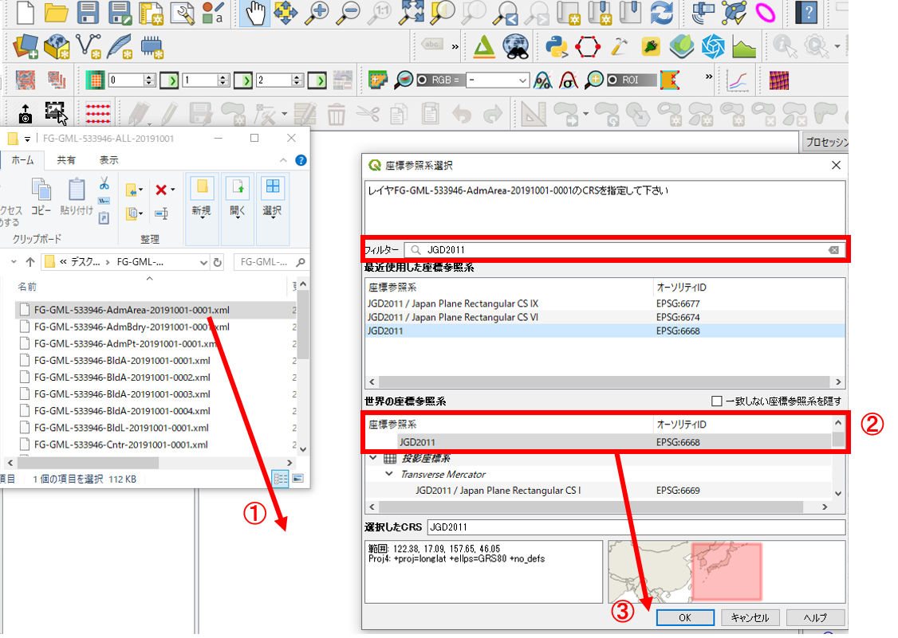
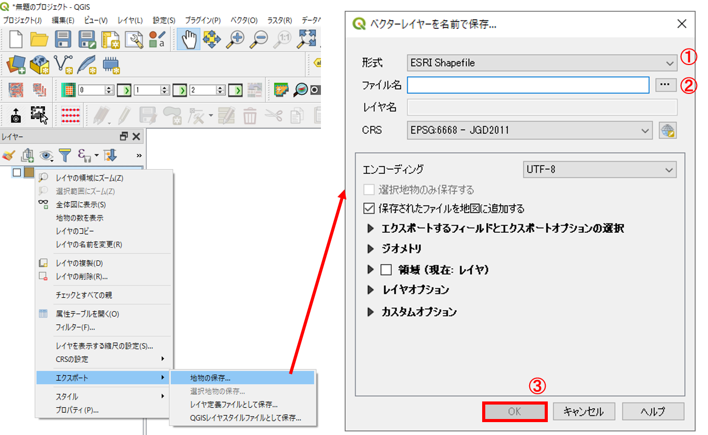
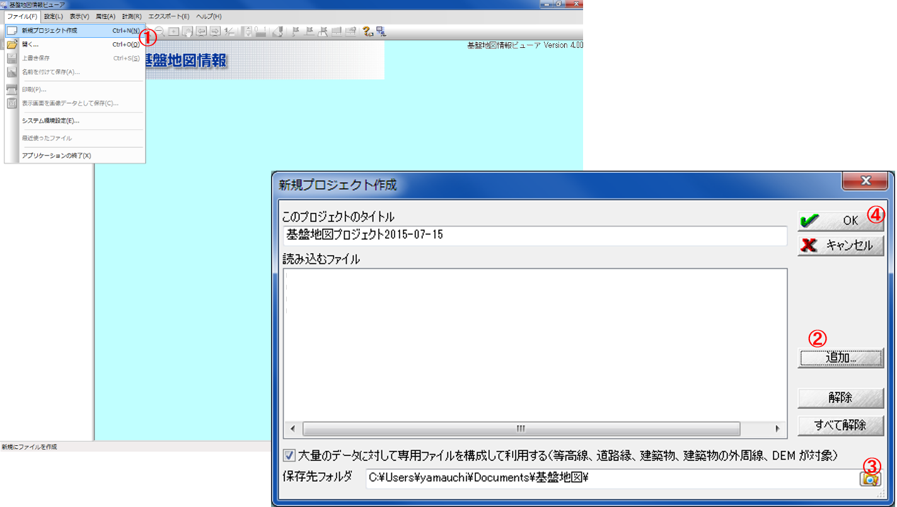
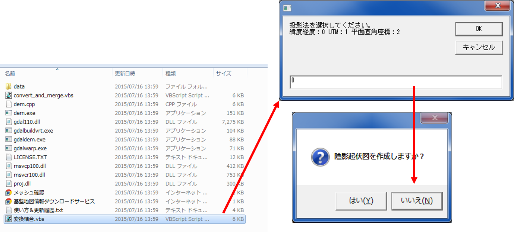
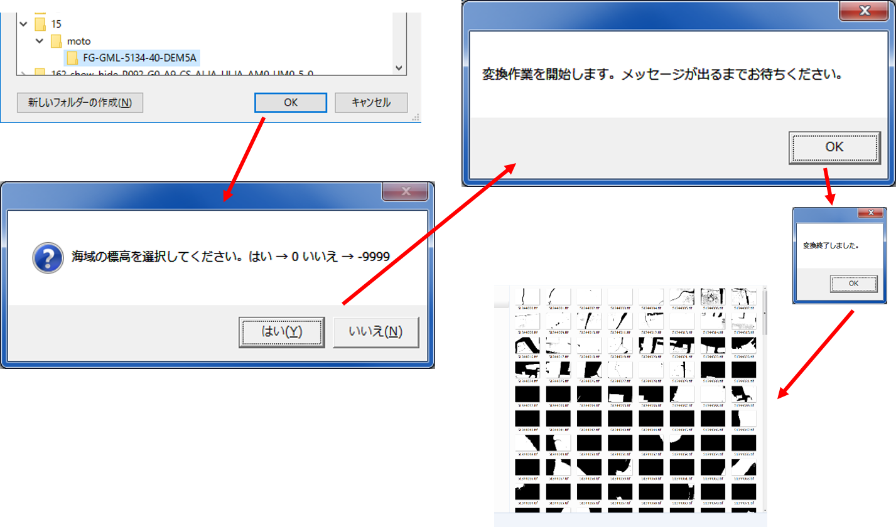
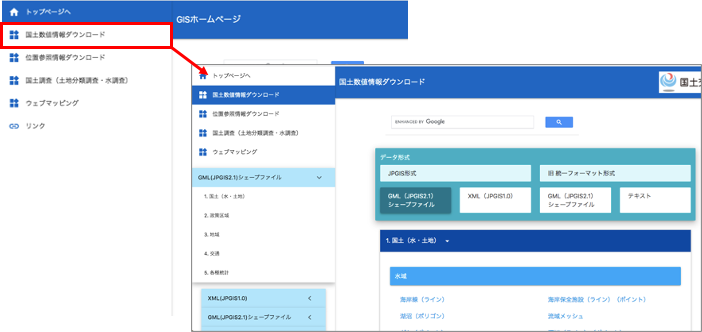
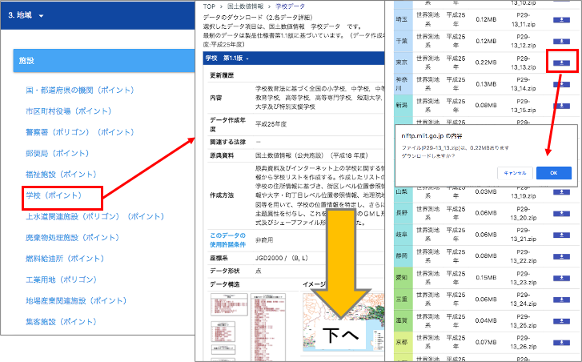

# 既存データの地図データと属性データ
　本教材は、「既存データの地図データと属性データの実習用教材」です。GISのデータは、複数の形式があり、様々な機関が提供しています。本教材では、無償で提供されるGISデータや、そのダウンロード手法について解説しています。 **GIS初学者は、学習内容の複雑化をさけるため、以下の`国土地理院の基盤地図情報`と`国土交通省の国土数値情報`のダウンロードとQGISでの表示のみ実習することを推奨します。** 課題形式で使用する場合は、本教材を一読した後、課題ページへお進みください。また、GIS初学者は、本教材を進める前に[GISの基本概念]の教材を確認しておいてください。本教材を使用する際は、[利用規約]をご確認いただき、これらの条件に同意された場合にのみご利用下さい。

※本教材は、2020年1月現在（一部、2015年8月現在）の情報で作成しています。そのため、ダウンロードサイトの仕様等に変更がある場合がある可能性があります。

[地理情報科学教育用スライド（GIScスライド）]:http://curricula.csis.u-tokyo.ac.jp/slide/2.html

**Menu**
-----
- [国土地理院の基盤地図情報](#国土地理院の基盤地図情報)
- [国土交通省の国土数値情報](#国土交通省の国土数値情報)
- [環境省のGISデータ](#環境省のgisデータ)
- [総務省のGISデータ](#総務省のgisデータ)
- [G空間情報センター](#g空間情報センター)
- [研究機関、研究者が提供するGISデータ](#研究機関が提供するgisデータ)
- [地方自治体が提供するGISデータ](#地方自治体が提供するgisデータ)
- [国外の機関が提供するGISデータ](#国外の機関が提供するgisデータ)

**スライド教材**

　本教材は、スライド形式([スライド_既存データの地図データと属性データ])としても、ご利用いただけます。

----------
## 国土地理院の基盤地図情報
　基盤地図情報は、国土交通省国土地理院が整備しているデータです。市町村や2次メッシュ単位で、測量の基準点のほか、行政区画の境界（2500レベル以上）や道路縁（2500レベル以上）等がダウンロードできます。また、地形表現や解析等で用いることのできるDEM（Digital Elevation Model）もダウンロードすることができます。基盤地図情報として提供されているデータは、ダウンロード後に変換が必要です。以下では、基盤地図情報からデータをダウンロードする手法について解説しています。教材に従って任意のファイルを選択し、ダウンロードを試してください。※基盤地図情報の利用については、測量法に従ってください。

### アカウントの作成
[基盤地図情報ダウンロードサービス]にアクセスし、右上にある「ログイン」メニューからログインする。アカウントがない場合は、ログイン画面の所で「新規登録」のリンクがあるので、アカウントの新規登録を行う。

### 基盤地図情報基本項目：ベクタデータの取得
ログインした状態で、[基盤地図情報ダウンロードサービス]から`基盤地図情報　基本項目のファイル選択へ`をクリックする。地図をスクロールし、ダウンロードするデータを選択する。ここでは、練習として東京大学本郷キャンパスが含まれる`533946`を選択し、`ダウンロードファイル確認へ`をクリックする。データが選択できたら、全てチェックをクリックし、まとめてダウンロードをクリックする。変換する範囲が都道府県全体のように大きいと、処理に時間がかかるため、練習では`533946`の区画のみとする。以下の動画も参考にデータのダウンロードを練習してください。

<iframe width="560" height="315" src="https://www.youtube.com/embed/-o-W7Xz9BtI" frameborder="0" allow="accelerometer; autoplay; encrypted-media; gyroscope; picture-in-picture" allowfullscreen></iframe>

### ダウンロードしたデータの表示とエクスポート
以下では、基盤地図情報基本項目をベクトルデータに変換する手法として、QGISを利用する手法とFGDVを利用する手法を解説します。
#### QGISでのデータの表示と出力
ダウンロードした.zipを解凍し、以下の手順を実行します。1.xmlをQGISにドラッグアンドドロップする。この際、座標系を指定するウィンドウが立ち上がるため、2.フィルターからJGD2011を検索し、3.OKをクリックする。しばらくするとデータが表示される。上記の手順を繰り返し、ファイル内の.xmlを読み込む。

データが表示されたのを確認し、レイヤーウィンドウのデータの上で右クリックし、`エクスポート>地物の保存`を選択する。次に、1.ESRI Shapefileを指定し、2.ファイル名と保存場所を設定する。最後に、3.OKをクリックする。

※Shapefileは複数のファイルで出力されるため、出力したファイルを移動する際は、すべて移動するように注意する（.shpのみを移動したために、データが表示できないというミスが多い）。

#### 基盤地図情報ビューアでのデータの表示と出力
[基盤地図情報のサイト](https://fgd.gsi.go.jp/download/documents.html) から、データをシェープファイルに変換するための`基盤地図情報ビューア`をダウンロードする。ダウンロードしたZipファイルを解凍し、`FGDV.exe`を開くと、ビューア（FGDV）が立ち上がる。以下の手順で、シェープファイルにデータを変換する。

1. ファイルを開き、新規プロジェクト作成をクリックする。
2. 「追加」ボタンから先ほどダウンロードしたZipファイルを選択。
3. プロジェクトの保存先フォルダを作成し、指定する。
4. OKをクリックする。

しばらくするとデータが表示されるが、読み込むデータの量によってフリーズする（PCの動作が停止する）ことがある。右下に処理の進捗状況を表す緑色のバーが出ているので、動いていれば正常に処理中である。

各値を設定し、シェープファイルの出力を行う。

1. 「エクスポート」メニュー中の「エクスポート」をクリックする。
2. 変換種別として「シェープファイル」を選択する。
3. 「直角座標系に変換」にチェックを入れ、`9系`を選択する（データによって変わるため、[平面直角座標系の対応表]を確認する）。
4. 「変換する領域」で「全データ領域」を出力にチェックする。
5. 「変換する要素」リスト内にある左上の四角にチェックを入れて、全てを対象とする。
6. 出力先のフォルダを指定する。
7. OKをクリックする。

※　変換が終わるまで時間がかかる。また、途中でフリーズする可能性があるため、広範囲、高密度のデータを変換する場合は、データを分けて変換することが望ましい。

#### 基盤地図情報数値標高モデル(DEM)：ラスタデータの取得

ログインした状態で、[基盤地図情報ダウンロードサービス]から`基盤地図情報　数値標高モデルのファイル選択へ`をクリックする。

地図をスクロールし、ダウンロードするデータを選択する（ここでは、例として東京大学本郷キャンパスが含まれる`533946`を選択し、`ダウンロードファイル確認へ`をクリックする。

データが選択できたら、全てチェックをクリックし、まとめてダウンロードをクリックする。ダウンロード後、Zipファイルを解凍する。

#### 基盤地図情報からダウンロードしたDEMを変換する
　基盤地図情報からダウンロードした数値標高モデルをGISソフトウェアで処理するためには、ラスタデータへの変換が必要です。以下では、[株式会社エコリスのＨＰ]のコンバーターを用いた変換について解説しています。[株式会社エコリスのＨＰ]から、`標高DEMデータ変換ツール`をダウンロードし、DEMtool.zipを解凍する。解凍したファイルを開き、変換結合.vbsを実行する。

投影法を尋ねるダイアログが出るので、緯度経度を選択するために'0'を入力する。陰影図の作成が必要な場合は、「はい」をクリックする（今回はいいえとした）。

基盤地図情報からダウンロードしたDEMが入っているフォルダを選択し、海域の標高値を選択する（今回は「はい → 0」を選択した）。変換作業を開始し、完了のメッセージを待つ。変換対象として選んだフォルダー内に、[番号].tifの名前を持つファイル群が出力されているかを確認する。

ファイルの変換が終了すると、ファイル内に`merge.tif`が出力されるため、これをQGISで読み込み、データを確認する（標高に応じて白と黒の濃淡が表現されていることを確認する）。ラスタデータの配色（値に応じた色分け）は、[空間データの統合・修正]の教材で解説している。

### 地理院地図
国土地理院が提供するデジタル地図として、[地理院地図]があります。地理院地図では、2万5千分の1地形図や空中写真等を電子化した電子国土基本図のほか、土地条件図などの主題図を閲覧することができます。地理院地図は、オープンソースとして提供されています。タイルで配信されているデータは、WEB地図やGISソフトウェアで背景地図として利用することができます。

[▲メニューへもどる]

## 国土交通省の国土数値情報
　国土数値情報は、国土交通省が整備しているGISデータで、国土計画の策定や推進のために提供されているものです。ほとんどのデータが、シェープファイルで提供されています。以下では、国土数値情報のサイトから、データをダウンロードする手法について解説をしています。教材に従って任意のファイル（3.地域　学校など）を選択し、ダウンロードを試してください。

1. [国土数値情報]のサイトにアクセスする。JPGIS形式もしくは、旧統一フォーマットを選択し、任意の項目にチェックをいれて下段の`選択`をクリックする。

2. データの範囲を決めるため、任意の地域にチェックをいれ選択をクリックする。今回は最新版の世界測地系のデータをダウンロードすることとし、該当する項目にチェックをいれ、`選択`をクリックする。

3. アンケートに回答し、利用約款を読み`はい`をクリックする。

4. `ダウンロード`をクリックすると、データが保存できる。QGISなどでデータを読み込む場合は、ダウンロード後に.Zip形式のファイルを解凍する必要がある。

以下は、上記の手順を動画にまとめたものです。
<iframe width="560" height="315" src="https://www.youtube.com/embed/Pn-XRt9t1oU" frameborder="0" allow="accelerometer; autoplay; encrypted-media; gyroscope; picture-in-picture" allowfullscreen></iframe>

[▲メニューへもどる]

## 環境省のGISデータ
　環境省は、生物多様性サイトを通じて、植生等に関するGISデータを提供しています。データをダウンロードする際には以下の手順で行います。

1. [生物多様性]のサイトにアクセスし、自然環境調査Web-GISをクリックする。Web地図の下のメニューからGISデータ（Shape）をダウンロードをする。

2. 取得したいデータを選択し、ダウンロード画面へ進む。例）植生調査（1/25,000縮尺）を選択した場合は、`都道府県別一覧へ`をクリックし、必要なデータをダウンロードする。

[▲メニューへもどる]

## 総務省のGISデータ
　以下では、総務省が公開しているGISデータのダウンロード手法について解説しています。[e-Stat]では、国勢調査、経済センサス、事務所・企業統計調査、農林業センサスなどがダウンロードできます。GISで扱えるデータとして、市区町村境界のデータも提供されています。データをダウンロードする際には以下の手順で行います。

1. [e-Stat]のサイトにアクセスする。`統計GIS＞地図で見る統計`に進む。このページでは、Web地図での統計情報の閲覧、統計データのダウンロード、境界データのダウンロードができる。以下では、境界データ（市区町村ごと）のダウンロード手法を解説する。
2. `統計GIS>境界データのダウンロード`をクリックし、小地域を選択する。
3. 国勢調査を選択し、 調査の年代と地域を選択する（今回は、2015年、小地域を選択する）。
4. ダウンロードするデータのタイプを選択する（今回は、世界測地系緯度経度・Shape形式とする）。
5. ダウンロードするデータの都道府県を選択した後、市町村をクリックする（データ形式からデータがダウンロードできる）。ダウンロードしたデータは、.shpとテキストデータを結合して利用できるがここでは紹介しいていない。この手法については、[視覚的伝達]の教材を参照してください。

[▲メニューへもどる]

## G空間情報センター
　G空間情報センターは、一般社団法人社会基盤情報流通推進協議会が運営している官民の地理空間情報プラットフォームで、総務省、国土交通省、環境省、国土地理院などの国の機関、地方自治体のオープンデータおよび民間のGISデータが検索、入手できます。データには、有償のものもあるが、無償で利用できるデータが数多く登録されています。データをダウンロードする際には以下の手順で行います。

1. [G空間情報センター]にアクセスし、`データセットへ`をクリックする。
2. 有償区分を無償とする
3. 任意のキーワードを入れてデータセットを検索し、データを保存する。タグによるデータの絞り込みも可能。

[G空間情報センター]:https://www.geospatial.jp/gp_front/

[▲メニューへもどる]

## 研究機関、研究者が提供するGISデータ

### Municipality map
皇學館大学の桐村 喬氏が公開している[Municipality map]では、市区町村区域のGISデータをダウンロードすることができる。ダウンロードしたい年月を選択し、区域データを生成するをクリックする。

### 今昔マップ
埼玉大学の谷　謙二氏が公開している[今昔マップ]では、過去の地形図を閲覧できる。これらの地形図は、タイルマップサービスとして提供されている。利用時には、`「今昔マップ on the web」`のクレジットが必要。

[Municipality map]:http://www.tkirimura.com/mmm
[今昔マップ on the web]:http://ktgis.net/kjmapw/

[▲メニューへもどる]

## 地方自治体が提供するGISデータ
地方自治体は様々なデータをWeb GISで公開していています。ダウンロードできるものと、閲覧のみのものがあります。以下では、その例をいくつか紹介しています。

### GISデータの閲覧のためのサイト
地方自治体のGISデータを閲覧できるサイトとして以下がある。

* [ぎふ県域統合型GIS]
* [おかやま全県統合型GIS]
* [静岡県統合基盤地理情報システム]
* [長野県統合型地理情報システム]
* [京都府・市町村共同_統合型地理情報システム（GIS）]

[ぎふ県域統合型GIS]:https://gis-gifu.jp/gifu/portal/index.html
[おかやま全県統合型GIS]:http://www.gis.pref.okayama.jp/map/top/index.asp
[静岡県統合基盤地理情報システム]:http://www.gis.pref.shizuoka.jp
[京都府・市町村共同_統合型地理情報システム（GIS）]:http://g-kyoto.gis.pref.kyoto.lg.jp/g-kyoto/top/
[長野県統合型地理情報システム]:http://www3.pref.nagano.lg.jp/gis/top/

[▲メニューへもどる]

### GISデータの提供サイト（オープンデータ）
　オープンデータとは、「機械判読に適したデータ形式で、二次利用が可能な利用ルールで公開されたデータ」であり「人手を多くかけずにデータの二次利用を可能とするもの」のことをさす([総務省オープンデータ戦略の推進]より引用）。いくつかの地方自治体は、オープンデータとしてGISデータ（シェープファイル、位置情報を含むテキストファイル等）を提供している。最近では、これらのオープンデータを利用した地図アプリなどの開発もされている。

#### オープンなGISデータを提供している自治体の例
- [北海道室蘭市（むろらんオープンデータライブラリ）]
- [福井県鯖江市]
- [東京都]
- [大阪市]
- [静岡県裾野市]
- [福井県越前市]

#### 地形、環境関連のオープンデータを提供している自治体の例

- [静岡県ポイントクラウドデータベース - Shizuoka Point Cloud DB]　：静岡県内で取得した点群データを提供。韮山反射炉や掛川城等の文化財のデータも提供。
- [兵庫県]　:G空間情報センターを通じて1ｍメッシュの標高データを提供。

[▲メニューへもどる]

[北海道室蘭市（むろらんオープンデータライブラリ）]:http://www.city.muroran.lg.jp/main/org2260/odlib.php
[福井県鯖江市]:http://data.city.sabae.lg.jp/
[大阪市]:https://data.city.osaka.lg.jp/
[東京都]:https://portal.data.metro.tokyo.lg.jp/
[静岡県裾野市]:http://www.city.susono.shizuoka.jp/shisei/9/1/index.html
[福井県越前市]:http://www.city.echizen.lg.jp/office/010/021/open-data-echizen.html
[静岡県ポイントクラウドデータベース - Shizuoka Point Cloud DB]:https://pointcloud.pref.shizuoka.jp/lasmap/ankenmap
[兵庫県]:https://web.pref.hyogo.lg.jp/press/20200110_4566.html

## 国外の機関が提供するGISデータ
以下では、国外の機関が無償で提供しているGISデータや提供元について紹介します。各機関が提供するデータを利用する場合は、それぞれの利用規約に従ってください。

### 地形、環境系（Geotiff）
- [EarthExplorer]　:全球レベルの地形、環境関連のデータを取得できる。

[▲メニューへもどる]

[EarthExplorer]:https://earthexplorer.usgs.gov/

#### この教材の[課題ページ_既存データの地図データと属性データ]へ進む

#### ライセンスに関する注意事項
本教材で利用しているキャプチャ画像の出典やクレジットについては、[その他のライセンスについて]よりご確認ください。

[▲メニューへもどる]:./07.md#Menu
[生物多様性]:http://www.biodic.go.jp/J-IBIS.html
[総務省オープンデータ戦略の推進]:http://www.soumu.go.jp/menu_seisaku/ictseisaku/ictriyou/opendata/
[株式会社エコリスのＨＰ]:http://www.ecoris.co.jp/contents/demtool.html
[国土地理院]:http://www.gsi.go.jp/
[利用規約]:../../policy.md
[その他のライセンスについて]:../license.md
[よくある質問とエラー]:../questions/questions.md
[平面直角座標系の対応表]:http://www.gsi.go.jp/LAW/heimencho.html
[基盤地図情報ダウンロードサービス]:https://fgd.gsi.go.jp/download/menu.php

[GISの基本概念]:../00/00.md
[QGISビギナーズマニュアル]:../QGIS/QGIS.md
[GRASSビギナーズマニュアル]:../GRASS/GRASS.md
[リモートセンシングとその解析]:../06/06.md
[既存データの地図データと属性データ]:../07/07.md
[空間データ]:../08/08.md
[空間データベース]:../09/09.md
[空間データの統合・修正]:../10/10.md
[基本的な空間解析]:../11/11.md
[ネットワーク分析]:../12/12.md
[領域分析]:../13/13.md
[点データの分析]:../14/14.md
[ラスタデータの分析]:../15/15.md
[傾向面分析]:../16/16.md
[空間的自己相関]:../17/17.md
[空間補間]:../18/18.md
[空間相関分析]:../19/19.md
[空間分析におけるスケール]:../20/20.md
[視覚的伝達]:../21/21.md
[参加型GISと社会貢献]:../26/26.md

[地理院地図]:https://maps.gsi.go.jp
[e-Stat]:https://www.e-stat.go.jp/
[国土数値情報]:http://nlftp.mlit.go.jp/ksj/
[基盤地図情報]:http://www.gsi.go.jp/kiban/
[地理院タイル]:http://maps.gsi.go.jp/development/ichiran.html

[スライド_GISの基本概念]:https://github.com/gis-oer/gis-oer/raw/master/materials/00/00.pptx
[スライド_QGISビギナーズマニュアル]:https://github.com/gis-oer/gis-oer/raw/master/materials/QGIS/QGIS.pptx
[スライド_GRASSビギナーズマニュアル]:https://github.com/gis-oer/gis-oer/raw/master/materials/GRASS/GRASS.pptx
[スライド_リモートセンシングとその解析]:https://github.com/gis-oer/gis-oer/raw/master/materials/06/06.pptx
[スライド_既存データの地図データと属性データ]:https://github.com/gis-oer/gis-oer/raw/master/materials/07/07.pptx
[スライド_空間データ]:https://github.com/gis-oer/gis-oer/raw/master/materials/08/08.pptx
[スライド_空間データベース]:https://github.com/gis-oer/gis-oer/raw/master/materials/09/09.pptx
[スライド_空間データの統合・修正]:https://github.com/gis-oer/gis-oer/raw/master/materials/10/10.pptx
[スライド_基本的な空間解析]:https://github.com/gis-oer/gis-oer/raw/master/materials/11/11.pptx
[スライド_ネットワーク分析]:https://github.com/gis-oer/gis-oer/raw/master/materials/12/12.pptx
[スライド_領域分析]:https://github.com/gis-oer/gis-oer/raw/master/materials/13/13.pptx
[スライド_点データの分析]:https://github.com/gis-oer/gis-oer/raw/master/materials/14/14.pptx
[スライド_ラスタデータの分析]:https://github.com/gis-oer/gis-oer/raw/master/materials/15/15.pptx
[スライド_空間補間]:https://github.com/gis-oer/gis-oer/raw/master/materials/18/18.pptx
[スライド_視覚的伝達]:https://github.com/gis-oer/gis-oer/raw/master/materials/21/21.pptx
[スライド_参加型GISと社会貢献]:https://github.com/gis-oer/gis-oer/raw/master/materials/26/26.pptx

[課題ページ_QGISビギナーズマニュアル]:../tasks/t_qgis_entry.md
[課題ページ_GRASSビギナーズマニュアル]:../tasks/t_grass_entry.md
[課題ページ_リモートセンシングとその解析]:../tasks/t_06.md
[課題ページ_既存データの地図データと属性データ]:../tasks/t_07.md
[課題ページ_空間データ]:../tasks/t_08.md
[課題ページ_空間データベース]:../tasks/t_09.md
[課題ページ_空間データの統合・修正]:../tasks/t_10.md
[課題ページ_基本的な空間解析]:../tasks/t_11.md
[課題ページ_ネットワーク分析]:../tasks/t_12.md
[課題ページ_基本的な空間解析]:../tasks/t_13.md
[課題ページ_点データの分析]:../tasks/t_14.md
[課題ページ_ラスタデータの分析]:../tasks/t_15.md
[課題ページ_空間補間]:../tasks/t_18.md
[課題ページ_視覚的伝達]:../tasks/t_21.md
[課題ページ_参加型GISと社会貢献]:../tasks/t_26.md
<h2 style="background-color:#F8F5FD;text-align:center;">教材の利用に関するアンケート</h2>　本プロジェクトでは、教材の改良を目的とした任意アンケートを実施しています。ご協力いただける方は、<a href="https://customform.jp/form/input/14328/">アンケート</a>にお進みください。ご協力のほどよろしくお願いいたします。  ※ 本アンケートの成果は、教材の改良のほか、学会での発表等の研究目的でも利用します。また、本アンケートでは、個人が特定できるような質問は設けておりません。
