# 空間データの統合・修正
　本教材は、「空間データの統合・修正」の実習用教材です。GISで用いられるラスタデータ（以下、ラスタという）とベクトルデータ（以下、ベクタという）の統合、修正、変換などデータの編集手法について解説しています。ソフトウェアは、無償で利用できるQGISを用いています。

　課題形式で使用する場合は、本教材を一読した後、課題ページへお進みください。GIS初学者は、本教材を進める前に[GISの基本概念]の教材を確認しておいてください。本教材を使用する際は、[利用規約]をご確認いただき、これらの条件に同意された場合にのみご利用下さい。

**Menu**
---------
* [ラスタのモザイクとクリップ](#ラスタのモザイクとクリップ)
* [等高線の抽出](#等高線の抽出)
* [ラスタをベクタへ](#ラスタをベクタへ)
* [新規ベクターレイヤの作成](#新規ベクタの作成)
* [ベクタをラスタへ](#ベクタをラスタへ)

**実習用データ**

実習をはじめる前に、[fuji]をダウンロードしてください。

**スライド教材**

本教材は、[スライド_空間データの統合・修正]としても、ご利用いただけます。

[fuji]:https://github.com/gis-oer/datasets/raw/master/fuji.zip
[スライド_空間データの統合・修正]:https://github.com/gis-oer/gis-oer/raw/master/materials/10/10.pptx

------

## ラスタのモザイクとクリップ
　以下では、[基盤地図情報]からダウンロードした5mDEMを用いて、ラスタデータの結合と任意範囲での切り抜きの解説を行っています。DEMは、Digital Elevation Modelの略であり、各セルごとに標高値を保持しているデータです。以下に従って、ダウンロードしたデータから任意の地域のデータを切り出して下さい。

ラスタを読み込むボタンをクリックして、変換したラスタを全て読み込む。
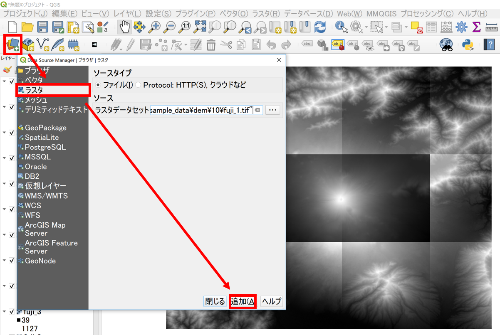

### ラスタのモザイク
基盤地図情報からダウンロードした5mメッシュのDEMデータをGeotiffに変換したものをQGISに読み込む。読み込んだ複数の.tifファイルは下の図のようなモザイク状になっているのでこれを一つにまとめる。
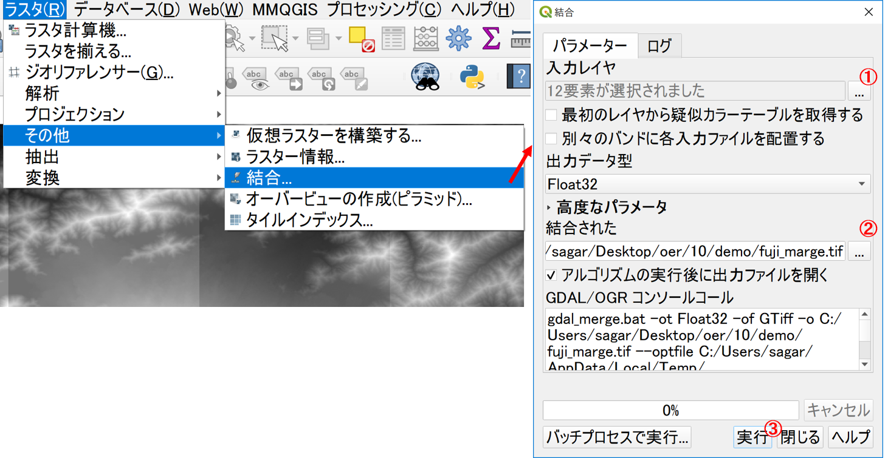
`ラスタ＞その他＞結合`をクリックし、以下の操作を行う。
1. 入力ファイルを選択する。
2. 出力先とファイル入力する。
3. ＯＫをクリックする。

※データが無い値は、0や-9999などを必要に応じて指定する。

以下のように、ラスタが結合できる。
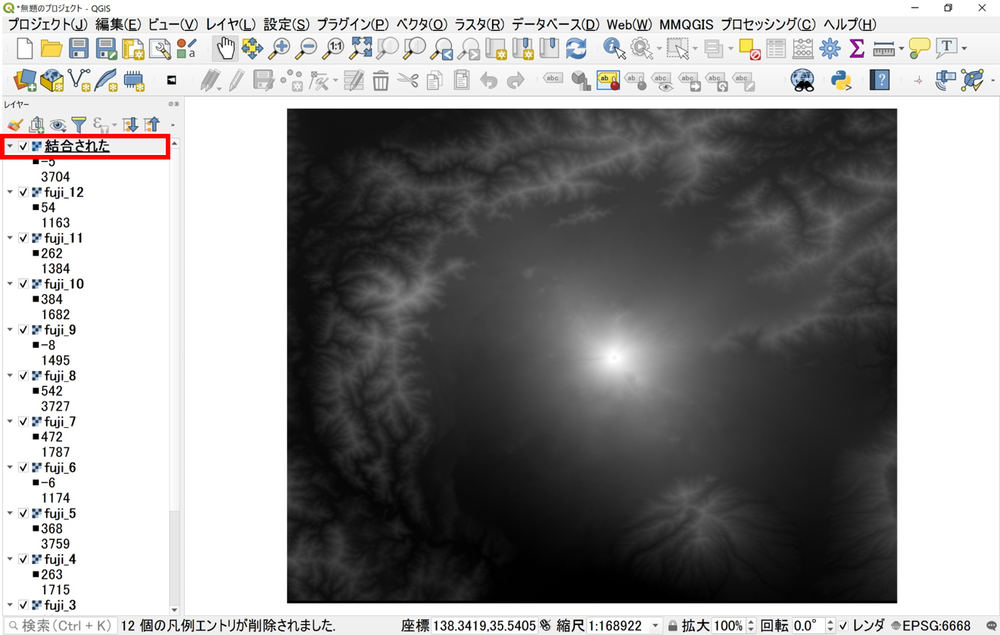

### ラスタの座標変換
ラスタの座標変換が必要な場合は、以下のように行う。
緯度経度から、平面直角座標系に変換するため、`ラスタ＞プロジェクション＞ワープ（再投影）`をクリックする。
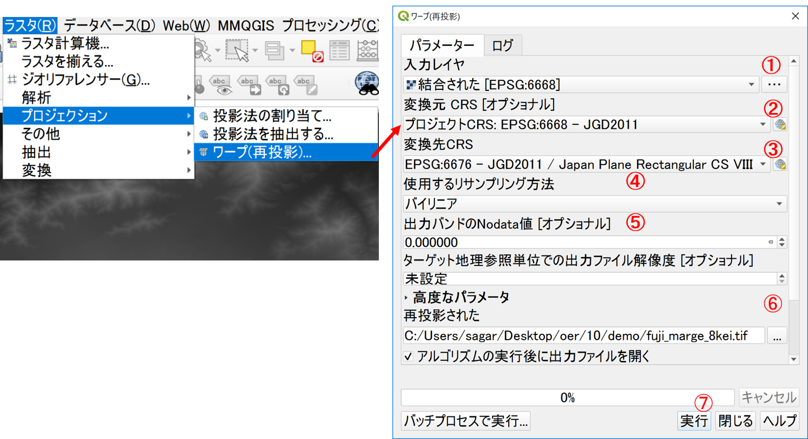

1. 入力レイヤとして、結合したラスタを選択する。
2. 変換元の座標系をEPSG:6668とする。
3. 変換先の座標系をEPSG:6676とする。
4. リサンプリングをバイリニアとする。
5. Nodata値を0とする。
6. 出力先とファイル名を指定する。
7. 実行をクリックする。

### ラスタのクリップ
解析に必要な範囲のデータの切り取りを行うことで、解析を効率よく行うことができる。そのため、以下からは、再投影したラスタ以外のレイヤを削除しておく。
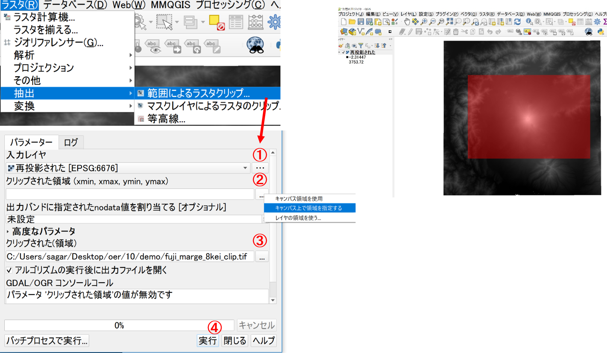
`ラスタ＞抽出＞範囲によるラスタクリップ`をクリックし、以下の操作を行う。
1. 再投影したラスタを入力レイヤに指定する。
2. `キャンパス上で領域を指定する`をクリックし、地図をドラッグして範囲を指定する。
3. 出力先とファイル名を指定する。
4. 実行をクリックする。

以下のように、ラスタがクリップできた。
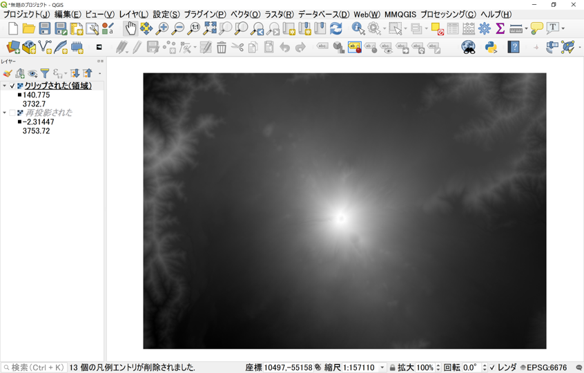

### ラスタの配色(値の分類)
このデータの場合、ラスタのセルごとに標高値を保持しているため、標高値による色分けができる。
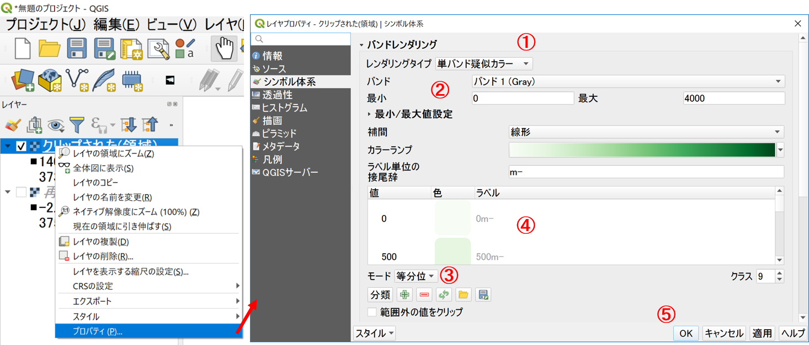
1. クリップしたラスタのプロパティ ＞ シンボル体系から、レンダリングタイプを単バンド疑似カラーにする。
2. 最小を0、最大を4000とする。
3. モードを等分位とし、クラスを9とする。
4. 各値ラベルをクリックし、表示値を書き換える。
5. OKをクリックする。

以下のように、標高値ごとに色わけができた。

以下のように、値の追加や編集によって、標高値に応じた色分けが可能（以下では、2500m以下を青色とした）。
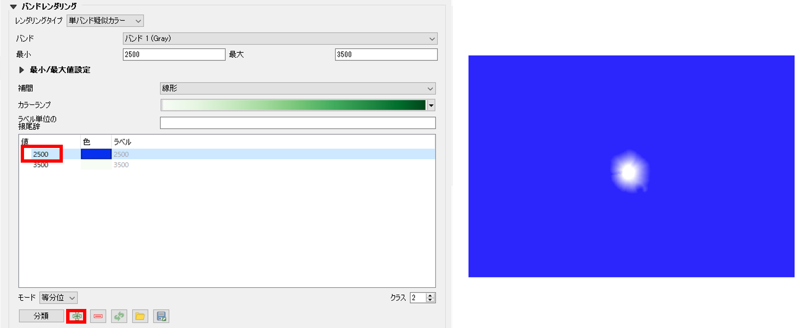

[▲メニューへもどる]

## 等高線の抽出
　作成したラスタデータは、各セルごとに標高値を保持している。そのため、セルの値を補間、等高線を作成することができる。以下では、等高線を作成する手法について解説しています。

クリップしたラスタを利用して、等高線を作成する。
`ラスタ＞抽出＞等高線`をクリックする。
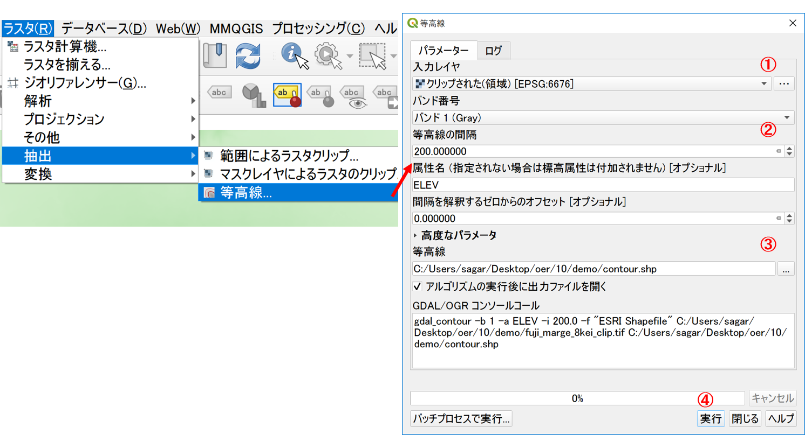

1. 入力ファイルを選択する。
2. 等高線の間隔を入力（今回は、200mとする）する。
3. 出力先とファイルを入力する（ESRI Shapefileで保存する）。
4. 実行をクリックする。

以下のように、200mの等高線が出力された。属性テーブルに、標高値が作成されていることも確認する。
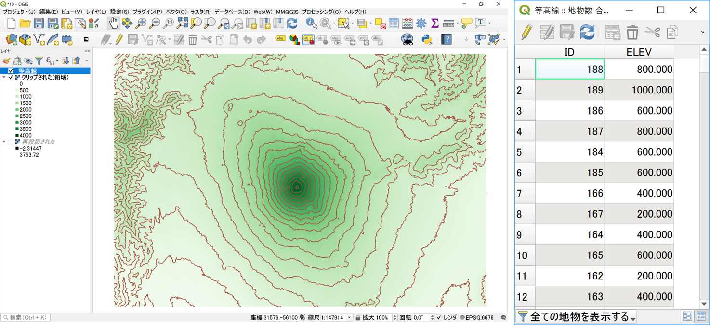

[▲メニューへもどる]

## ラスタをベクターに変換する
　GISでは、処理の内容やデータの表現のため、ラスタデータやベクタデータを使い分けて使用します。以下では、ラスターデータをベクタデータ(ポリゴン)に変換する手法について解説しています。

ラスタをベクターに変換する。
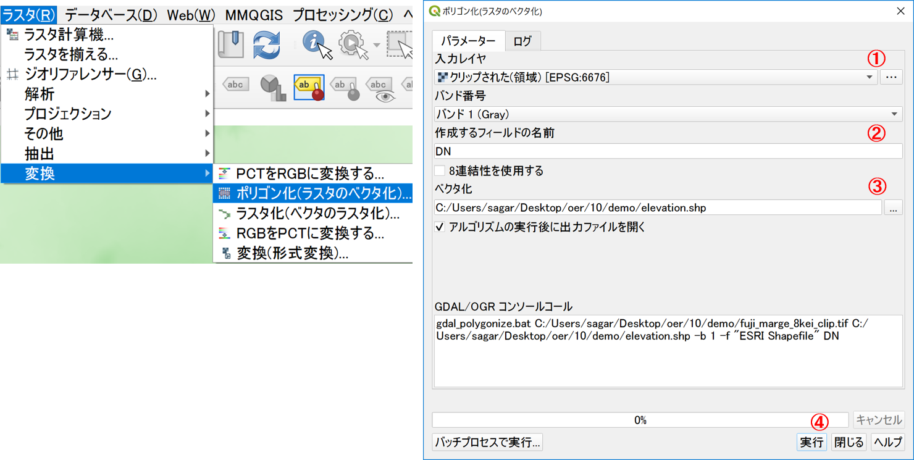
`ラスタ＞変換＞ポリゴン化（ラスタのベクタ化）`をクリックし、以下の操作を行う。
1. 入力ファイルを選択する。
2. 作成するフィールドの名前を指定する。
3. 出力先とファイルを入力する。
4. 実行をクリックする。

以下のように、ラスタがベクタに変換されるので、DNフィールドの値で色分けする。
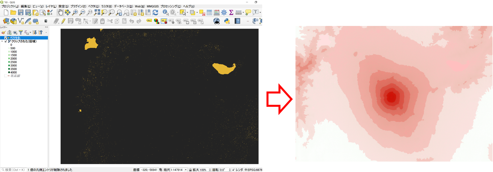

### ポリゴンから特定の値（例：2500m以上の地域）を表示する
作成したポリゴンから、特定の値の地域の抽出しデータを表示する場合は、以下のように行う。レイヤの上で右クリックし、`プロパティ>シンボロジー`をクリックする。
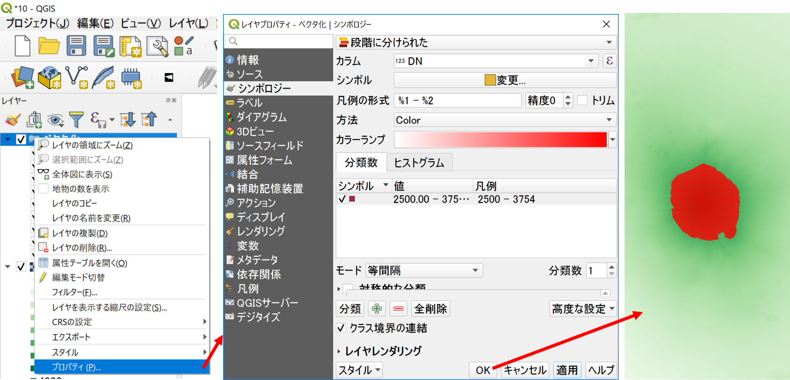
「段階に分けられた」を選択し、カラムに「DN」値を指定する。
分類数を1にし、「分類」をクリックする。値をクリックし2500-最大値を入力し、OKをクリックする。

[▲メニューへもどる]

## 新規ベクターレイヤの追加
　GISでは、データを自作をすることができます。以下では、新規にベクトルデータを作成する手法について解説しています。

以下をはじめる前に、富士山登山同図（fuji_trails.tif）を読み込んでおく。
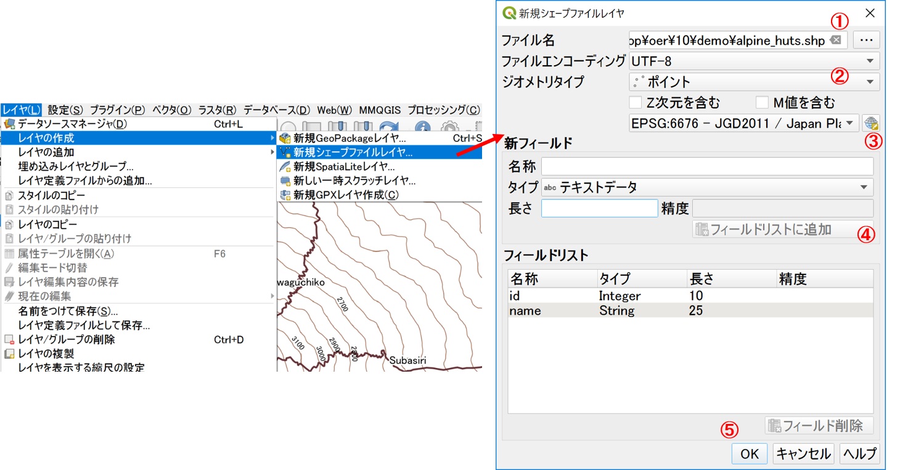
`レイヤ＞レイヤの作成＞新規シェープファイルレイヤ`
1. 保存先とファイル名を指定する。
2. 作成したいレイヤのタイプを選択する。
3. 座標系（今回は、EPSG:6676とする）を設定する。
4. 新規ポイントに追加したい属性を`新フィールド`から設定する。

「名称」はカラム名、「タイプ」はデータ型にあわせる、「幅」と「精度」は入力するデータによる。

「タイプ」・・・値が整数ならInteger、小数を含むならReal、テキストならStringとなる。

「幅」＞桁数、「精度」＞表示する小数の位

5. OKをクリックする。

※新規ベクターレイヤ追加では、ポイント、ライン、ポリゴンを同時に作成することができない。各レイヤを作成する場合ごとに、新規レイヤ作成が必要となる。

### ポイントデータの作成と保存
以下では、富士山の登山道図をトレースして、山小屋のポイントを作成する。追加するポイントのIDと名前は表を参照する。
レイヤを選択し、`編集モード切替`をクリックする。

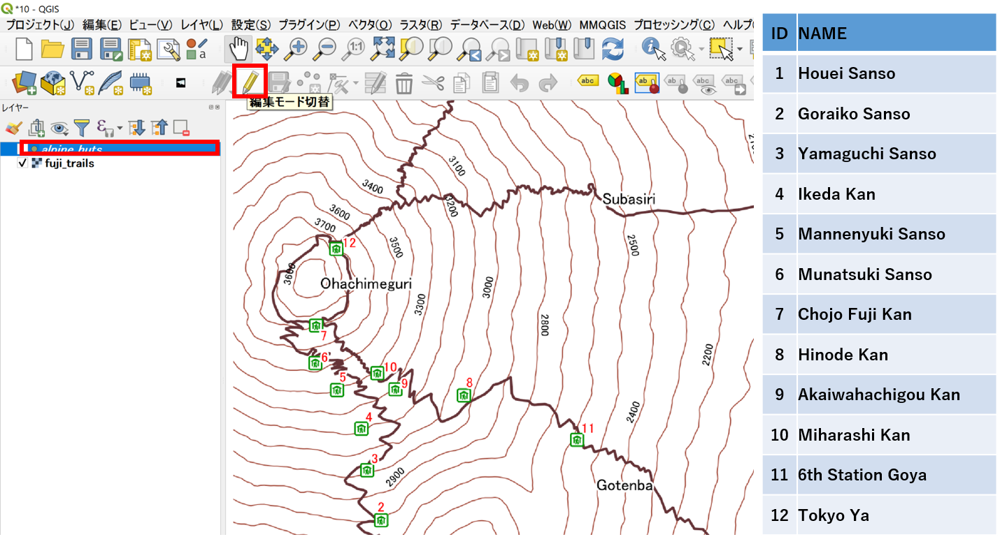

`ポイント地物を追加する`をクリックし、山小屋1の位置をクリックし、idと名前を入力する。この作業をID12まで行う。
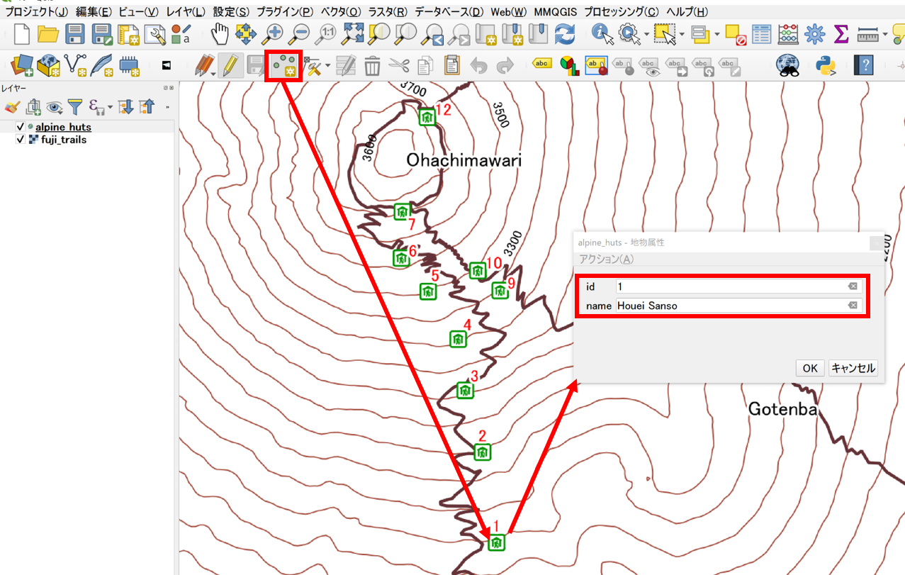

ポイントが追加できたら、`レイヤ編集内容を保存（青枠）`、`編集モード切替（赤枠）`の順でクリックしてデータを保存する。
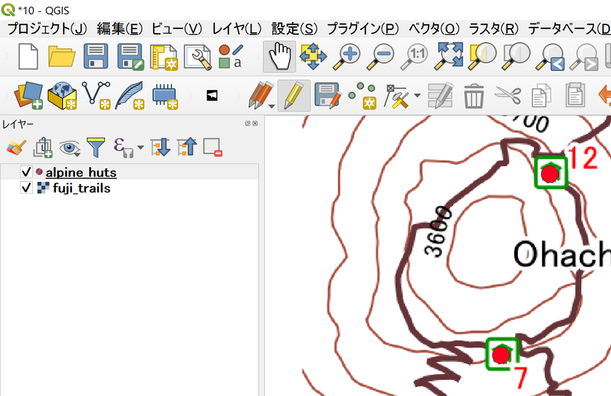

### ポイントの削除
以下では、ポイントデータを編集する手法について解説しています。
この実習を行う場合、レイヤは保存しないでください。

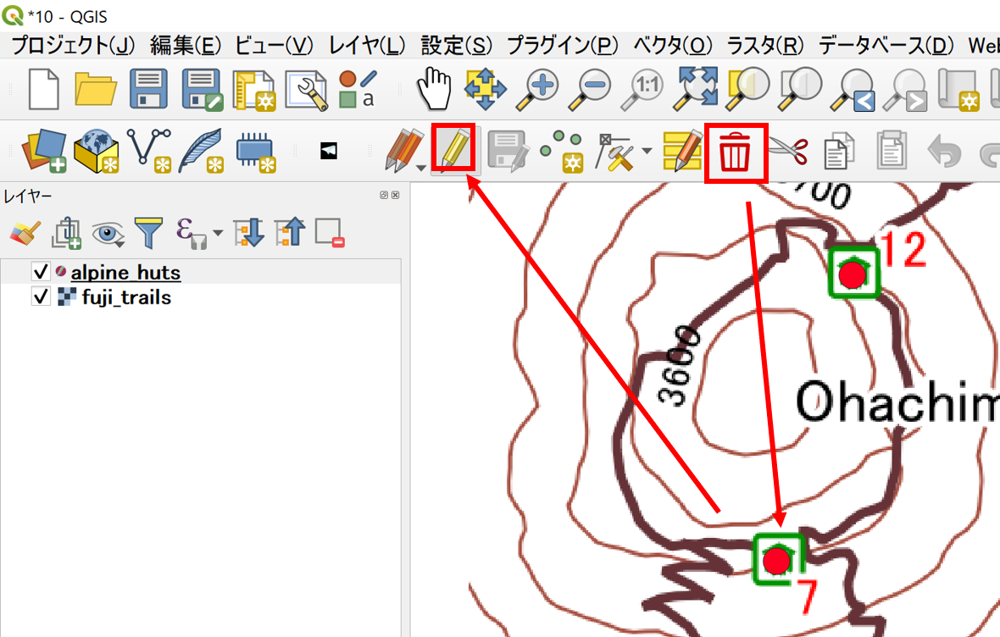
編集モードの状態で、選択ツールを用いて、削除したいレイヤを選択し、選択物を削除をクリックする。

#### ポイントの移動
ベクタ編集の練習として、ポイントの移動を行う。
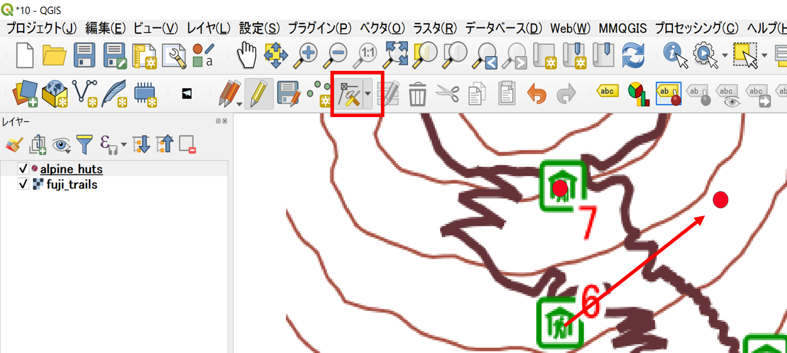
頂点ツールをクリックして、移動したいレイヤの頂点をクリックし、任意の場所に移動する。

#### 属性情報の編集
QGISでは、属性情報を編集することができます。

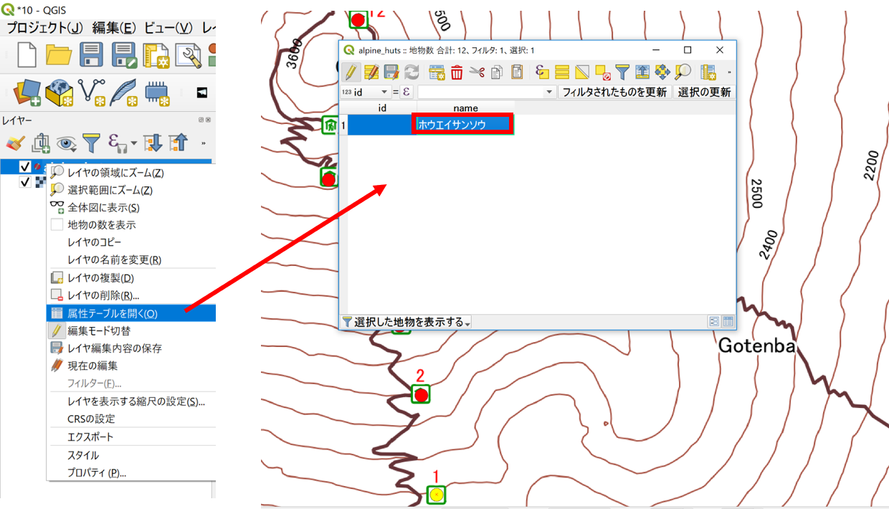
属性テーブルを開き、属性情報をクリックし、編集したい情報を入力する。

#### ラインデータの作成
レイヤ＞レイヤの作成＞新規シェープファイルレイヤから、ポイントレイヤと同様の手法でラインデータを作成します。
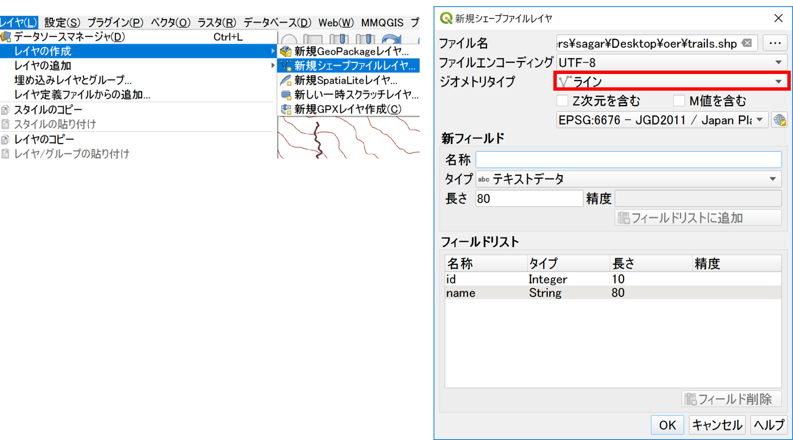

以下では、登山道のラインデータを作成する。頂点を連結させるため、設定＞オプション＞デジタイズから、`デフォルトでスナップオプションを有効にする`にチェックをつける。
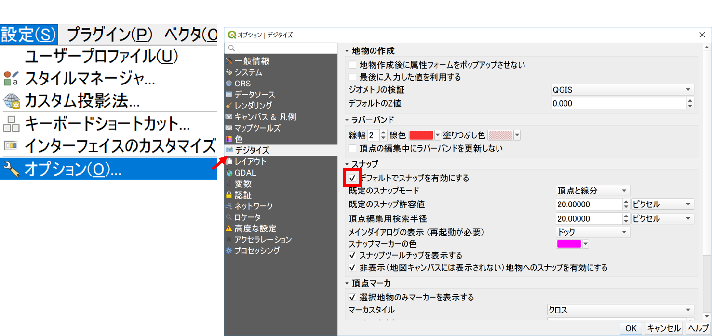

ポイントデータを作成する要領で、登山道を何度もクリックしてなぞるようにラインデータを作成する。作成した線の最後の点で右クリックをするとダイアログが表示されるため、属性情報を入力する（以下では、１．富士宮口の登山道と２．お鉢巡りの道の順で作成します）。
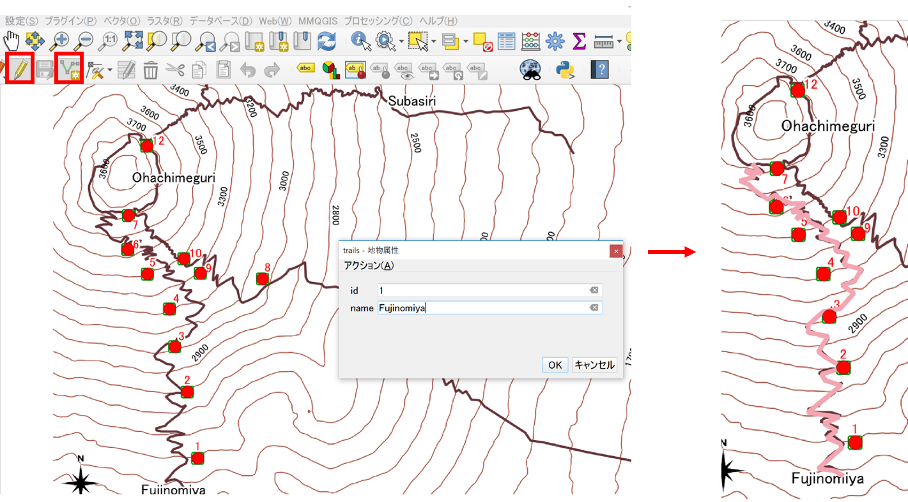

お鉢巡りを作成する際に、富士宮口登山道の終点に点が重なるように作成する。最終点の周辺にカーソルを重ねるとピンク色になるので、その場所にお鉢巡りの始点と終点を重ねるように作成する。
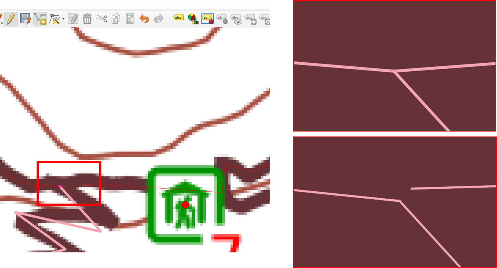

#### ポリゴンデータの作成
火口域のポリゴンデータを作成するため、ブラウザパネルを表示し、地理院タイル（簡易空中写真）をよみこむ
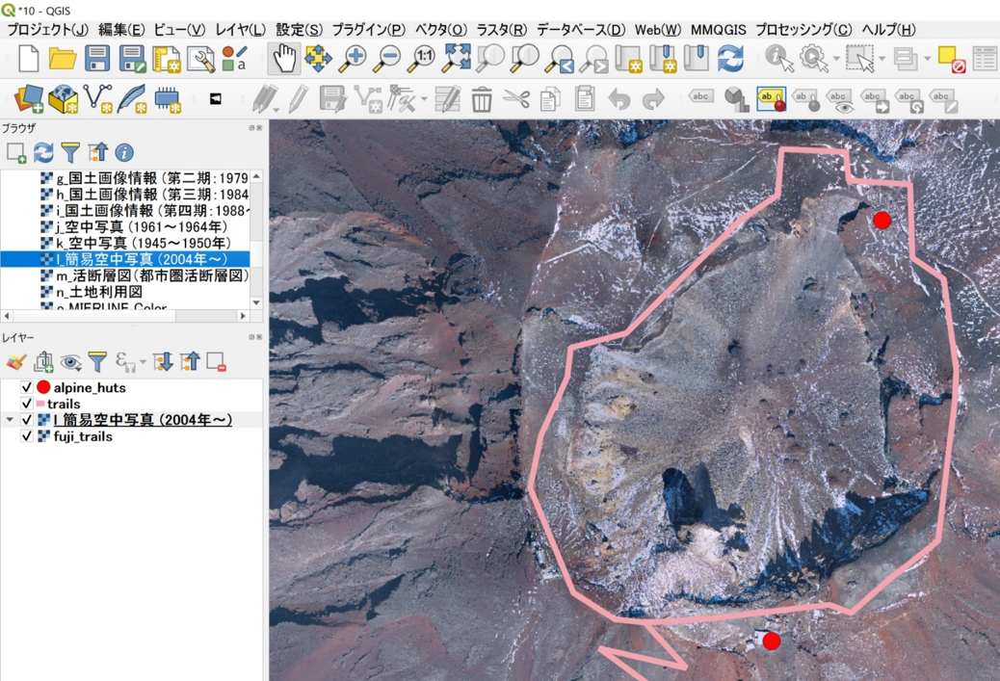

`レイヤ＞レイヤの作成＞新規シェープファイルレイヤ`から、ポイントレイヤと同様の手法でポリゴンデータを作成する。
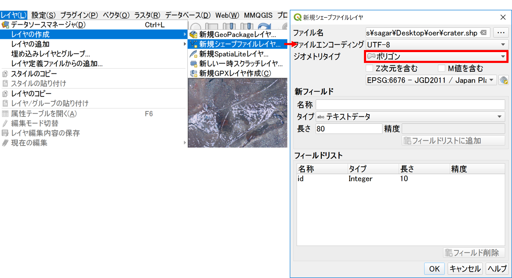

ラインデータを作成する要領で、火口のふちを何度もクリックしてなぞるようにポリゴンデータを作成する。作成した線の最後の点で右クリックをするとダイアログが表示されるため、属性情報を入力する。
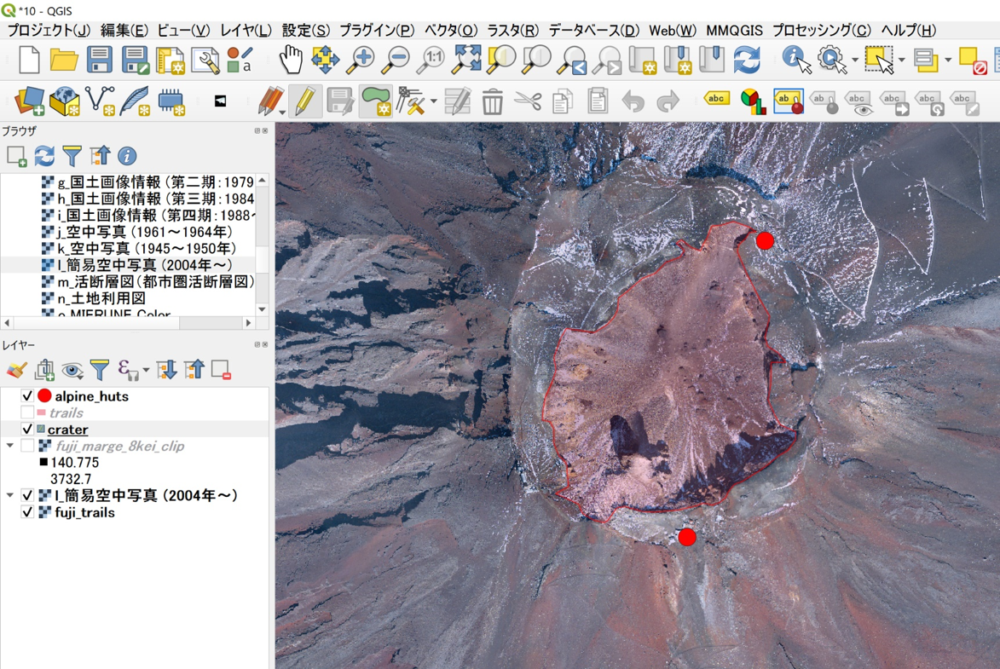

[▲メニューへもどる]

## ベクタをラスタへ変換する
　GISでは、処理の内容やデータの表現のため、ラスタやベクタを使い分けて使用します。以下では、land_condition.shpを利用するので、実習用データからQGISに読み込んでください。

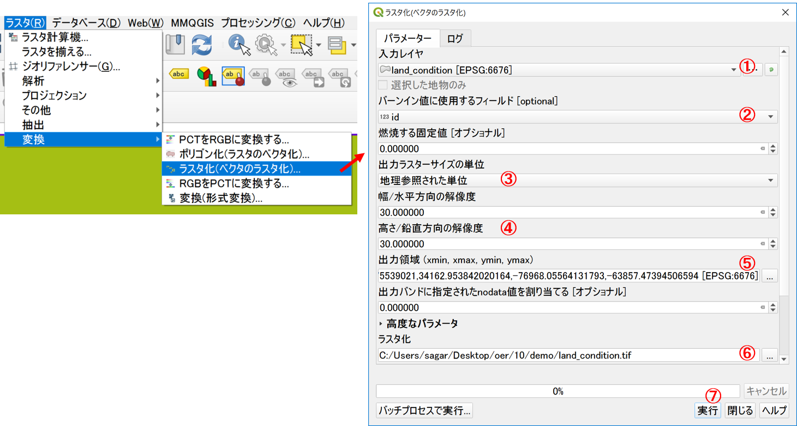
ラスタ＞変換＞ラスタ化（ベクタのラスタ化）

1. land_conditionを選択する。
2. バーンイン値に使用するフィールドをIDとする。
3. 出力ラスターサイズの単位を地理参照された単位とする。
4. 解像度を幅、高さそれぞれ30mとする。
5. 出力領域をレイヤの領域に従うとし、land_conditionを選択する。
6. 出力先とファイル名を指定する。
7. 実行をクリックする。

左図のように出力されるので、右図のように属性にあわせて色付けを行う。以下では、等分位を４とし、1を黄緑、2を茶、３を赤、４を青とした。

[▲メニューへもどる]

#### この教材の[課題ページ_空間データの統合・修正]へ進む

#### ライセンスに関する注意事項
本教材で利用しているキャプチャ画像の出典やクレジットについては、[その他のライセンスについて]よりご確認ください。

[▲メニューへもどる]:./10.md#Menu
[地理情報科学教育用スライド（GIScスライド）]:http://curricula.csis.u-tokyo.ac.jp/slide/3.html
[利用規約]:../../policy.md
[その他のライセンスについて]:../license.md
[よくある質問とエラー]:../questions/questions.md

[GISの基本概念]:../00/00.md
[QGISビギナーズマニュアル]:../QGIS/QGIS.md
[GRASSビギナーズマニュアル]:../GRASS/GRASS.md
[リモートセンシングとその解析]:../06/06.md
[既存データの地図データと属性データ]:../07/07.md
[空間データ]:../08/08.md
[空間データベース]:../09/09.md
[空間データの統合・修正]:../10/10.md
[基本的な空間解析]:../11/11.md
[ネットワーク分析]:../12/12.md
[領域分析]:../13/13.md
[点データの分析]:../14/14.md
[ラスタデータの分析]:../15/15.md
[傾向面分析]:../16/16.md
[空間的自己相関]:../17/17.md
[空間補間]:../18/18.md
[空間相関分析]:../19/19.md
[空間分析におけるスケール]:../20/20.md
[視覚的伝達]:../21/21.md
[参加型GISと社会貢献]:../26/26.md

[地理院地図]:https://maps.gsi.go.jp
[e-Stat]:https://www.e-stat.go.jp/
[国土数値情報]:http://nlftp.mlit.go.jp/ksj/
[基盤地図情報]:http://www.gsi.go.jp/kiban/
[地理院タイル]:http://maps.gsi.go.jp/development/ichiran.html

[スライド_GISの基本概念]:https://github.com/gis-oer/gis-oer/raw/master/materials/00/00.pptx
[スライド_QGISビギナーズマニュアル]:https://github.com/gis-oer/gis-oer/raw/master/materials/QGIS/QGIS.pptx
[スライド_GRASSビギナーズマニュアル]:https://github.com/gis-oer/gis-oer/raw/master/materials/GRASS/GRASS.pptx
[スライド_リモートセンシングとその解析]:https://github.com/gis-oer/gis-oer/raw/master/materials/06/06.pptx
[スライド_既存データの地図データと属性データ]:https://github.com/gis-oer/gis-oer/raw/master/materials/07/07.pptx
[スライド_空間データ]:https://github.com/gis-oer/gis-oer/raw/master/materials/08/08.pptx
[スライド_空間データベース]:https://github.com/gis-oer/gis-oer/raw/master/materials/09/09.pptx
[スライド_空間データの統合・修正]:https://github.com/gis-oer/gis-oer/raw/master/materials/10/10.pptx
[スライド_基本的な空間解析]:https://github.com/gis-oer/gis-oer/raw/master/materials/11/11.pptx
[スライド_ネットワーク分析]:https://github.com/gis-oer/gis-oer/raw/master/materials/12/12.pptx
[スライド_領域分析]:https://github.com/gis-oer/gis-oer/raw/master/materials/13/13.pptx
[スライド_点データの分析]:https://github.com/gis-oer/gis-oer/raw/master/materials/14/14.pptx
[スライド_ラスタデータの分析]:https://github.com/gis-oer/gis-oer/raw/master/materials/15/15.pptx
[スライド_空間補間]:https://github.com/gis-oer/gis-oer/raw/master/materials/18/18.pptx
[スライド_視覚的伝達]:https://github.com/gis-oer/gis-oer/raw/master/materials/21/21.pptx
[スライド_参加型GISと社会貢献]:https://github.com/gis-oer/gis-oer/raw/master/materials/26/26.pptx

[課題ページ_QGISビギナーズマニュアル]:../tasks/t_qgis_entry.md
[課題ページ_GRASSビギナーズマニュアル]:../tasks/t_grass_entry.md
[課題ページ_リモートセンシングとその解析]:../tasks/t_06.md
[課題ページ_既存データの地図データと属性データ]:../tasks/t_07.md
[課題ページ_空間データ]:../tasks/t_08.md
[課題ページ_空間データベース]:../tasks/t_09.md
[課題ページ_空間データの統合・修正]:../tasks/t_10.md
[課題ページ_基本的な空間解析]:../tasks/t_11.md
[課題ページ_ネットワーク分析]:../tasks/t_12.md
[課題ページ_基本的な空間解析]:../tasks/t_13.md
[課題ページ_点データの分析]:../tasks/t_14.md
[課題ページ_ラスタデータの分析]:../tasks/t_15.md
[課題ページ_空間補間]:../tasks/t_18.md
[課題ページ_視覚的伝達]:../tasks/t_21.md
[課題ページ_参加型GISと社会貢献]:../tasks/t_26.md
<h2 style="background-color:#F8F5FD;text-align:center;">教材の利用に関するアンケート</h2>　本プロジェクトでは、教材の改良を目的とした任意アンケートを実施しています。ご協力いただける方は、<a href="https://customform.jp/form/input/14328/">アンケート</a>にお進みください。ご協力のほどよろしくお願いいたします。  ※ 本アンケートの成果は、教材の改良のほか、学会での発表等の研究目的でも利用します。また、本アンケートでは、個人が特定できるような質問は設けておりません。
