# 点データの分析
　本教材は、「点データの分析」の実習用教材です。QGISを用いて、点データの密度を可視化し視覚的に分析する手法や、点パターン分布を数理的に分析する手法について解説しています。理論の解説は、講義用教材の[地理情報科学教育用スライド（GIScスライド）]の4章が参考になります。

　課題形式で使用する場合は、本教材を一読した後、課題ページへお進みください。GIS初学者は、本教材を進める前に[GISの基本概念]の教材を確認しておいてください。本教材を使用する際は、[利用規約]をご確認いただき、これらの条件に同意された場合にのみご利用下さい。

[地理情報科学教育用スライド（GIScスライド）]:http://curricula.csis.u-tokyo.ac.jp/slide/4.html

**Menu**
------

**視覚的分析**

* [点の分布密度](#点の分布密度)
* [メッシュによる点密度の表示](#メッシュによる点密度の表示)
* [行政区内の点密度](#行政区内の点密度)
* [カーネル密度推計](#カーネル密度推計)

**数理的分析**

* [平均最近隣距離法](#平均最近隣距離法)
* [標準偏差距離と標準偏差楕円](#標準偏差距離と標準偏差楕円)
* [K-関数法](#k-関数法)

**実習用データ**

実習をはじめる前に、[tokyo]をダウンロードしてください。

**スライド教材**

本教材は、[スライド_点データの分析]としても、ご利用いただけます。

[tokyo]:https://github.com/gis-oer/datasets/raw/master/tokyo.zip

-------
## 視覚的分析
　以下では、国土数値情報のコンビニエンスストアのデータを用いて、QGISでポイントデータの密度を視覚的に分析する手法について解説しています。前提として、点データの視覚的分析では、メッシュや行政区画などの空間集計に用いるオブジェクトの大きさに影響されることを注意する必要があります。

## 点の分布密度
　下の図は、QGISでcvs_jgd2011_9.shpファイルを読み込み、東京都のコンビニエンスストアの分布を示したものです。この図を見ると点が密集している地域とそうでない地域があることはわかります。しかし、地域ごとの密度の違いはよくわかりません。そこで、以下ではQGISでメッシュ（方形区）や行政区画ごとに密度を可視化する手法を解説します。

## メッシュによる点密度の表示
`プロセッシング＞ツールボックス＞ベクター作成＞グリッドの作成`から以下の手順で、メッシュを作成する。ここでは、500m×500mのメッシュを作成する。
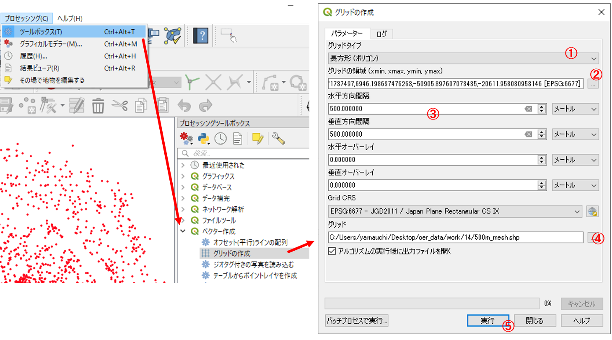

1. 長方形（ポリゴン）を選択する。
2. レイヤの領域を使うため、cvs_jgd2011_9を選択する。
3. 水平、垂直方向をそれぞれ500mとする。
4. 出力先とファイル名を指定する。
5. 実行をクリックする。

下の図のように、500m×500mのメッシュが作成できる。
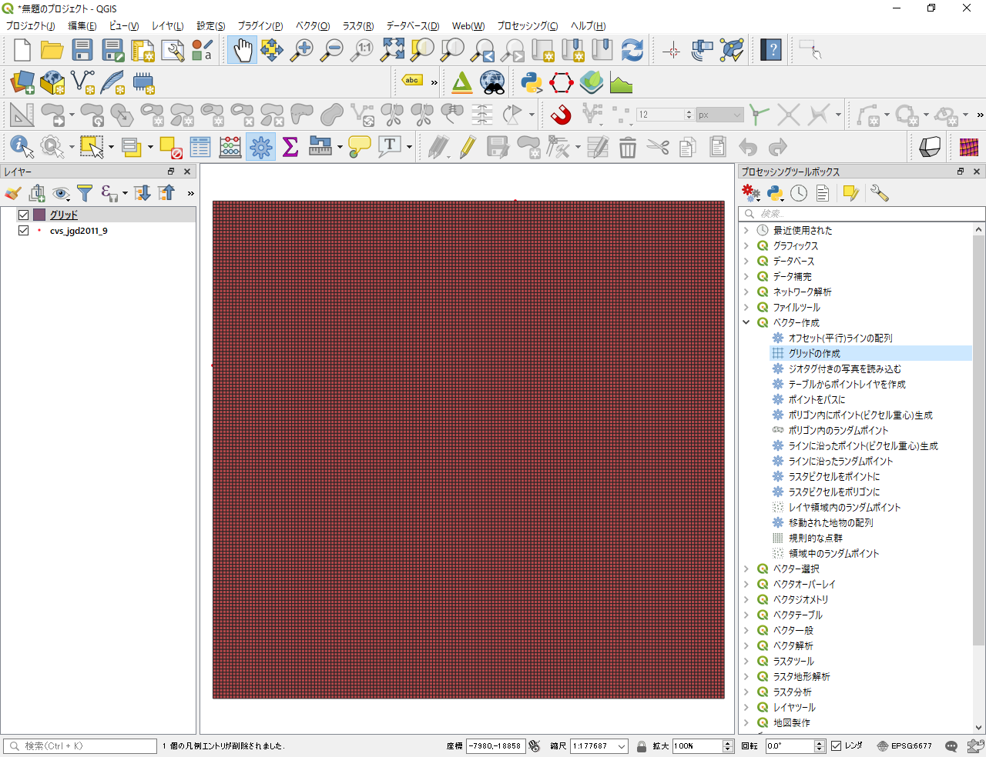

### メッシュ内のポイント数を計算する
`ベクタ＞解析ツール＞ポリゴン内のポイント数`からメッシュ内のポイント数を以下のように計算する。
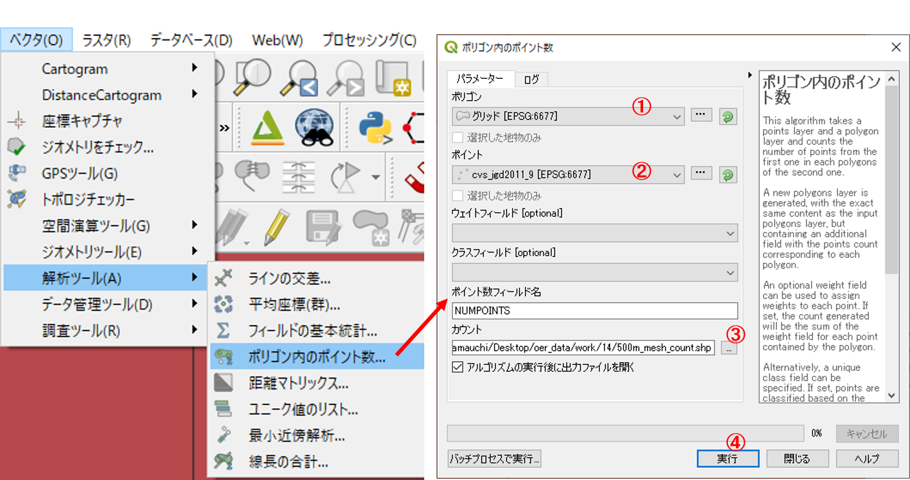

1. ポリゴンに出力したメッシュを選択する。
2. ポイントにコンビニのレイヤ(cvs_jgd2011_9.shp)を指定する。
3. 出力先を指定する。
4. 実行をクリックする。

以下のように、メッシュ内のポイント数を集計した、新規ポリゴンが作成される。
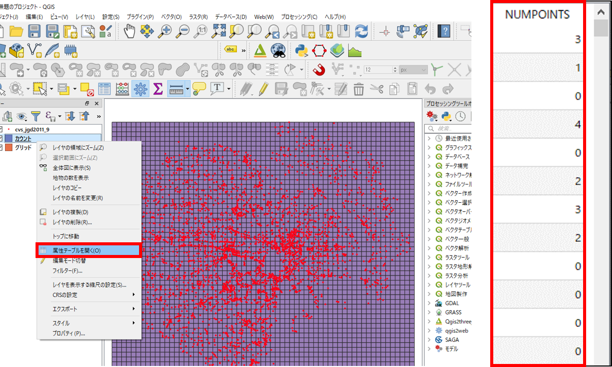
属性テーブルを開き、一番端の列のデータを並び替えて表示すると、計算結果が追加されていることが確認できる。

### メッシュ内のポイント数で色分け
`プロパティ＞シンボロジーから` メッシュ内のポイント数をもとに色分けを行う。
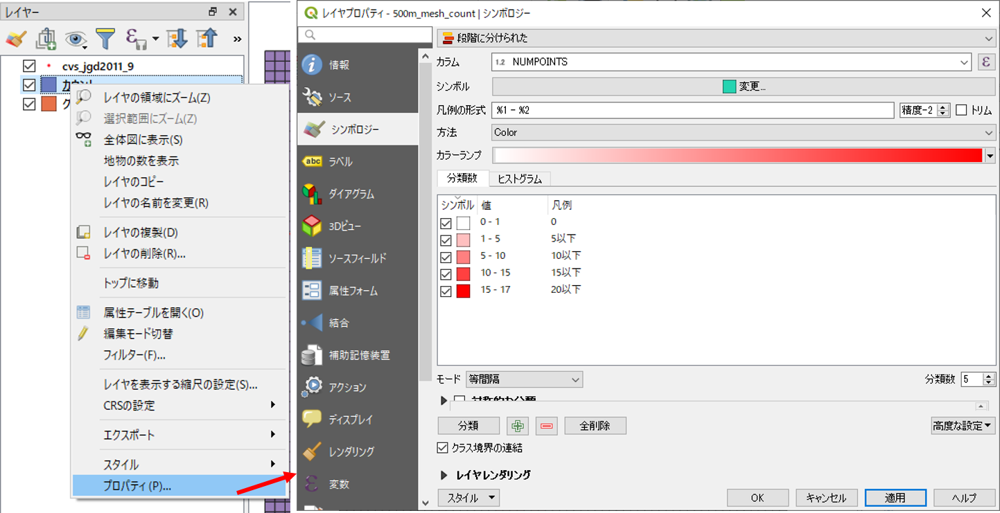

※属性値が、文字型になっていると、ポリゴン内のポイント数の段階づけの色分けができない。そのため、以下の手順で数値型へ変換する。メッシュの属性テーブルを開き、`フィールド計算機>新しいフィールドを作る`から、フィールド名（任意）を入力し、出力フィールドタイプをintegerにする。次に、`フィールドと値`からポイントを集計した列名を選択し、OKをクリックする。再計算が完了したのを確認し、編集モード（鉛筆マーク）をクリックし編集結果を保存する。　

以下のように、メッシュごとにコンビニの密度が可視化される。
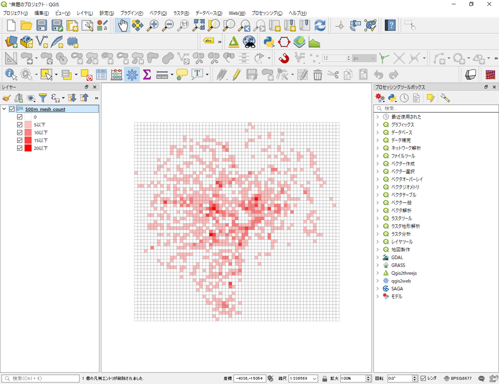

## 行政区内の点密度
　以下では、行政区画のポリゴンを利用し、行政区ごとの点密度を計算する手法について解説しています。tokyo23ku_jgd2011_9.shpを読み込み、`解析ツール＞ポリゴン内のポイント数`から、以下ののように設定し、行政区ごとのコンビニ数を計算する。
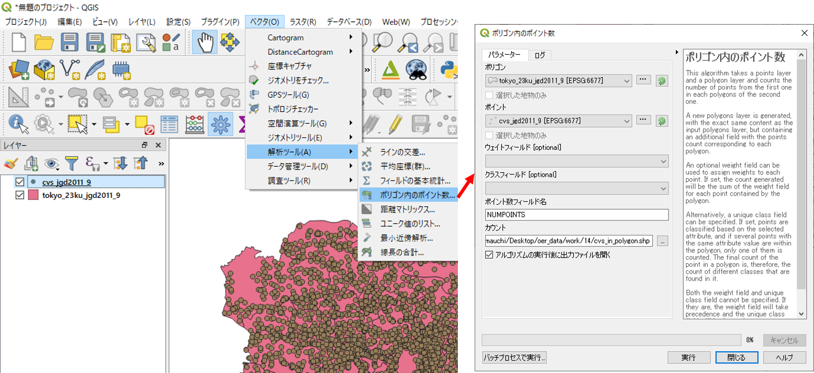

計算結果のスタイルをプロパティから設定する。
`プロパティ＞シンボロジーから`属性値に応じて、以下のようにポリゴンの表現を整える。
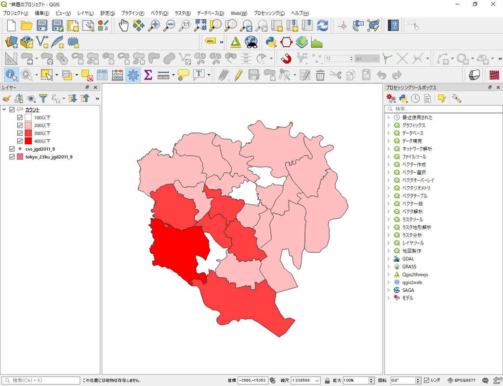

## カーネル密度推計
　カーネル密度分析は犯罪発生マップなどに用いられる手法で、カーネル関数を用いてポイントの分布密度を連続的な密度局面としてモデル化する手法です。QGISでは、`プロセッシング＞ツールボックス＞データ補間＞ヒートマップ（カーネル密度推定）`を選択し、以下のように実行します。
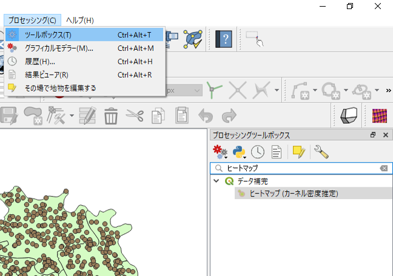

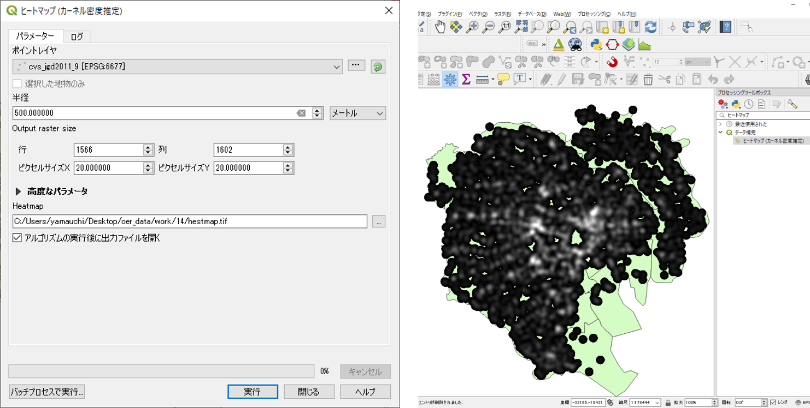

1. 入力ポイントレイヤにコンビニのデータを選択する。
2. 半径を500mとする。
3. **ピクセルサイズをそれぞれ、20とする。** ※ピクセルサイズが、小さすぎると処理時間が長くなるため十分に注意する。
4. 出力ラスタを設定し、実行をクリックする。

出力されたラスタの配色を、`プロパティ＞シンボロジーから`設定する。
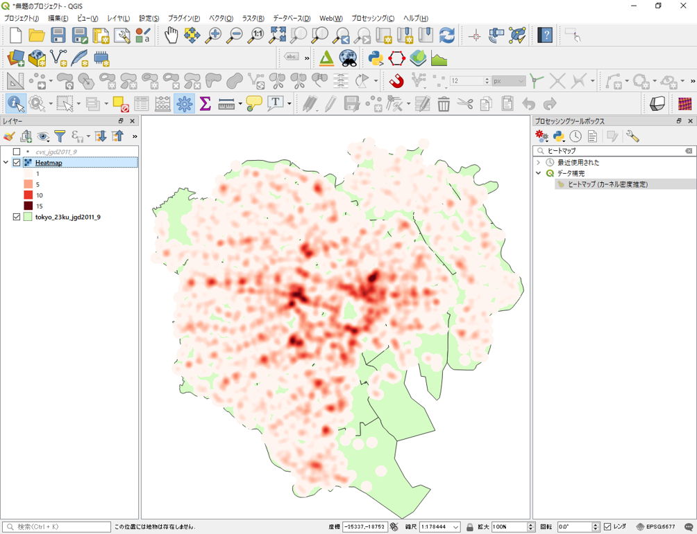

半径の値（バンド幅）を変えて出力し、同じ閾値で分類すると結果が変わることも確認しておくと良い。バンド幅を広くとったカーネルは広域的傾向把握に有効である。一方で、局地的な値への対応が難しくなる。そのため、バンド幅の設定には注意する必要がある。

[▲メニューへもどる]

## 数理的分析
　以下では、コンビニエンスストアのデータを用いて、ポイントデータの分布パターンを数理的に分析する手法について解説しています。またCrimeStatを使用した分析の手法についても解説しています。以下の手法の理論については、講義用教材の[地理情報科学教育用スライド（GIScスライド）]の4章が詳しいです。

## 平均最近隣距離法
`プロセッシング＞ツールボックス＞ベクタ解析＞最小近傍解析をクリックし`、cvs_jgd2011_9を選択して、実行をクリックする。
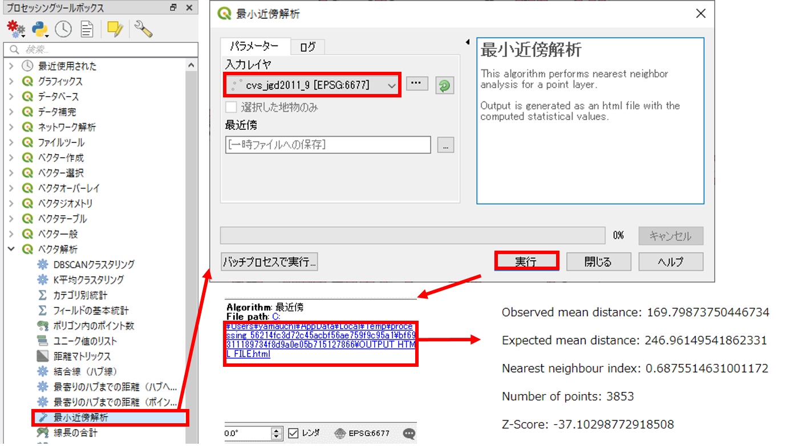

[▲メニューへもどる]

## 標準偏差距離と標準偏差楕円
### 標準偏差距離
`プラグイン＞プラグインの管理とインストール`からStandard Distanceをインストールする。`プロセッシング＞ツールボックス＞ Standard Distance`を選択し、cvs_jgd2011_9を指定し、実行する。
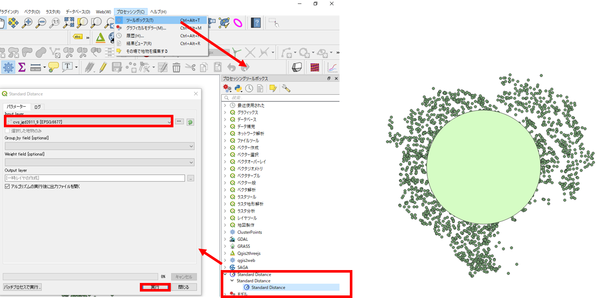

### 標準偏差楕円
`プラグイン＞プラグインの管理とインストール`からStandard Deviational Ellipseをインストールする。`ベクタ＞Standard Deviational Ellipse＞ Standard Deviational Ellipse `を選択し、cvs_jgd2011_9を指定し、実行する。
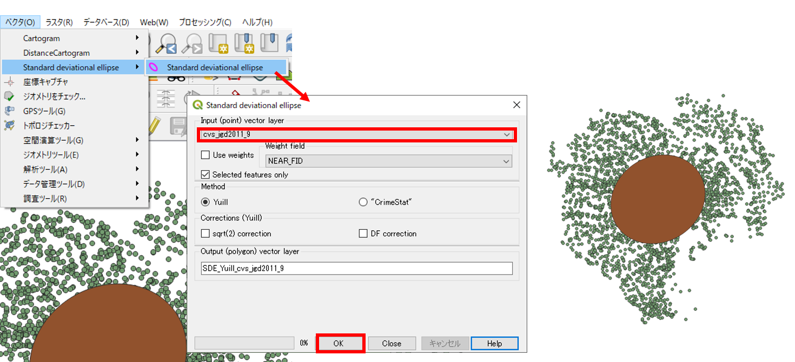

[▲メニューへもどる]

## K-関数法
以下では、CrimeStatを用いたK-関数法について解説しています。

### CrimeStatのインストール
[NIJのサイト]にアクセスし、CrimeStat IV をダウンロードし、解凍後に.exeファイルを起動する。
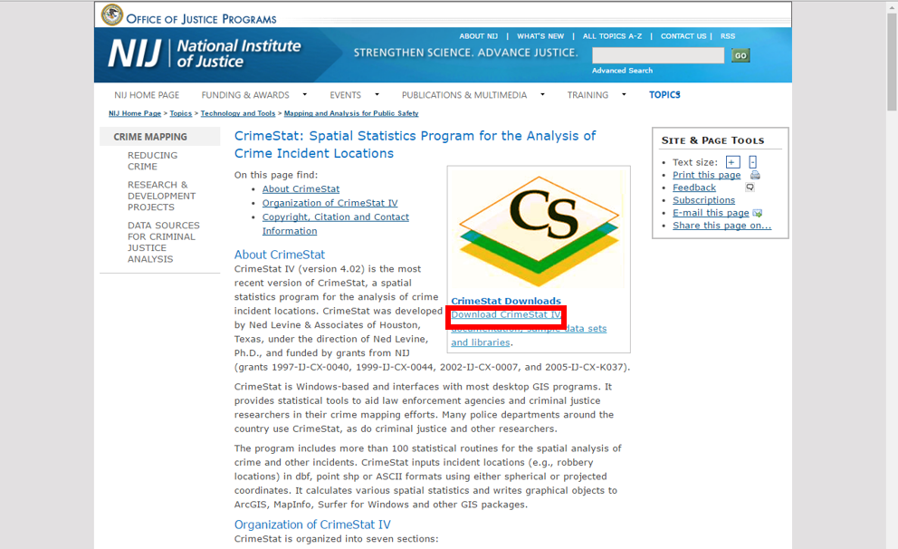

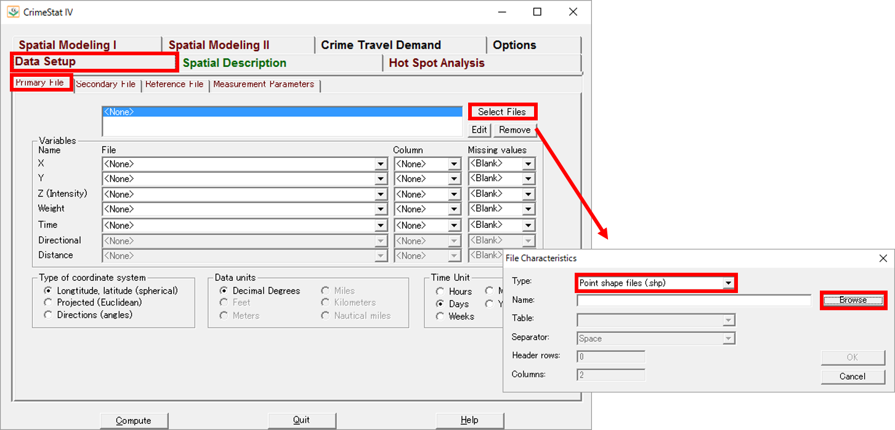
1. crimestat.exeをダブルクリックし、CrimeStatを起動する。
2. `Data Setup`タグから、分析したいデータを選択する。
3. `Data Setup > Primary File > Select Filesをクリックし`、typeで.shpを選択し、Browseからファイルを指定する。

`Colum`から、ポイントデータのX,Yを指定する。
projectedとMetersにそれぞれチェックをつける。

`Spatial description >  Distance Analysis`を選択する。`Ripley’s K statistic(Ripley K)`にチェックをいれUnitをMetersとし、Computeをクリックする。
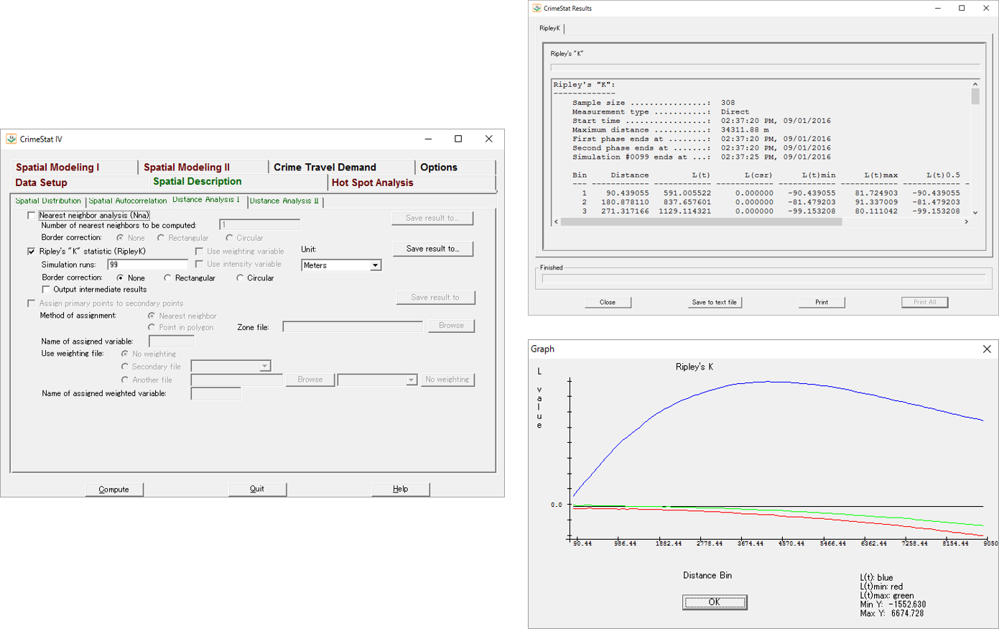

[▲メニューへもどる]

#### この教材の[課題ページ_点データの分析]へ進む

#### ライセンスに関する注意事項
本教材で利用しているキャプチャ画像の出典やクレジットについては、[その他のライセンスについて]よりご確認ください。

[▲メニューへもどる]:./14.md#Menu
[QGISユーザガイド]:http://docs.qgis.org/2.2/ja/docs/user_manual/plugins/plugins_heatmap.html
[NIJのサイト]:http://nij.gov/topics/technology/maps/Pages/crimestat.aspx
[利用規約]:../../policy.md
[その他のライセンスについて]:../license.md
[よくある質問とエラー]:../questions/questions.md

[GISの基本概念]:../00/00.md
[QGISビギナーズマニュアル]:../QGIS/QGIS.md
[GRASSビギナーズマニュアル]:../GRASS/GRASS.md
[リモートセンシングとその解析]:../06/06.md
[既存データの地図データと属性データ]:../07/07.md
[空間データ]:../08/08.md
[空間データベース]:../09/09.md
[空間データの統合・修正]:../10/10.md
[基本的な空間解析]:../11/11.md
[ネットワーク分析]:../12/12.md
[領域分析]:../13/13.md
[点データの分析]:../14/14.md
[ラスタデータの分析]:../15/15.md
[傾向面分析]:../16/16.md
[空間的自己相関]:../17/17.md
[空間補間]:../18/18.md
[空間相関分析]:../19/19.md
[空間分析におけるスケール]:../20/20.md
[視覚的伝達]:../21/21.md
[参加型GISと社会貢献]:../26/26.md

[地理院地図]:https://maps.gsi.go.jp
[e-Stat]:https://www.e-stat.go.jp/
[国土数値情報]:http://nlftp.mlit.go.jp/ksj/
[基盤地図情報]:http://www.gsi.go.jp/kiban/
[地理院タイル]:http://maps.gsi.go.jp/development/ichiran.html

[スライド_GISの基本概念]:https://github.com/gis-oer/gis-oer/raw/master/materials/00/00.pptx
[スライド_QGISビギナーズマニュアル]:https://github.com/gis-oer/gis-oer/raw/master/materials/QGIS/QGIS.pptx
[スライド_GRASSビギナーズマニュアル]:https://github.com/gis-oer/gis-oer/raw/master/materials/GRASS/GRASS.pptx
[スライド_リモートセンシングとその解析]:https://github.com/gis-oer/gis-oer/raw/master/materials/06/06.pptx
[スライド_既存データの地図データと属性データ]:https://github.com/gis-oer/gis-oer/raw/master/materials/07/07.pptx
[スライド_空間データ]:https://github.com/gis-oer/gis-oer/raw/master/materials/08/08.pptx
[スライド_空間データベース]:https://github.com/gis-oer/gis-oer/raw/master/materials/09/09.pptx
[スライド_空間データの統合・修正]:https://github.com/gis-oer/gis-oer/raw/master/materials/10/10.pptx
[スライド_基本的な空間解析]:https://github.com/gis-oer/gis-oer/raw/master/materials/11/11.pptx
[スライド_ネットワーク分析]:https://github.com/gis-oer/gis-oer/raw/master/materials/12/12.pptx
[スライド_領域分析]:https://github.com/gis-oer/gis-oer/raw/master/materials/13/13.pptx
[スライド_点データの分析]:https://github.com/gis-oer/gis-oer/raw/master/materials/14/14.pptx
[スライド_ラスタデータの分析]:https://github.com/gis-oer/gis-oer/raw/master/materials/15/15.pptx
[スライド_空間補間]:https://github.com/gis-oer/gis-oer/raw/master/materials/18/18.pptx
[スライド_視覚的伝達]:https://github.com/gis-oer/gis-oer/raw/master/materials/21/21.pptx
[スライド_参加型GISと社会貢献]:https://github.com/gis-oer/gis-oer/raw/master/materials/26/26.pptx

[課題ページ_QGISビギナーズマニュアル]:../tasks/t_qgis_entry.md
[課題ページ_GRASSビギナーズマニュアル]:../tasks/t_grass_entry.md
[課題ページ_リモートセンシングとその解析]:../tasks/t_06.md
[課題ページ_既存データの地図データと属性データ]:../tasks/t_07.md
[課題ページ_空間データ]:../tasks/t_08.md
[課題ページ_空間データベース]:../tasks/t_09.md
[課題ページ_空間データの統合・修正]:../tasks/t_10.md
[課題ページ_基本的な空間解析]:../tasks/t_11.md
[課題ページ_ネットワーク分析]:../tasks/t_12.md
[課題ページ_領域分析]:../tasks/t_13.md
[課題ページ_点データの分析]:../tasks/t_14.md
[課題ページ_ラスタデータの分析]:../tasks/t_15.md
[課題ページ_空間補間]:../tasks/t_18.md
[課題ページ_視覚的伝達]:../tasks/t_21.md
[課題ページ_参加型GISと社会貢献]:../tasks/t_26.md
<h2 style="background-color:#F8F5FD;text-align:center;">教材の利用に関するアンケート</h2>　本プロジェクトでは、教材の改良を目的とした任意アンケートを実施しています。ご協力いただける方は、<a href="https://customform.jp/form/input/14328/">アンケート</a>にお進みください。ご協力のほどよろしくお願いいたします。  ※ 本アンケートの成果は、教材の改良のほか、学会での発表等の研究目的でも利用します。また、本アンケートでは、個人が特定できるような質問は設けておりません。
