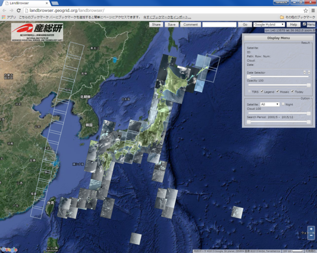
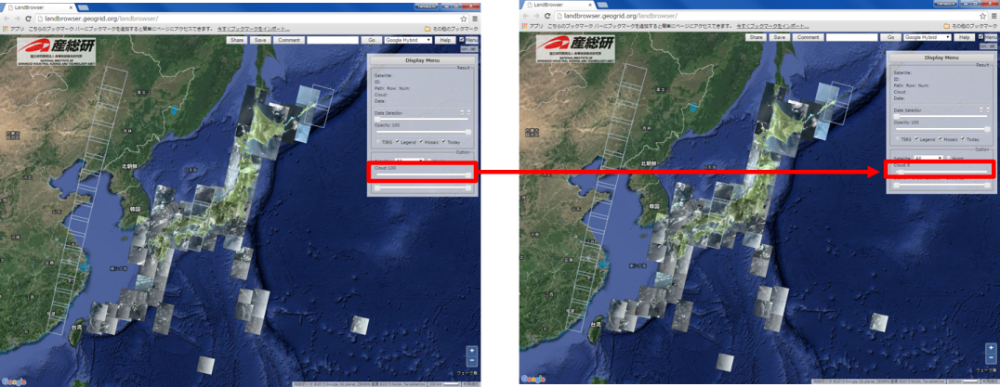
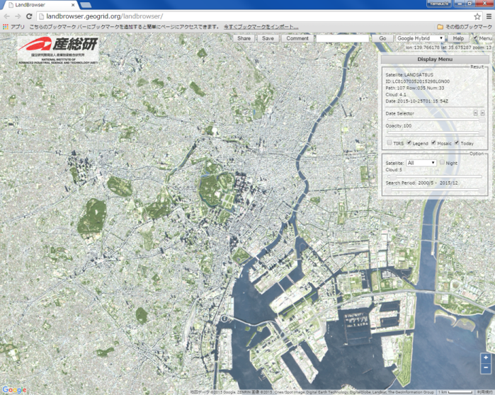
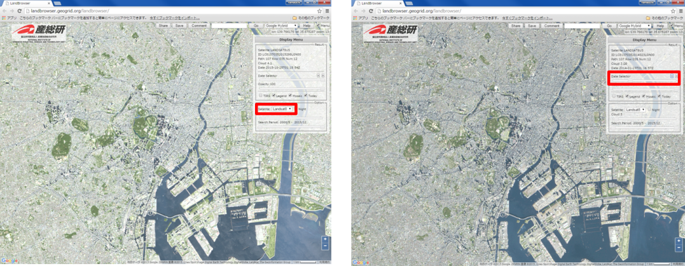
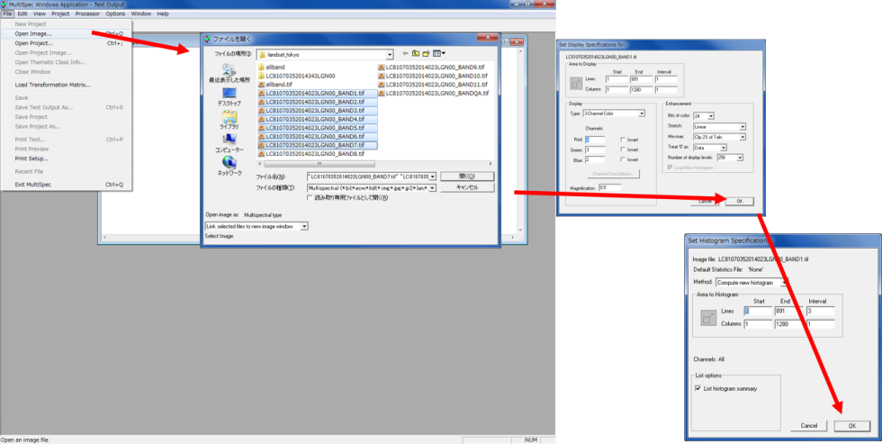
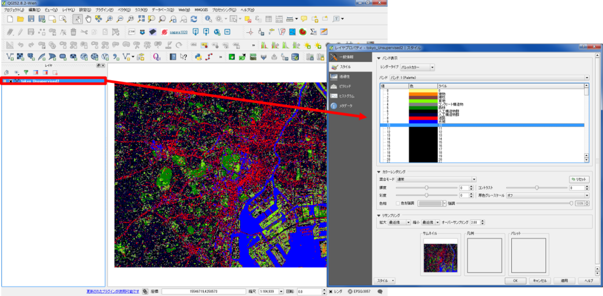
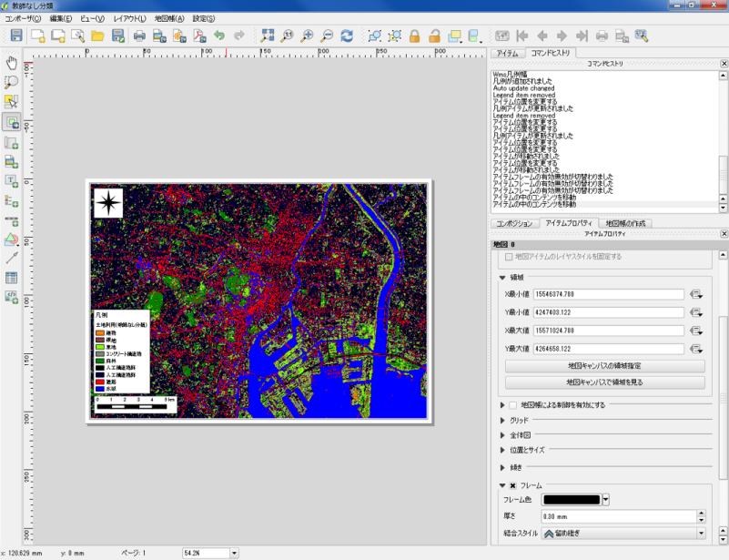

# リモートセンシングとその解析
　本教材は、「リモートセンシングとその解析」の実習用教材です。リモートセンシングは、対象物に触れずに離れた地点から対象を計測する技術を指します。宇宙から地球を観測する手法としてリモートセンシングが用いられ、地表の高さの計測、植物活性度の調査、天候予測など様々な分野で利用されています。リモートセンシングに関する詳しい説明は、[地理情報科学教育用スライド（GIScスライド）]の2章を参照してください。以下では、リモートセンシング入門として、衛星画像をダウンロードし、ソフトウェアを用いて画像分類等をする手法について解説しています。衛星画像の解析には、無償で利用できるMultiSpecを用いています（解析後のデータ表示など、一部でQGISを利用しています）。

　課題形式で使用する場合は、本教材を一読した後、課題ページへお進みください。GIS初学者は、本教材を進める前に[GISの基本概念]の教材を確認しておいてください。本教材を使用する際は、[利用規約]をご確認いただき、これらの条件に同意された場合にのみご利用下さい。

[地理情報科学教育用スライド（GIScスライド）]:http://curricula.csis.u-tokyo.ac.jp/slide/2.html

**Menu**
------
- [衛星画像データのダウンロード](#衛星画像データのダウンロード)
- [MultiSpecのインストール](#MultiSpecのインストール)
- [MultiSpecの起動](#MultiSpecの起動)
- [RGB合成](#RGB合成)
- [NDVI](#NDVI)
- [教師なし分類と教師つき分類](#教師なし分類と教師つき分類)

**使用データ**

- LANDSAT-8（2014-12-09T17:19:28Z）

**スライド教材**

　本教材は、スライド形式([スライド_リモートセンシングとその解析])としても、ご利用いただけます。

**データの出典**
本教材では、産総研LandBrowserをスクリーンショットとして利用しています。
"Image produced and distributed by AIST,  Source of Landsat 8 data: U.S. Geological Survey."

本教材では、産総研LandBrowserからダウンローしたLandsat8のデータを使用しています。
"The source data were downloaded from AIST's LandBrowser,
 (`https://landbrowser.airc.aist.go.jp/landbrowser/index.html`). Landsat 8 data courtesy of the U.S. Geological Survey."

----------

## 衛星画像データのダウンロード
以下は、産業総合研究所の[LandBrowser]を用いて、衛星画像をダウンロードする手法について解説しています。

産業総合研究所の[LandBrowser]にアクセスし、右上の「Display Menu」を確認する。「Display Menu」では、ダウンロードする画像の絞り込みができる。

雲の量をcloud:5～10（雲の量）程度に設定する（今回は土地利用の分類を行うため、雲の多い画像は使用しない）。

ダウンロードする画像の範囲を拡大する。

今回は、Landsat8の衛星画像をダウンロードするため、SatelliteからLandsat8を選択し、Date Selectorから画像を探す。

Saveをクリックし画像をダウンロードする。今回は、WCSのBand1～Band11までをダウンロードする。

[▲メニューへもどる]

## MultiSpecのインストール
衛星画像を解析するためのソフトウェアであるMultiSpecをダウンロードする。[MultiSpecの公式サイト]にアクセスし、ダウンロード後にファイルを解凍する。

[▲メニューへもどる]

## MultiSpecの起動
MultiSpecW32.exeをダブルクリックし、 MultiSpecを起動する。
`File>Open Image`から画像を読み込む。

[▲メニューへもどる]

## RGB合成
　以下では、LANDSATの異なるバンドの画像を用いて、カラーコンポジットを作成し、画像を視覚的に表現する手法について解説しています。バンドを組み合わせることで、フォールスカラー、トゥルースカラー、ナチュラルカラーのカラーコンポジットを作成する手法の解説をしています。

`Processor>Display image…`からR5,G4,B3を入力し、フォールスカラーを表示する。

同じ方法で、左：トゥルースカラー(R4,G3,B2)と右：ナチュラルカラー(R4,G5,B3)を設定する。

[▲メニューへもどる]

## NDVI
　以下では、LANDSATの衛星画像からNDVI（Normalized Difference Vegetation Index）を算出する手法について解説しています。NDVIを算出することで、植物の分布量や活性量を知ることができます。

ProcesorからReformatを選択し、`Open Image File Format`をクリックする。`Transform Data`にチェックを入れ、`New Channel from General algebraic Transformation`をチェックする。NDVIを求める式を入力し、OKをクリックし、保存する。

※NDVI として計算される値は0 から200 の間の値になる。

先ほど計算したファイルを開き、Typeを選択し、分類数を設定し、OKをクリックする。

左下のカラーパレットより、MODIS NDVI を選択する。
ＮＤＶＩが表示できた。緑の濃い部分が植生活性度高い地域となる。

[▲メニューへもどる]

## 教師なし分類と教示つき分類
　LANDSATの画像を画像分類することによって、土地被覆図の作成ができます。以下では、教師なし分類と教師つき分類を行い土地被覆図を作成する手法について解説しています。

### 教師なし分類
`Processor > Open Image File Format`を選択する。
ChannelsをAllにして、OKをクリックする（コンポジットバンドの作成）。

出力したデータを読み込み、`Processor > Cluster`を選択する。
ISODATAにチェックを入れ、分類数（任意で指定する）を10にして、OKをクリックする。必要項目にチェックをいれ、OKをクリックすると分類が開始する。

画像をFileから読み込みなおすと、右のように分類つきで表示される。
凡例の色をクリックすると、色が変更でき、名前をクリックすると名前が変更できる。

空中写真や現地調査をもとに土地利用の分類を行う。shiftキーをおしながら、凡例の色をクリックすると選択した色が消える。

今回は、水域、道路、森林、草地、裸地、人工構造物地域などに分類する。色の指定ができたら、`File > Save image To GeoTIFF　As`をクリックする。

QGISで画像を読み込み、[QGISビギナーズマニュアル]を参考に凡例などを設定し、地図のレイアウトを行う。

ファイルから新規プリントコンポーザを開き、レイアウトを整える。コンポーザー名は任意で入力する。

[▲メニューへもどる]

### 教師つき分類
ProcessorからStatisticsを選択する。
Channels to UseをAllにして、OKをクリックする。
右端のようなウインドウが表示されるので、Polygon Enterにチェックを入れる。

画像からトレーニングエリアを抽出する。
抽出ができたら、Add to Listをクリックし、Class名などを入力する。
同じ要領で複数のトレーニングエリアを作成後、Update Project Statsをクリックする。

ProcessorからClassifyを選択し、最尤法（Maximum Likelihood）で分類を行う。
右上のように設定し、OKをクリックし、保存先を指定する。

画像をFileから読み込みなおすと、右のように分類つきで表示される。
凡例の色をクリックすると、色が変更でき、名前をクリックすると名前が変更できる。
色の指定ができたら、FileからSave image To GeoTIFF　Asをクリックする。

QGISを開き、画像を読み込み、プロパティから凡例の設定を行う。
新規プリントコンポーザを開き、レイアウトを整える。

[▲メニューへもどる]

#### この教材の[課題ページ_リモートセンシングとその解析]へ進む

#### ライセンスに関する注意事項
本教材で利用しているキャプチャ画像の出典やクレジットについては、[その他のライセンスについて]よりご確認ください。

[▲メニューへもどる]:./06.md#Menu
[MultiSpecの公式サイト]:https://engineering.purdue.edu/~biehl/MultiSpec/
[LandBrowser]:http://landbrowser.geogrid.org/landbrowser/
[利用規約]:../../policy.md
[その他のライセンスについて]:../license.md
[よくある質問とエラー]:../questions/questions.md

[GISの基本概念]:../00/00.md
[QGISビギナーズマニュアル]:../QGIS/QGIS.md
[GRASSビギナーズマニュアル]:../GRASS/GRASS.md
[リモートセンシングとその解析]:../06/06.md
[既存データの地図データと属性データ]:../07/07.md
[空間データ]:../08/08.md
[空間データベース]:../09/09.md
[空間データの統合・修正]:../10/10.md
[基本的な空間解析]:../11/11.md
[ネットワーク分析]:../12/12.md
[領域分析]:../13/13.md
[点データの分析]:../14/14.md
[ラスタデータの分析]:../15/15.md
[傾向面分析]:../16/16.md
[空間的自己相関]:../17/17.md
[空間補間]:../18/18.md
[空間相関分析]:../19/19.md
[空間分析におけるスケール]:../20/20.md
[視覚的伝達]:../21/21.md
[参加型GISと社会貢献]:../26/26.md

[地理院地図]:https://maps.gsi.go.jp
[e-Stat]:https://www.e-stat.go.jp/
[国土数値情報]:http://nlftp.mlit.go.jp/ksj/
[基盤地図情報]:http://www.gsi.go.jp/kiban/
[地理院タイル]:http://maps.gsi.go.jp/development/ichiran.html

[スライド_GISの基本概念]:https://github.com/gis-oer/gis-oer/raw/master/materials/00/00.pptx
[スライド_QGISビギナーズマニュアル]:https://github.com/gis-oer/gis-oer/raw/master/materials/QGIS/QGIS.pptx
[スライド_GRASSビギナーズマニュアル]:https://github.com/gis-oer/gis-oer/raw/master/materials/GRASS/GRASS.pptx
[スライド_リモートセンシングとその解析]:https://github.com/gis-oer/gis-oer/raw/master/materials/06/06.pptx
[スライド_既存データの地図データと属性データ]:https://github.com/gis-oer/gis-oer/raw/master/materials/07/07.pptx
[スライド_空間データ]:https://github.com/gis-oer/gis-oer/raw/master/materials/08/08.pptx
[スライド_空間データベース]:https://github.com/gis-oer/gis-oer/raw/master/materials/09/09.pptx
[スライド_空間データの統合・修正]:https://github.com/gis-oer/gis-oer/raw/master/materials/10/10.pptx
[スライド_基本的な空間解析]:https://github.com/gis-oer/gis-oer/raw/master/materials/11/11.pptx
[スライド_ネットワーク分析]:https://github.com/gis-oer/gis-oer/raw/master/materials/12/12.pptx
[スライド_領域分析]:https://github.com/gis-oer/gis-oer/raw/master/materials/13/13.pptx
[スライド_点データの分析]:https://github.com/gis-oer/gis-oer/raw/master/materials/14/14.pptx
[スライド_ラスタデータの分析]:https://github.com/gis-oer/gis-oer/raw/master/materials/15/15.pptx
[スライド_空間補間]:https://github.com/gis-oer/gis-oer/raw/master/materials/18/18.pptx
[スライド_視覚的伝達]:https://github.com/gis-oer/gis-oer/raw/master/materials/21/21.pptx
[スライド_参加型GISと社会貢献]:https://github.com/gis-oer/gis-oer/raw/master/materials/26/26.pptx

[課題ページ_QGISビギナーズマニュアル]:../tasks/t_qgis_entry.md
[課題ページ_GRASSビギナーズマニュアル]:../tasks/t_grass_entry.md
[課題ページ_リモートセンシングとその解析]:../tasks/t_06.md
[課題ページ_既存データの地図データと属性データ]:../tasks/t_07.md
[課題ページ_空間データ]:../tasks/t_08.md
[課題ページ_空間データベース]:../tasks/t_09.md
[課題ページ_空間データの統合・修正]:../tasks/t_10.md
[課題ページ_基本的な空間解析]:../tasks/t_11.md
[課題ページ_ネットワーク分析]:../tasks/t_12.md
[課題ページ_基本的な空間解析]:../tasks/t_13.md
[課題ページ_点データの分析]:../tasks/t_14.md
[課題ページ_ラスタデータの分析]:../tasks/t_15.md
[課題ページ_空間補間]:../tasks/t_18.md
[課題ページ_視覚的伝達]:../tasks/t_21.md
[課題ページ_参加型GISと社会貢献]:../tasks/t_26.md
<h2 style="background-color:#F8F5FD;text-align:center;">教材の利用に関するアンケート</h2>　本プロジェクトでは、教材の改良を目的とした任意アンケートを実施しています。ご協力いただける方は、<a href="https://customform.jp/form/input/14328/">アンケート</a>にお進みください。ご協力のほどよろしくお願いいたします。  ※ 本アンケートの成果は、教材の改良のほか、学会での発表等の研究目的でも利用します。また、本アンケートでは、個人が特定できるような質問は設けておりません。
