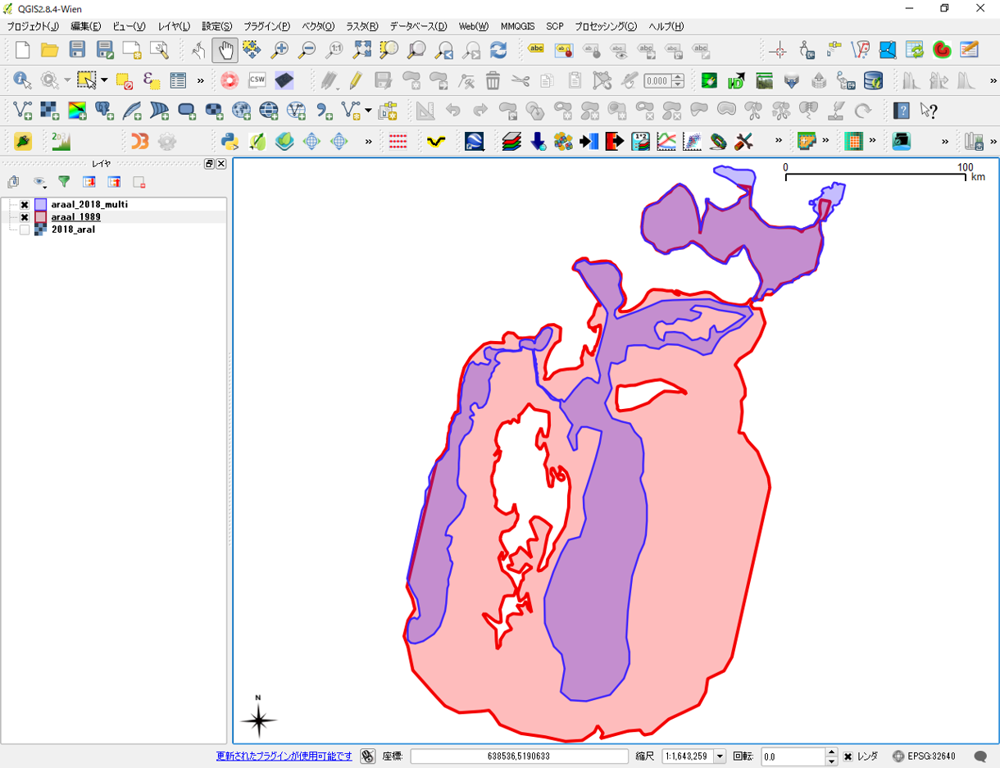

# 衛星画像を用いた環境変化地図の作成（第8～9回）
　この教材では、衛星画像を用いてアラル海の経年変化を可視化する手法について紹介します。以下に示す手順を参考に学習例と同じ図を作成してください。GIS入門者は、この学習を始める前に、[GISの基本概念]と[QGISビギナーズマニュアル]を利用し、GISの基礎をマスターしておくことを推奨します。この教材は、主に実習を対象としているため、用語や理論に関する解説を省略している箇所があります。各実習にあたっては、参照教材の上段にある講義用教材（GIScスライド）を一読してから学習することを推奨します。

## 学習目標
- 衛星画像のダウンロード手法を理解する
- 衛星画像のバンド帯を理解する
- 空間データの作成手法を理解する

## 実習1：MultiSpecと衛星画像のダウンロード（第8回）
　この実習では、以下の図を作成する手法について、GIS実習オープン教材を援用して解説します。学習例のデータは、任意の地域に置き換えて学習しても構いません。

### 手順
1. [リモートセンシングとその解析]を参考に、解析用ソフトウェアのMultiSpecをインストールする
2. [リモートセンシングとその解析]を参考に、産総研のLandBrowserを使って、アラル海周辺の衛星画像をダウンロードする（2時期）。

## 実習2：衛星画像のRGB合成とベクトルデータの作成（第9回）

### 手順
1. [リモートセンシングとその解析]を参考に、RGB合成を行い、Trueカラーで出力する。古いランドサットはバンド帯の指定が1ずつずれるため注意する（Trueカラー: 古R4G3B2→新R3G2B1）。
2. RGB合成した画像を出力する（1区画ごとにした場合は、[空間データの統合・修正]の教材を参考にQGISでマージする）
3. 出力した画像をQGISで読み込み、[空間データの統合・修正]の教材を参考に、沿岸をなぞるようにトレースしてポリゴンを作成する。
4. 地図をレイアウトする。

### 動画で学ぶ
　上記の手順を動画にまとめています。GISの操作に自信がない方におすすめの学習法です。動画はYoutubeで公開しているため、画面の大きさや再生速度等を調節して、ご利用ください。

準備中

[動画が再生されない場合はこちら]()
> この動画は、GIS実習オープン教材の内容を援用して作成したものです。教材の更新が動画内容の更新よりも優先されるため、紹介するサイトのレイアウト等が異なる箇所は、適宜GIS実習オープン教材を参照してください。動画内では、第3者の著作物を引用という形で使用しています。著作者からの異議申し立てがあった場合は、速やかに当該部分を削除します。
