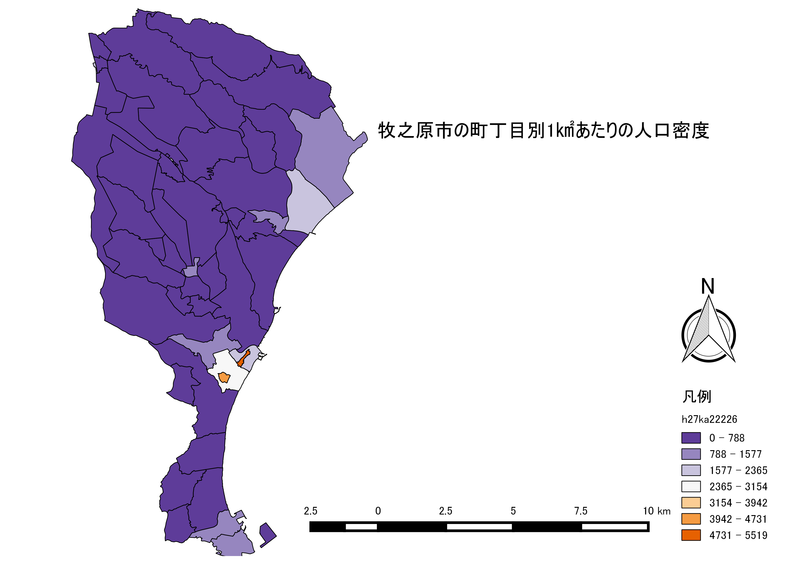
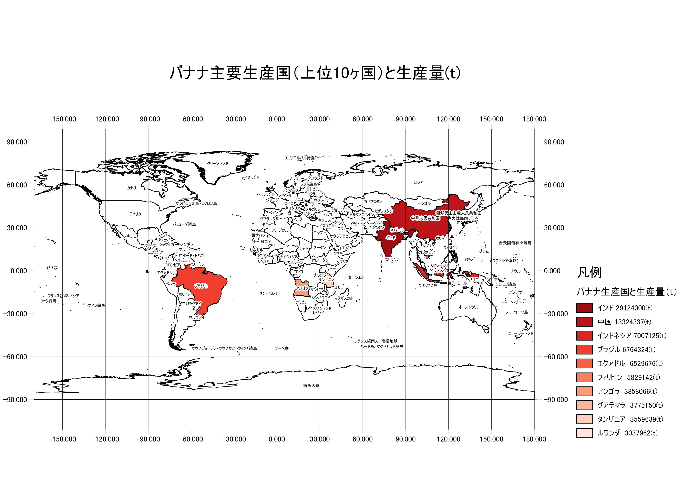
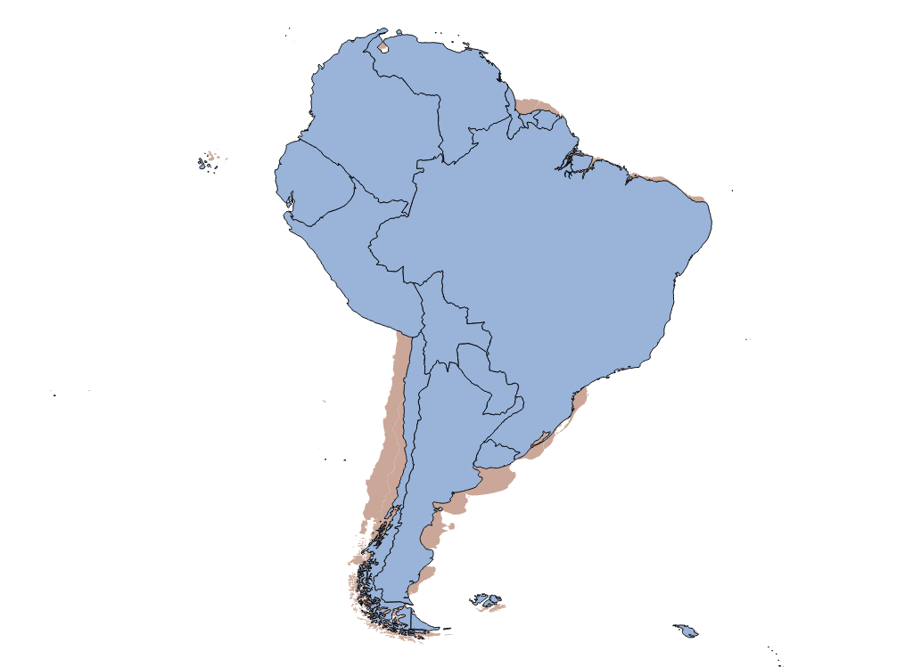

# 日本と世界の統計情報の可視化（第2回～4回）
　この教材では、統計情報を地図と組み合わせて可視化する手法について紹介します。以下に示す手順を参考に学習例と同じ図を作成してください。GIS入門者は、この学習を始める前に、[GISの基本概念]と[QGISビギナーズマニュアル]を利用し、GISの基礎をマスターしておくことを推奨します。この教材は、主に実習を対象としているため、用語や理論に関する解説を省略している箇所があります。各実習にあたっては、参照教材の上段にある講義用教材（GIScスライド）を一読してから学習することを推奨します。

## 学習目標
- GISデータのダウンロード手法を理解する
- 統計情報を境界データを結合して表示す手法を理解する
- 階級区分図やカルトグラムのような地図表現の技法を理解する

## 実習1 : 静岡県牧之原市の町丁目ごとの高齢者の人口密度を算出する(第2回)
　この実習では、以下の図を作成する手法について、GIS実習オープン教材を援用して解説します。学習例のデータは、任意の地域に置き換えて学習しても構いません。

### 手順
1. [既存データの地図データと属性データ]の教材を参考に、ベースとなる境界データを[e-stat]から入手する。ここでは牧之原市（世界測地系平面直角座標系　シェープファイル ）をダウンロードする。
2. [視覚的伝達]の教材を参考に、ダウンロードしたデータの人口と面積をもとに人口密度（1㎢あたり）を計算する。
3. 算出した人口密度をもとに、階級区分を行い、それに応じて視覚化する。
4. [QGISビギナーズマニュアル]を参考に、地図をレイアウトする。

### 動画で学ぶ
　上記の手順を動画にまとめています。GISの操作に自信がない方におすすめの学習法です。動画はYoutubeで公開しているため、画面の大きさや再生速度等を調節して、ご利用ください。

<iframe width="560" height="315" src="https://www.youtube.com/embed/ACRC1SkGNSI" frameborder="0" allow="autoplay; encrypted-media" allowfullscreen></iframe>

[動画が再生されない場合はこちら](https://www.youtube.com/watch?v=ACRC1SkGNSI)

> この動画は、GIS実習オープン教材の内容を援用して作成したものです。教材の更新が動画内容の更新よりも優先されるため、紹介するサイトのレイアウト等が異なる箇所は、適宜GIS実習オープン教材を参照してください。動画内では、第3者の著作物を引用という形で使用しています。著作者からの異議申し立てがあった場合は、速やかに当該部分を削除します。

## 実習2:世界の境界データを用いた統計情報の可視化(第3回)
　この実習では、以下の図を作成する手法について、GIS実習オープン教材を援用して解説します。学習例のデータは、任意の地域に置き換えて学習しても構いません。

### 手順
1. [実習データ](https://github.com/gis-oer/datasets/blob/master/world_ja.zip)をダウンロードする。
2. 属性―テーブルを開き、編集モード＞新規にフィールドを作成する。
3. [外務省のホームページ:バナナの生産量の多い国](https://www.mofa.go.jp/mofaj/kids/ranking/banana.html)を参考に、属性情報を入力する(生産量は(t)とする)。ランキングに該当しない国は0とする。
4. [QGISビギナーズマニュアル]を参考に、地図をレイアウトする。緯線と経線を表示したい場合は、[よくある質問とエラー：緯線と経線の作成](../questions/questions.md)を参照。

### 動画で学ぶ
　上記の手順を動画にまとめています。GISの操作に自信がない方におすすめの学習法です。動画はYoutubeで公開しているため、画面の大きさや再生速度等を調節して、ご利用ください。

<iframe width="560" height="315" src="https://www.youtube.com/embed/ljT_Cxy56pg" frameborder="0" allow="autoplay; encrypted-media"
 allowfullscreen></iframe>

[動画が再生されない場合はこちら](https://www.youtube.com/watch?v=ljT_Cxy56pg)
> この動画は、GIS実習オープン教材の内容を援用して作成したものです。教材の更新が動画内容の更新よりも優先されるため、紹介するサイトのレイアウト等が異なる箇所は、適宜GIS実習オープン教材を参照してください。動画内では、第3者の著作物を引用という形で使用しています。著作者からの異議申し立てがあった場合は、速やかに当該部分を削除します。

## 実習3 : カルトグラムの作成（第4回)
　この実習では属性値を用いて、面積を変形させた以下のようなカルトグラムを作成する手法について、GIS実習オープン教材を援用して解説します。学習例のデータは、任意の地域に置き換えて学習しても構いません。

 ### 完成例

 

 ### 手順
 1. 実習2の課題データを用いて南米大陸を選択して書き出す
 2. 実習2を参考に、[外務省　中南米の国々](https://www.mofa.go.jp/mofaj/kids/ichiran/i_latinamerica.html)を参考に各国の人口を調べ、属性値を入力する。
 3. [視覚的伝達]の教材を参考に、カルトグラム（面積変形地図）を作成する。
