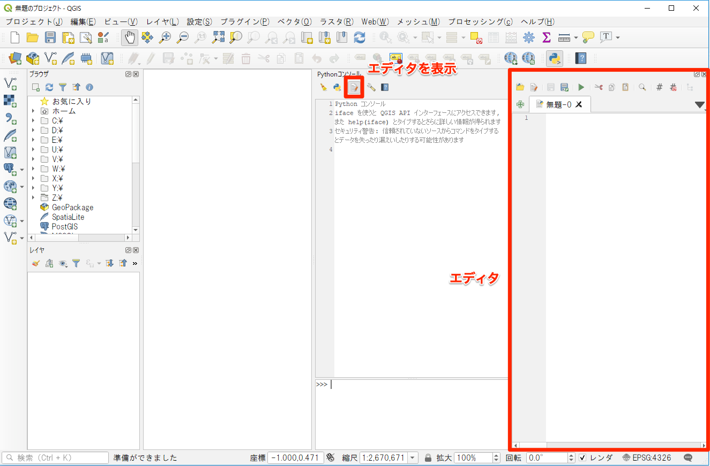
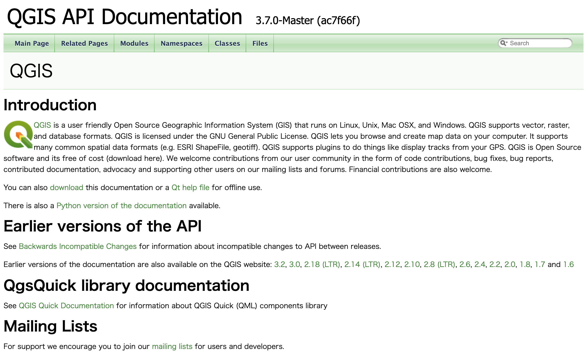
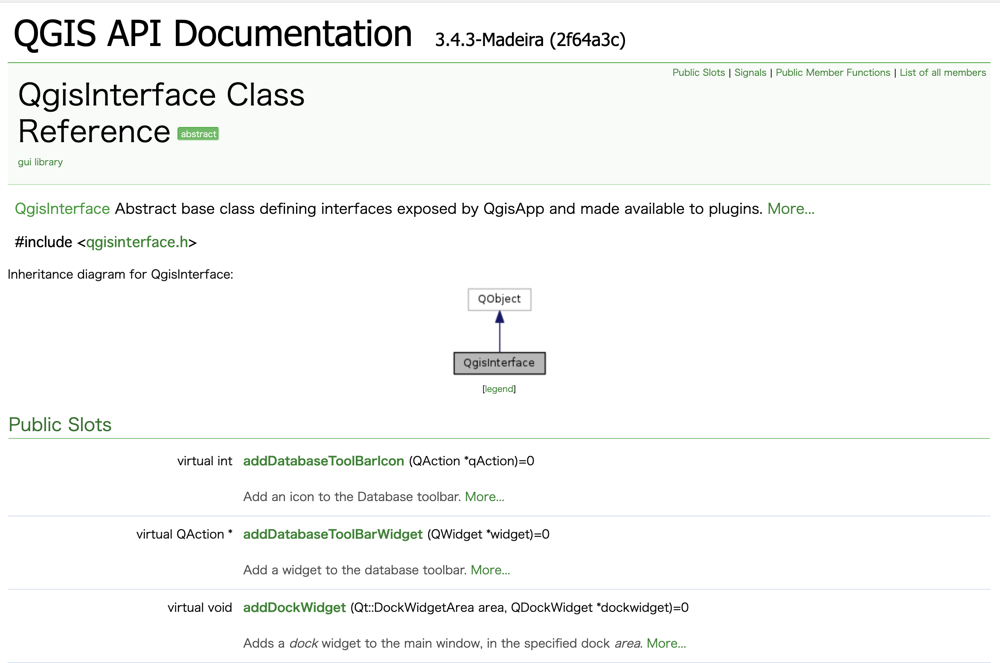

# QGISでのPython入門

**Menu**
------
- [エディタの表示と実行](#エディタの表示と実行)
- [Python入門2](#Python入門2)
- [QGISで用意されているクラス](#QGISで用意されているクラス)

## <a name="エディタの表示と実行"></a>エディタの表示と実行
前回の教材に引き続きPythonコンソールから操作を行います。ただし、入力する内容が長くなってくると、1行入力してはReturnキーを押して確認の流れでは、効率が悪くなってきます。
数行に渡る入力についてはエディタが用意されていますので、こちらを使用しましょう。
`Pythonコンソール > エディタの表示`をクリックするとエディタが表示されます。エディタはコンソールの入力領域と異なり、書いたコードを保存することができます。

エディタに入力した内容を実行するには、エディタ上部のツールバーから`スクリプト実行`(緑の矢印)をクリックします。



ただし、この後の例文については入力領域に入力したイメージで、下記のように記載されています。
```
>>>x = 130
>>>if x < 130:
... print('small')
...elif x == 130:
... print('equal')
...else:
... print('big')
equal
```

エディタ上で入力した場合は、下記のイメージになりますので、随時読み替えてください。
```
x = 130
if x < 130:
  print('small')
elif x == 130:
  print('equal')
else:
  print('big')
```

## <a name="Python入門2"></a>Python入門2
条件分岐や繰り返し処理、関数、クラスの作成・使用までを試しましょう。

### 条件分岐
他の言語と同様のif文が用意されています。インデント(字下げ)には気をつけてください。
ある条件で実行される処理は、同じインデントで揃えます。

```
条件文
  実行する処理1
  実行する処理2
```
```
>>>x = 130
>>>if x < 130:
... print('small')
...elif x == 130:
... print('equal')
...else:
... print('big')
equal
```

### ループ処理

#### for文

Pythonのfor文が他の言語と違うところとして、任意のシーケンス(リスト、文字列)にわたって反復を行います。

```
>>>a = ['QGIS', 3, 4]
>>>for x in a:
... print(x)
QGIS
3
4
```

複数列にわたって反復を行う場合は、`range()`を使用します。`range(10)`は0から始まり、0から始まる10個の値からなるリストを生成します。開始数値を指定したり、増加数(減少数)を指定することも出来ます。

```
>>>range(10)
range(0, 10)
>>>for i in range(2,10,2):
... print(i)
2
4
6
8
```

#### while文
while文の使用方法は他の言語と変わりません。指定の条件を満たす間、処理を繰り返します。
```
>>>cnt = 0
>>>while cnt < 10:
... print(cnt)
... cnt += 1
0
1
2
3
4
5
6
7
8
9
```

### 関数
#### 関数を利用する
for文ですでに出てきていますが、`range()`は標準で用意されている組み込み関数です。関数を使用する場合は、関数名に続き`( )`丸括弧で引き数を添えて関数を呼び出します。以下は引き数として文字列を渡すと、文字数を返す`len()`の例になります。

```
>>> len('QGIS')
4
```

#### 関数を作る
関数の定義はdefの後に関数名と引き数を丸括弧で囲んで行います。関数の処理本体は、行を変えてインデントを揃えて記述します。
Pythonコンソールの入力領域で入力する場合は、`print(a)`の次の行は空行(Returnキーを押すだけ)を入力して、関数内の処理の記述を終えます。
```
>>>def test(a):
...  print(a)
...
>>>test(10)
10
```

関数に戻り値がある場合は、処理本体内で`return`の後に記述します。
```
>>>def test(a):
...  return a+10
...
>>>b = test(10)
>>>b
20
```

### クラス
いくつかの関数と変数をまとめたクラスを定義できます。
クラスの定義は`class`の後にクラス名を記述して行います。クラスの内部には関数定義、クラス変数を記述します。
定義されたクラスは、`a = クラス名()`のようにインスタンスの生成を行った上で使用します。

```
>>>class test:
...  def output(self):
...    print(10)
...
>>>a = test()
>>>a.output()
10
```

インスタンス生成時に実行される特別なメソッドとして`__init__()`を定義しておくことが出来ます。
また、クラス中に定義されている関数の第一引数には`self`が指定されています。`self`を指定しておくと、各関数内から自身のインスタンスへのアクセスが可能となります。
```
>>>class test():
...  def __init__(self):
...    self.a = 10
...  def output(self, c):
...    print(self.a + c)
...
>>>b = test()
>>>b.output(10)
20
```

## <a name="QGIS API"></a>QGISで用意されているクラス
### QgsInterfaceクラス(iface)

QGISを起動して、Pythonコンソールを立ちあげて下さい。出力領域に下記メッセージが最初に表示されます。

```
`iface`を使うとQGIS API インタフェースにアクセスできます。また`help(iface)`とタイプするとさらに詳しい情報が得られます
```

`iface`は`QgisInterface`クラスのインスタンスになります。`QgisInterface`クラスは、Pythonコンソールや、プラグインからQGISアプリケーションにアクセスする際に窓口になるクラスです。ここから、各GUIパーツ、読み込み済みのレイヤ等にアクセスすることになります。

クラスの定義はドキュメントが公開されていますので、確認しましょう。

[QGIS API Documentation](http://www.qgis.org/api/index.html)

ドキュメントのバージョンには注意してください。”QGIS API Documentation”の対応するバージョンが書かれています。最新(開発版)のドキュメントになっていますので、対応するバージョンを選択して参照するようにしてください。

`QgisInterface`クラスの定義を見てみましょう。3.4版のドキュメントはこちらになります。
https://qgis.org/api/3.4/classQgisInterface.html



<h2 style="background-color:#F8F5FD;text-align:center;">教材の利用に関するアンケート</h2>　本プロジェクトでは、教材の改良を目的とした任意アンケートを実施しています。ご協力いただける方は、<a href="https://docs.google.com/forms/d/1r8RTFK3CPo4xNM6SdOEsAtdA0CrChD6KPVVU9kRxWRs/">アンケート</a>にお進みください。ご協力のほどよろしくお願いいたします。<br><br>※ 本アンケートの成果は、教材の改良のほか、学会での発表等の研究目的でも利用します。
