# プラグイン開発1
QGISの拡張機能であるプラグインの開発入門というテーマで、QGISで利用できるプラグインの開発手法について、この章と次の章で解説します。

**Menu**
-----
- [プラグインの基本構成](#プラグインの基本構成)
- [プラグインビルダー](#プラグインビルダー)
- [ディレクトリの確認](#ディレクトリの確認)
- [resouces.pyの作成](#resouces.pyの作成)
- [作成したプラグインの実行](#作成したプラグインの実行)

## <a name="プラグインの基本構成"></a>プラグインの基本構成
この章ではPythonコンソールから一旦離れて、Pluginに必要なファイルをテキストエディタを使用して編集していきます。
QGISの起動時に読み込まれるpythonプラグインは、
- QGISインストールディレクトリ/python/plugins
- ユーザーのホームディレクトリ/AppData\Roaming\QGIS\QGIS3\profiles\default\python\plugins
のどちらかに入れておきます。
通常、オリジナルのプラグインを作成した場合は、後者に配置することになります。Windowsを想定しますが、
- C:\Users\ユーザー名\AppData\Roaming\QGIS\QGIS3\profiles\default\python\plugins\PluginTest
というような形で、プラグインごとのディレクトリを作成することになります。
QGISはpluginsディレクトリ内の各ディレクトリを見ていき、`metadata.txt`というファイルからプラグインの情報を読み取ります。また、各プラグインのQGISへの追加は、`__init__.py`
から行われます。`__init__.py`内には、処理本体が記述されたクラスを返す関数を記載しておきます。通常、処理本体は別なファイルに記述する方わかりやすいので、名前は任意で良いですが、最低もう１ファイル作成することになります。

## <a name="プラグインビルダー"></a>プラグインビルダー
プラグインに必要なファイルを個別に用意していくことも可能ですが、Plugin Builder 3プラグインを使用すると、最低限必要な内容を揃えてくれるので便利です。
プラグインの追加はQGISのメニューバーから`プラグイン > プラグインの管理とインストール...`を選択します。

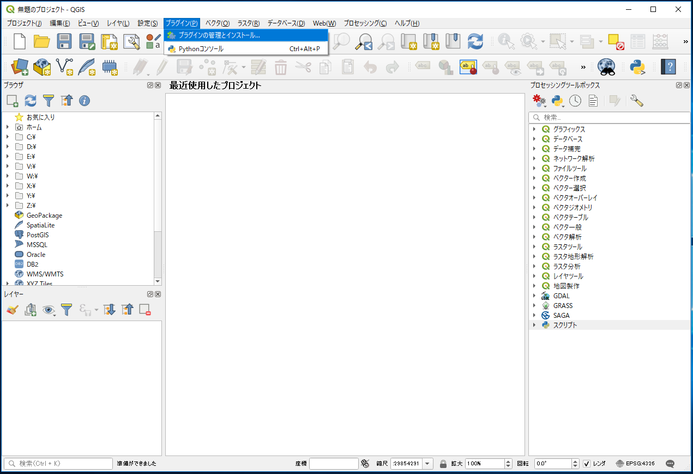

Plugin Builder 3を選択し、インストールしましょう。

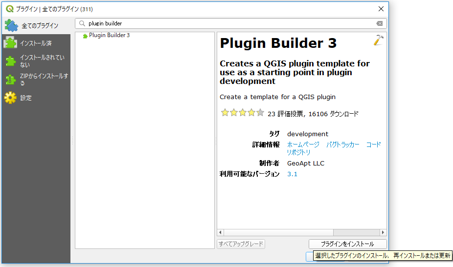

インストールが終了したら、早速Plugin Builder 3を起動しましょう。

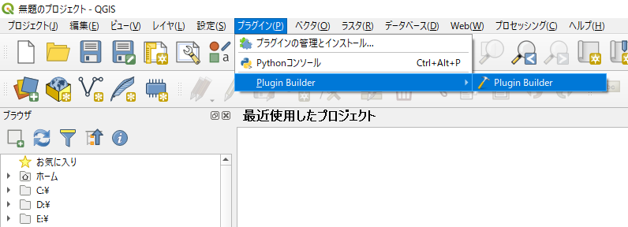

ウィンドウが表示されます。ここで作成するプラグインの基本情報を入力します。

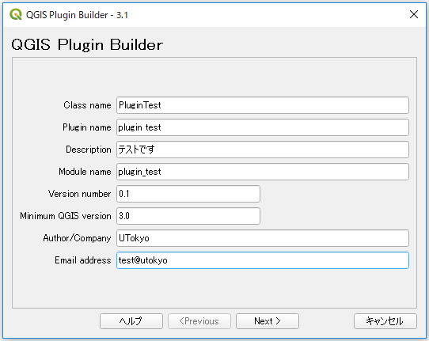

まずはプラグインの基本情報として、

    Class name:
    プラグインのクラス名です。pythonファイル内で使用されます。キャメルケース(複合語をひと綴りとして、要素語の最初を大文字)で記述します。
    Plugin name:    プラグインマネージャー等で表示されるプラグイン名
    Description:    プラグインマネージャー等で表示されるプラグインの説明文
    Module name:    pythonのモジュール名
    Version number: プラグインのバージョン
    Minimum QGIS version:   プラグインが動作するQGISの最低バージョン
    Author/Company: プラグイン作者名
    Email address:  作者メールアドレス

を入力します。


続いてプラグインの詳細な説明を記述します。ここでは適当な文を入れておくだけにしましょう。

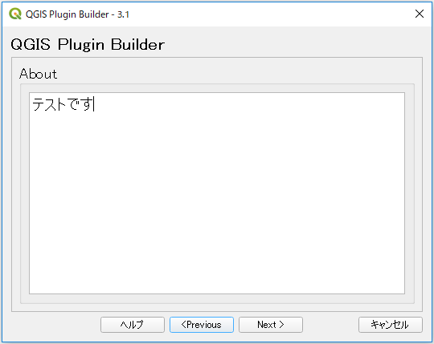


作成するプラグインのテンプレートとして3種類用意されています。”Tool Button with dialog”を選択しておいてください。UIとしてプラグイン実行時に表示されるダイアログも一緒に作成してくれます。メニューへ表示する文字列と、どのメニューに表示するかも設定しておきます。

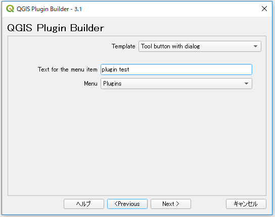


多言語対応やヘルプ等の雛形も一緒に作成することができます。ただし、今回は最小限のプラグインを作成してみることを目的としますので、すべてのチェックを外しておきましょう。

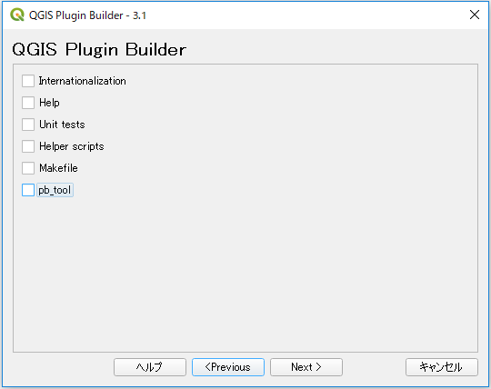

 プラグインの不具合報告先を明確にしておくため、Bug tracker、RepositoryのURLの入力を求められます。ここでは適当な文字列を入れておくだけにしましょう。ただし、きちんとしたプラグインを公開する場合は、GitHub等で公開することが推奨されてます。

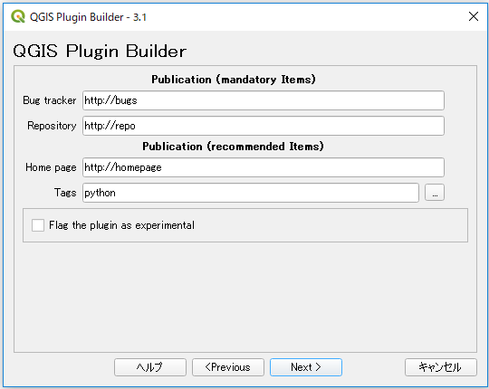

ここまでの入力が終わると、プラグイン書き出し先のディレクトリの指定になります。ユーザーのホームディレクトリ/AppData\Roaming\QGIS\QGIS3\profiles\default\python\pluginsに書き出してください。

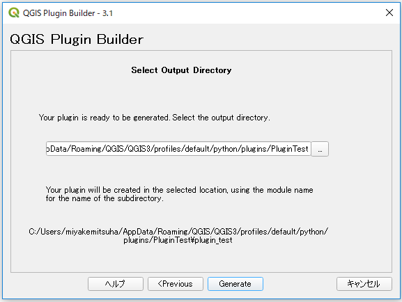


Generateをクリックするとプラグインのフォルダが作成されたことを示すメッセージウィンドウが現れます。OKをクリックしてウィンドウを閉じましょう。

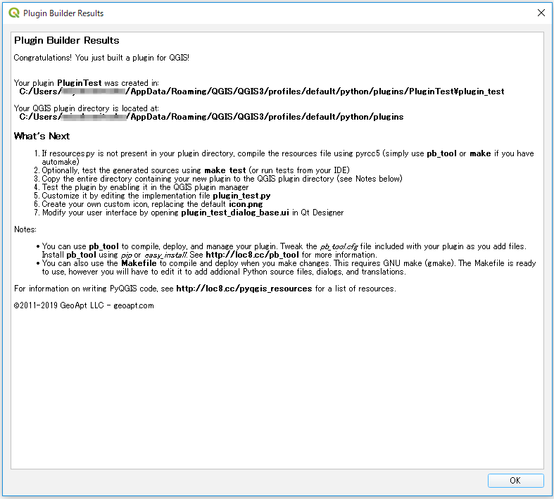


## <a name="ディレクトリの確認"></a>ディレクトリの確認
エクスプローラーからユーザーのホームディレクトリ/AppData\Roaming\QGIS\QGIS3\profiles\default\python\pluginsを開き、plugin buiderによりファイルが作成されていることを確認します。

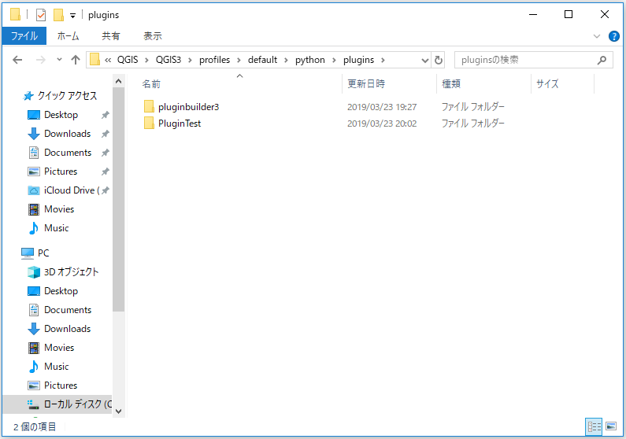


## <a name="resouces.pyの作成"></a>resouces.pyの作成
さて、書きだされたプラグインを実行してみたいところですが、その前にもう一手間必要です。メニューバーの`プラグイン`とツールバーに表示されるアイコン画像のファイル名は、 アイコンとして使用する画像ファイルへのパスを記述した、Qtのリソースファイルの中に記述されています。ファイル名は、`resources.qrc`となっています。リソースファイルはxmlで記述されており、内容は下記になります。

```XML
<RCC>
    <qresource prefix="/plugins/PluginTest" >
        <file>icon.png</file>
    </qresource>
</RCC>
```

このファイル をPythonのコードへ変換しておく必要がありますので、pyrcc4コマンドで変換を行います。Windowsの場合にはOSGeo4W shellを立ち上げましょう。ダブルクリックで起動すると、コマンドプロンプトが立ち上がります。

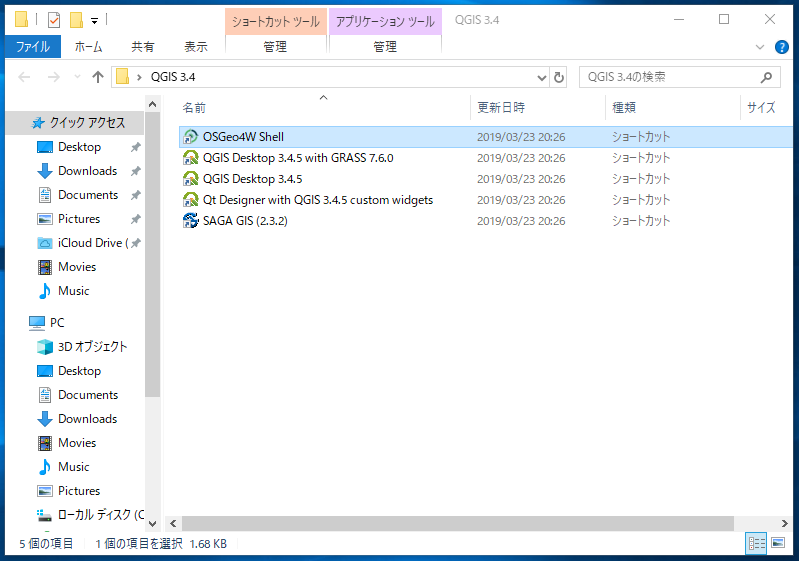

OSGeo4W shell上でプラグインを作成しているディレクトリに移動してください。

```
cd ユーザーのホームディレクトリ/AppData\Roaming\QGIS\QGIS3\profiles\default\python\plugins\PluginTest`
```

移動した後、

```
>call qt5_env.bat
>call py3_env.bat
>pyrcc5 -o resources.py resources.qrc
```


エクスプローラーでresources.pyが作成されたことを確認します。


これで最小限のプラグイン作成は終了です。


## <a name="作成下プラグインの実行"></a>作成したプラグインの実行
QGISを立ち上げてみましょう。
`プラグイン > プラグインの管理とインストール`の中から”plugin test”を探してインストールしてみてください。


メニューバーから`プラグイン > Plugin Test`を選択するとウィンドウが表示され、プラグインがインストールされていることがわかります。

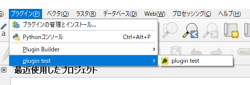

空のdialogが表示されるだけのプラグインですが、実行を確認できます。

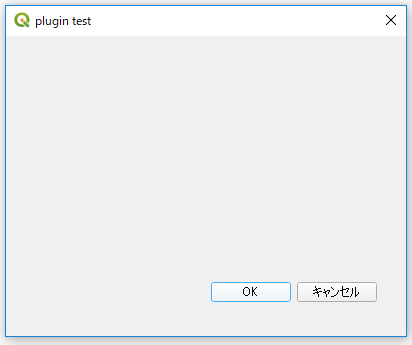

<h2 style="background-color:#F8F5FD;text-align:center;">教材の利用に関するアンケート</h2>　本プロジェクトでは、教材の改良を目的とした任意アンケートを実施しています。ご協力いただける方は、<a href="https://docs.google.com/forms/d/1r8RTFK3CPo4xNM6SdOEsAtdA0CrChD6KPVVU9kRxWRs/">アンケート</a>にお進みください。ご協力のほどよろしくお願いいたします。<br><br>※ 本アンケートの成果は、教材の改良のほか、学会での発表等の研究目的でも利用します。
