# プラグイン開発2
QGISの拡張機能であるプラグインの開発の応用を学びます。

- [metadata.txt](#metadata.txt)
- [\_\_init__.py](#\_\_init__.py)
- [処理本体が記載されたファイル](#処理本体が記載されたファイル)
- [ダイアログの変更](#ダイアログの変更)
- [処理の追記](#処理の追記)
- [プラグインの実行](#プラグインの実行)


## <a name="metadata.txt"></a>metadata.txt
必須となる幾つかのファイルの内容を見ていきましょう。`metadata.txt`はプラグインに関する情報が記載されています。テキストエディタで開いてみましょう。
決められた変数に`=`で繋いで値を代入していることがわかります。プラグインビルダーで入れた情報が記載されていますが、必要に応じて書き換えることができます。

```
general
name=plugin test
qgisMinimumVersion=3.0
description=てすとです
version=0.1
author=asahi
email=asahi@mierune.co.jp
```


## <a name="\_\_init__.py"></a>\_\_init__.py
プラグイン読み込みの際に最初に読み込まれるファイルです。`classFactory()`という関数を記載しておきます。この中で処理の本体となるモジュールを読み込み、必要なインスタンスを返しています。 `QgisInterface`のインスタンスである`iface`が渡されていることを確認しておきましょう。プラグイン内でもifaceを通してQGISを操作することになります。

```
def classFactory(iface):  # pylint: disable=invalid-name
    """Load PluginTest class from file PluginTest.

    :param iface: A QGIS interface instance.
    :type iface: QgsInterface
    """
    #
    from .plugin_test import PluginTest
    return PluginTest(iface)
```


## <a name="処理本体が記載されたファイル"></a>処理本体が記載されたファイル
処理が記載されたクラスが最低限持つ必要があるメソッドは、
    initGui(): プラグインが使用可になった場合に実行されるメソッド
    unload(): プラグインが使用不可になった場合に実行されるメソッド
の２つになります。
`plugin_test.py`の内容を見てみましょう。まずは`initGui()`です。
```
    def initGui(self):
        """Create the menu entries and toolbar icons inside the QGIS GUI."""

        icon_path = ':/plugins/plugin_test/icon.png'
        self.add_action(
            icon_path,
            text=self.tr(u'plugin test'),
            callback=self.run,
            parent=self.iface.mainWindow())

        # will be set False in run()
        self.first_start = True
```

メニューやツールバーへのプラグインの追加自体は、`self.add_action()`で行われています。`add_action()`の中の下記の行を見てみましょう。

```
        action = QAction(icon, text, parent)
        action.triggered.connect(callback)
```
　
`QAction`は、メニューやツールバーに追加されるユーザインタフェース部品になります。`action`の`triggerd`が`callback`(引数で`self.run`が渡されています)に`connect`されています。
作成された`QAction`がツールバーとメニューに追加されているのがわかります。

```
        if add_to_toolbar:
            # Adds plugin icon to Plugins toolbar
            self.iface.addToolBarIcon(action)

        if add_to_menu:
            self.iface.addPluginToMenu(
                self.menu,
                action)
```

実際に行われる処理は、`run()`に書かれています。

```
    def run(self):
        """Run method that performs all the real work"""

        # Create the dialog with elements (after translation) and keep reference
        # Only create GUI ONCE in callback, so that it will only load when the plugin is started
        if self.first_start == True:
            self.first_start = False
            self.dlg = PluginTestDialog()

        # show the dialog
        self.dlg.show()
        # Run the dialog event loop
        result = self.dlg.exec_()
        # See if OK was pressed
        if result:
            # Do something useful here - delete the line containing pass and
            # substitute with your code.
            pass
```

ここでは、作成済みのダイアログの表示を行っているだけになります。もし何か単一の処理をメニュー/ツールバーから選択された際に行いたいだけであえば、ダイアログの表示部分を削除して、この中に処理を書けばいいことになります。`self.iface`からQGISにアクセスもできます。
`unload()`も見てみましょう。`initGui()`、`add_action()`で作成した`QAction`をツールバー、メニューから削除していることがわかります。

```
    def unload(self):
        """Removes the plugin menu item and icon from QGIS GUI."""
        for action in self.actions:
            self.iface.removePluginMenu(
                self.tr(u'&plugin test'),
                action)
            self.iface.removeToolBarIcon(action)
```


## <a name="ダイアログの変更"></a>ダイアログの変更
プラグインビルダーを使用すると、空のダイアログは作成してくれます。このダイアログを変更する方法を見てみましょう。
ダイアログの作成/変更には、Qt Designerを利用します。QGISをインストールした際に一緒に入っているので、Windowsのスタートメニューで検索して立ち上げます。

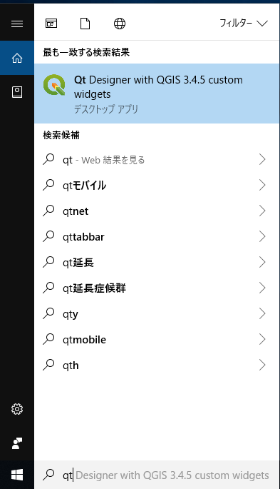

Qt Designerを立ち上げると新しいフォームの作成ウィンドウが表示されます。

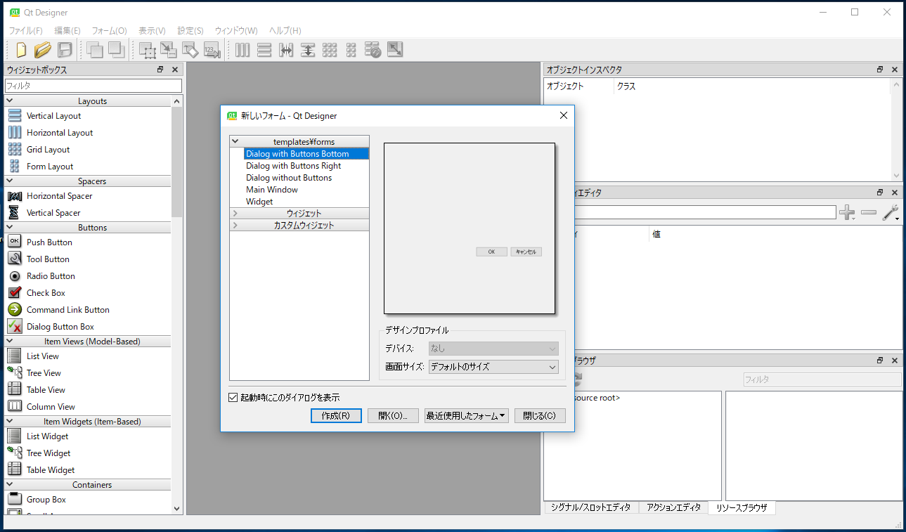

「開く」ボタンをクリックして、Plugin Testディレクトリから`plugin_test_dialog_base.ui`を開きましょう。

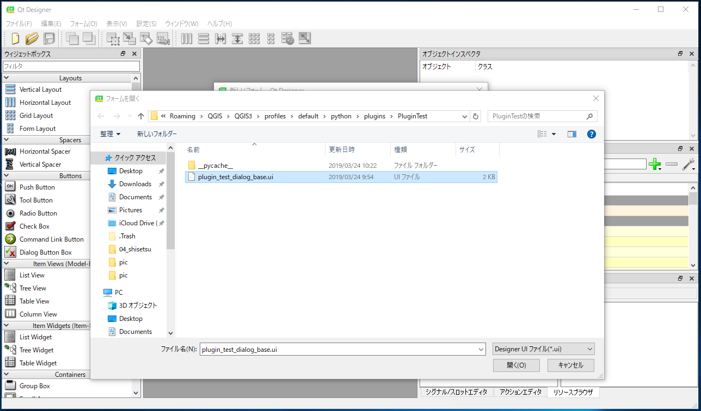

フォームにテキストボックスを配置します。画面左のウィジェットボックスから、”Text Edit”検索します。`Text Edit`をドラッグしながら、ダイアログの上に配置します。

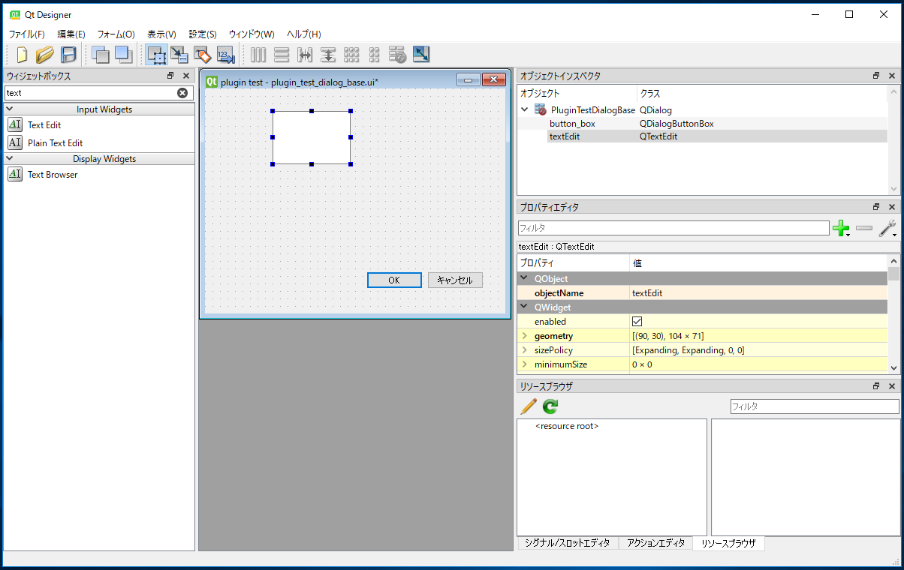

配置した`Text Edit`にプログラムからアクセスする場合には、ウィンドウ右側のプロパティに表示される`objectName`で識別します。判りやすいものに変えておいた方が良いですが、今回は作成時に入れられる名前のままで進みます。
次に`Dialog`の領域自体の大きさも変更して、適当な大きさにしておきましょう。オブジェクトを選択した状態でドラッグすると、大きさを調節できます。

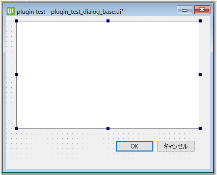

レイアウトを整えたら、次にボタンの`signal`が、どの`slot`に`connect`されているか確認しておきましょう。ウィンドウ右下の`シグナル/スロットエディタ`から確認することができます。

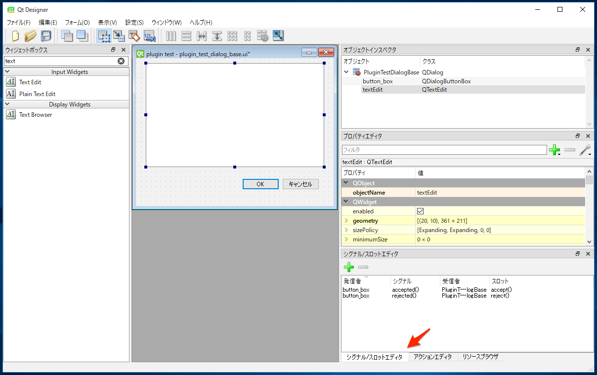

`button_box`からの`accepted()` (OKボタンの`signal`)が、`dialog`の`accept()`に、`rejected()`が`dialogのreject()`に、それぞれ`connect`されていることがわかります。

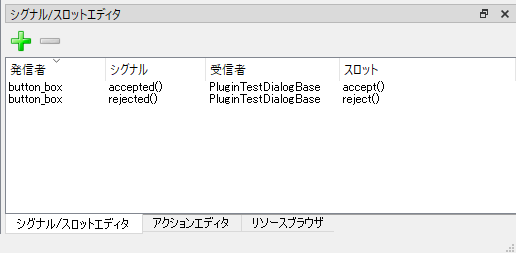

`button_box`からの`signal`を別な`slot`に`connect`する、もしくは`dialog`の`slot`を上書きしてあげれば処理を変更することができます。
作成の終了した`dialog`は、「保存」で上書きしておきましょう。

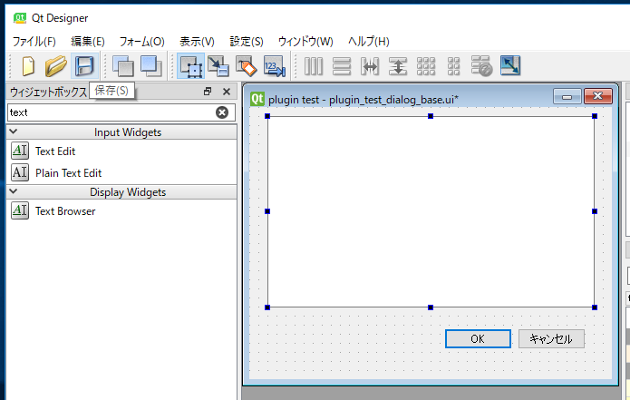


## <a name="処理の追記"></a>処理の追記
`dialog`の`accept()`を書き換えれば、「OK」ボタンが押された際に処理を追加することができることがわかりました。プラグインビルダーで書きだされている`plugin_test_dialog.py`を書き換えて処理を加えましょう。
エクスプローラーから`plugin_test_dialog.py`をテキストエディターで開きます。(ここではVisual Studio Codeを使用していますが、ご自分の使っているエディターで構いません。)

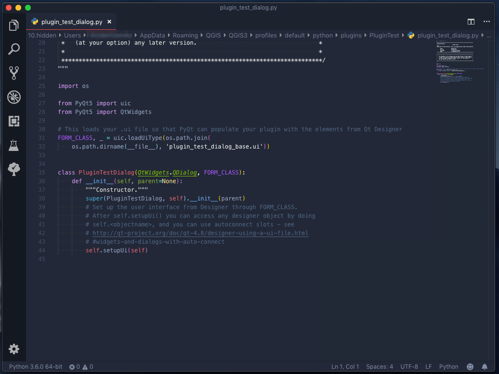

`PluginTestDialog`クラスは、先ほど変更した`plugin_test_dialog_base.ui`を継承するコードが記述されています。
ここで`PluginTestDialog`クラスに`accept()`を定義して上書きしましょう。以下のコードを追加して記述してください。ここでは少し回りくどいやり方ですが、`accept()`の内容を空にしています。

```
FORM_CLASS, _ = uic.loadUiType(os.path.join(
    os.path.dirname(__file__), 'plugin_test_dialog_base.ui'))


class PluginTestDialog(QtWidgets.QDialog, FORM_CLASS):
    def __init__(self, parent=None):
        """Constructor."""
        super(PluginTestDialog, self).__init__(parent)
        # Set up the user interface from Designer.
        # After setupUI you can access any designer object by doing
        # self.<objectname>, and you can use autoconnect slots - see
        # http://qt-project.org/doc/qt-4.8/designer-using-a-ui-file.html
        # #widgets-and-dialogs-with-auto-connect
        self.setupUi(self)
#ここに追記 2行
    def accept(self):
        pass
```

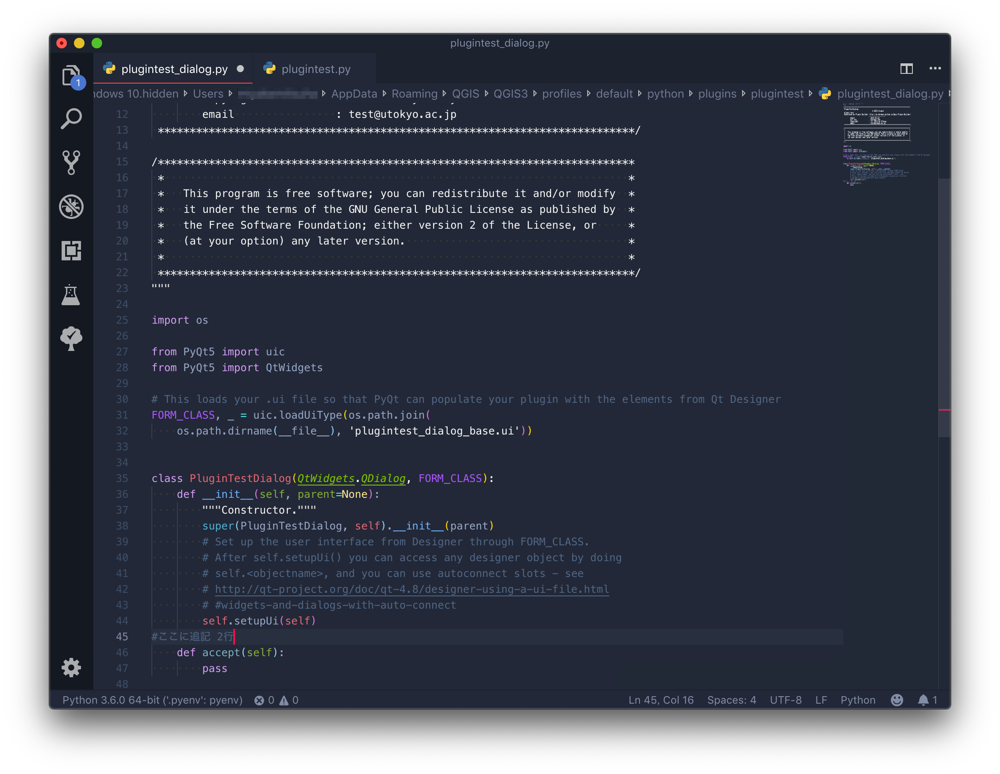

次に、`plugin_test.py`の内容を書き換えます。

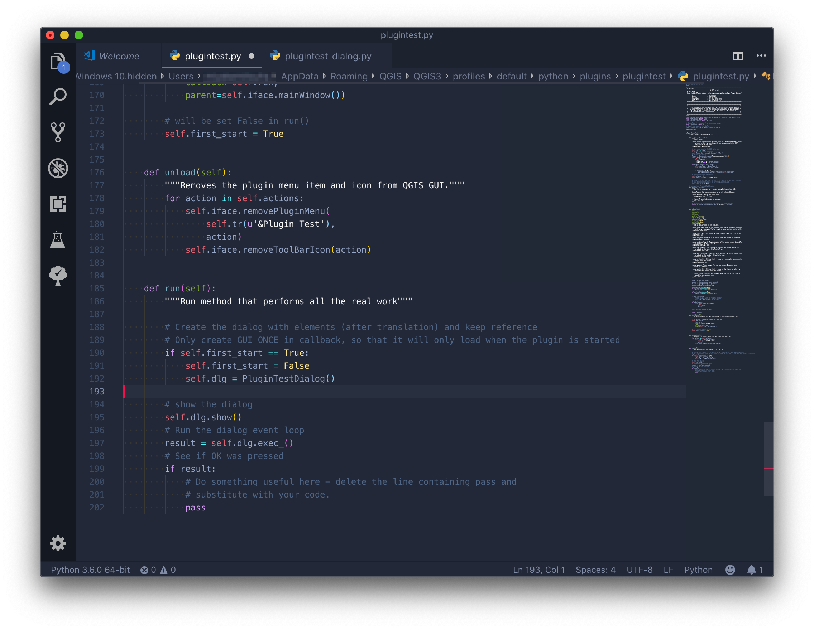

`run()`が具体的な処理の記述部分です。

```
(前略)
    def run(self):
        """Run method that performs all the real work"""

        # Create the dialog with elements (after translation) and keep reference
        # Only create GUI ONCE in callback, so that it will only load when the plugin is started
        if self.first_start == True:
            self.first_start = False
            self.dlg = PluginTestDialog()
(以下略)
```

`dialog`を作成した際に、`dialog`の`button_boxのaccepted()`に新しい処理を`connect`します。`connect`するメソッドには、レイヤ数を`dialog`の`textEdit`に書き出す処理を記述してあります。

```
    def run(self):
        """Run method that performs all the real work"""

        # Create the dialog with elements (after translation) and keep reference
        # Only create GUI ONCE in callback, so that it will only load when the plugin is started
        if self.first_start == True:
            self.first_start = False
            self.dlg = PluginTestDialog()
#ここに追記 1行
            self.dlg.button_box.accepted.connect(self.set_text)


        # show the dialog
        self.dlg.show()
        # Run the dialog event loop
        result = self.dlg.exec_()
        # See if OK was pressed
        if result:
            # Do something useful here - delete the line containing pass and
            # substitute with your code.
            pass

#ここに追記 2行
    def set_text(self):
        self.dlg.textEdit.setText(str(self.iface.mapCanvas().layerCount()))

```

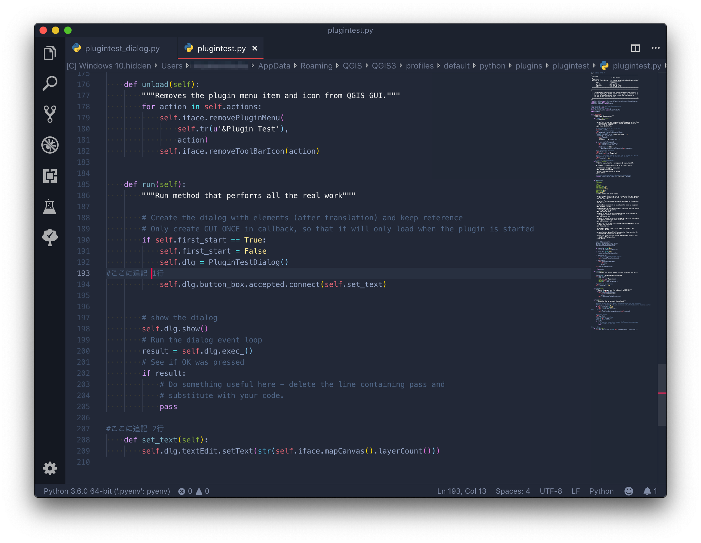

これでプラグインは完成です。


## <a name="プラグインの実行"></a>プラグインの実行
QGISに戻り、プラグインを実行してみましょう。プラグインを立ち上げると、ダイアログボックスが増えています。QGISのユーザーインターフェースでレイヤを読み込んでからプラグインのウィンドウに戻り、`OK`をクリックするとダイアログボックスに読み込んでいるレイヤの数が表示されます。(以下の例では２つのレイヤを読み込んでいます。)

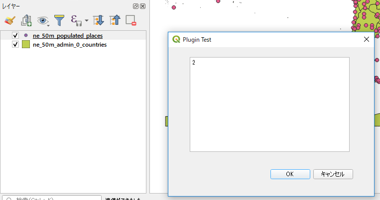

<h2 style="background-color:#F8F5FD;text-align:center;">教材の利用に関するアンケート</h2>　本プロジェクトでは、教材の改良を目的とした任意アンケートを実施しています。ご協力いただける方は、<a href="https://docs.google.com/forms/d/1r8RTFK3CPo4xNM6SdOEsAtdA0CrChD6KPVVU9kRxWRs/">アンケート</a>にお進みください。ご協力のほどよろしくお願いいたします。<br><br>※ 本アンケートの成果は、教材の改良のほか、学会での発表等の研究目的でも利用します。
