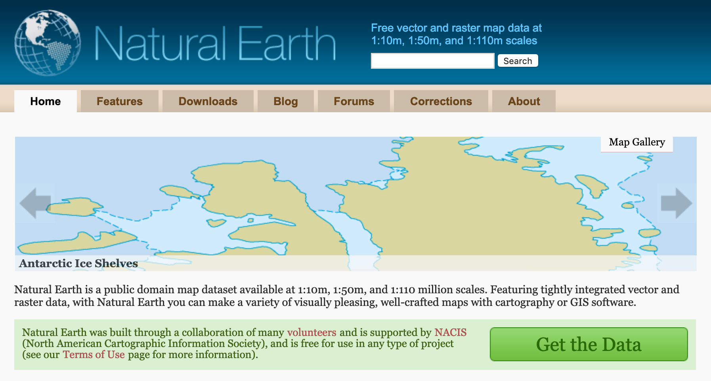

# GIS初中級者のためのPython入門
本教材は、GIS初中級者向けにQGISにおけるPythonの役割や用語、操作方法などをまとめたものです。GISに関する基本的な知識は、[地理情報科学教育用スライド（GIScスライド）]が参考になります。本教材を使用する際は、[利用規約]をご確認いただき、これらの条件に同意された場合にのみご利用ください。

### 製作協力
 本教材は、[MIERUNE.inc](https://mierune.co.jp/index.html)と共同で整備したものです。

[地理情報科学教育用スライド（GIScスライド）]:http://curricula.csis.u-tokyo.ac.jp/slide/2.html
[利用規約]:../../policy.md

## 実習環境
本教材では以下の環境で動作検証を行なっています。
- Windows10
- QGIS3.4

## 本教材で利用するデータと出典
本教材で使用するデータセットは以下の通りです。学習を始める前に以下より、入手してください。

### ベクターデータ
ベクターデータについてはパブリックドメインでデータを提供している[Natural Earth](https://www.naturalearthdata.com/downloads/50m-cultural-vectors/)のものを使用しています。

- 1:50m Cultural Vectors - Admin 0 – Countries (ne_50m_admin_0_countries.shp)
- 1:50m Cultural Vectors - Populated Places (ne_50m_populated_places.shp)

### ラスターデータ
- [sample_image.tif]

[sample_image.tif]:https://github.com/gis-oer/datasets/raw/master/sample.zip

本教材では、ErthExplorerからダウンローしたLandsat8のデータを編集・使用しています。 "The source data were downloaded from USGS's ErthExplorer, (https://earthexplorer.usgs.gov/). Landsat 8 data courtesy of the U.S. Geological Survey."

## 本教材の構成
実習用データの取得が完了したら、以下順に従って教材をご利用ください。

|章|教材名|
|---|---|
|00|[Pythonの概要とQGISにおけるPythonの役割](./00/00.md)|
|01|[QGISでのPython入門](./01/01.md)|
|02|[ベクターデータの読み込みと図形へのアクセス](./02/02.md)|
|03|[ベクターデータの属性情報に基づく処理](./03/03.md)|
|04|[ベクターデータの座標変換・計測](./04/04.md)|
|05|[基本的な空間演算](./05/05.md)|
|06|[NumPyについて](./06/06.md)|
|07|[ラスターデータの読み込み](./07/07.md)|
|08|[プロセッシング入門](./08/08.md)|
|09|[一括処理](./09/09.md)|
|10|[プラグイン開発1](./10/10.md)|
|11|[プラグイン開発2](./11/11.md)|
