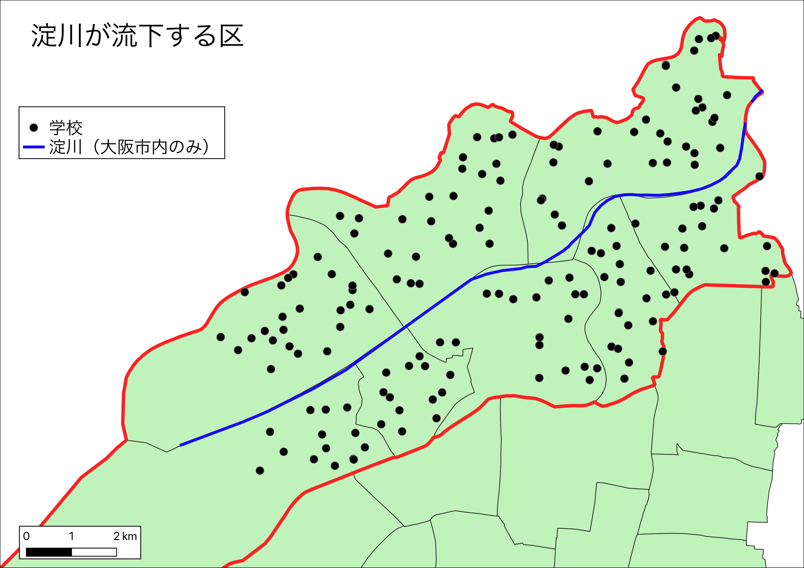

# 課題：基本的な空間解析
　本実習では、空間データから新たなデータを計測する手法および複数の空間データの位置関係から新規データの作成や距離の計測を行います。課題1としてGISソフトウェア上で地物の大きさを計測する手法を学びます。課題2では、ベクトルデータの形状を用いて新規のデータを作成する手法を学びます。以下の手順とGISオープン教材の[基本的な空間解析]の教材を参考に、完成例のような地図が作成できれば、完了となります。GIS初学者は、本教材を進める前に[GISの基本概念]の教材を確認しておいてください。

### 実習用データ
本実習をはじめる前に、[osaka]をダウンロードしてください。

[osaka]:https://github.com/gis-oer/datasets/raw/master/osaka.zip

**Menu**
--------
- [課題1_周長と面積の計測](#課題1_周長と面積の計測)
- [課題2_データの形状や属性を用いた解析](#課題2_データの形状や属性を用いた解析)

## 課題1_周長と面積の計測
　GISで示される地物は、位置や形状が座標で管理されています。そのためGIS上で、周長や面積計算を行うことができます。以下の手順と[基本的な空間解析]の教材を参考に、を参考に、大阪市の24区の行政界を用いて、それぞれの周長と面積を算出した後、浪速区の周長と面積を回答してください。

### 手順
1. QGISで、`osaka_6kei.shp`を読み込む。
2. 新規属性テーブルを作成し、区ごとに周長を計測する。
3. 同じように新規属性テーブルを作成し、各市町村ポリゴンごとに面積を計測する。
4. 地図から浪速区を空間選択し、属性テーブルの周長と面積確認し、質問に回答する。

## 課題2_データの形状や属性を用いた解析
　この実習は、解析に必要な範囲を求め、新規レイヤとして抽出するものです。GISでは、ベクトルデータの保持する形状、位置、属性等の情報を用いることで特定の条件にあった新規レイヤを抽出することができます。以下の手順と[基本的な空間解析]の教材を参考に、淀川が流れる区のみを抽出し、完成例のような図を作成してください。
　
### 完成例

### 手順
1. `osaka_6kei.shp`、`yodo_river.shp`、`school.shp`をQGISで読み込む。
2. 淀川が流れる市町村を選択して、`名前を付けて保存`から出力する。
3. 2で出力したポリゴンをデイゾルブする。
4. ディゾルブしたポリゴンを用いて、淀川をクリップする。
5. ディゾルブしたポリゴンを用いて、区内の学校をインターセクトする
6. 出力したデータを用いて地図をレイアウトする。

#### 完成例で使用したデータ
本ページで使用しているデータの出典については、該当する教材よりご確認ください。

[利用規約]:../../../policy.md
[その他のライセンスについて]:../../license.md
[よくある質問とエラー]:../../questions/questions.md

[GISの基本概念]:../../00/00.md
[QGISビギナーズマニュアル]:../../QGIS/QGIS.md
[GRASSビギナーズマニュアル]:../../GRASS/GRASS.md
[リモートセンシングとその解析]:../../06/06.md
[既存データの地図データと属性データ]:../../07/07.md
[空間データ]:../../08/08.md
[空間データベース]:../../09/09.md
[空間データの統合・修正]:../../10/10.md
[基本的な空間解析]:../../11/11.md
[ネットワーク分析]:../../12/12.md
[領域分析]:../../13/13.md
[点データの分析]:../../14/14.md
[ラスタデータの分析]:../../15/15.md
[傾向面分析]:../../16/16.md
[空間的自己相関]:../../17/17.md
[空間補間]:../../18/18.md
[空間相関分析]:../../19/19.md
[空間分析におけるスケール]:../../20/20.md
[視覚的伝達]:../../21/21.md
[参加型GISと社会貢献]:../../26/26.md

[地理院地図]:https://maps.gsi.go.jp
[e-Stat]:https://www.e-stat.go.jp/
[国土数値情報]:http://nlftp.mlit.go.jp/ksj/
[基盤地図情報]:http://www.gsi.go.jp/kiban/
[地理院タイル]:http://maps.gsi.go.jp/development/ichiran.html

[課題ページ_QGISビギナーズマニュアル]:../../tasks/t_qgis_entry.md
[課題ページ_GRASSビギナーズマニュアル]:../../tasks/t_grass_entry.md
[課題ページ_リモートセンシングとその解析]:../../tasks/t_06.md
[課題ページ_既存データの地図データと属性データ]:../../tasks/t_07.md
[課題ページ_空間データ]:../../tasks/t_08.md
[課題ページ_空間データベース]:../../tasks/t_09.md
[課題ページ_空間データの統合・修正]:../../tasks/t_10.md
[課題ページ_基本的な空間解析]:../../tasks/t_11.md
[課題ページ_ネットワーク分析]:../../tasks/t_12.md
[課題ページ_基本的な空間解析]:../../tasks/t_13.md
[課題ページ_点データの分析]:../../tasks/t_14.md
[課題ページ_ラスタデータの分析]:../../tasks/t_15.md
[課題ページ_空間補間]:../../tasks/t_18.md
[課題ページ_視覚的伝達]:../../tasks/t_21.md
[課題ページ_参加型GISと社会貢献]:../../tasks/t_26.md
