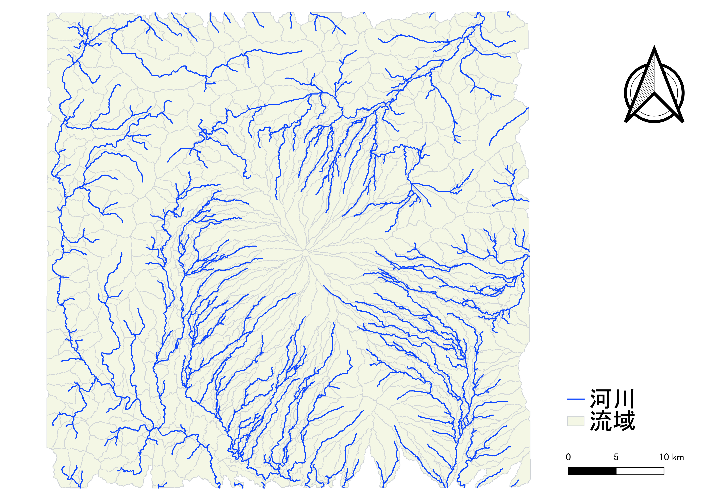

# 課題：ラスタデータの分析
　この実習では、ラスタデータを用いた地形情報の可視化や分析を行います。ラスターデータはベクトルデータと異なり、ピクセルごとに入力された値が分析に用いられます。実習で使われる用語や概念は、地理情報科学教育用スライド（GIScスライド）の4章を参照してください。

　手順とGISオープン教材の[ラスタデータの分析]の教材を参考に、完成例のような地図が作成できれば、完了となります。GIS初学者は、本教材を進める前に[GISの基本概念]の教材を確認しておいてください。

### 実習用データ

[Fuji_task]

[Fuji_task]:https://github.com/gis-oer/datasets/raw/master/tasks/fuji_task.zip

**Menu**
--------
- [課題1_数値標高モデルの視覚的分析](#課題1_数値標高モデルの視覚的分析)
- [課題2_地形断面図](#課題2_地形断面図)
- [課題3_ラスタ演算](#課題3_ラスタ演算)
- [課題4_流域解析](#課題4_流域解析)
-----------------

## 課題1_数値標高モデルの視覚的分析
　富士山周辺のDEMデータを用いて、標高区分図、傾斜区分図、傾斜方位図、陰影図、3D地図を作成し、レイアウトを行い。富士山の地形的な特徴を整理し、400字程度でまとめてください。※凡例の値や方位記号等は任意で指定してください。

### 完成例

※　上段：左から、標高区分図（段彩図）、傾斜区分図、傾斜方位図、陰影図　下段：3D地図（背景地図として地理院タイルを使用）

### 手順
1. ダウンロードしたラスターデータをQGISで読み、[空間データの統合・修正]の教材を参考にラスタデータを結合する。
2. ラスタ＞解析から傾斜、傾斜方位、陰影図を作成する。
3. 標高値、傾斜角、斜面方位（0°-360°）など、それぞれのラスターデータの値に応じて色分けを行い、標高区分図、傾斜区分図、傾斜方位図を作成する。
4. 平面では、確認しにくい箇所もあるため、3D地図を作成する。
5. 作成した標高区分図、傾斜区分図、傾斜方位図、陰影図、3D地図を視覚的に分析し、富士山の地形的な特徴を簡単にまとめる。

--------

## 課題2_地形断面図の作成
　この課題では、各セルの値を利用し、地形断面図を作成します。以下の手順を参考に地形断面図を作成した後、作成した地形断面図から読み取れる地形の特徴について、400字程度でまとめてください。

### 手順
1. プラグインの管理とインストールから、VoGIS Profile toolを検索し、インストールする。
2. [ラスタデータの分析]の教材を参考に、VoGIS Profile toolで地形断面図を作成する。
3. 地形断面図から読み取れる地形情報について、400字程度でまとめる。

--------

## 課題3_ラスタ演算
　この課題では、複数のラスタデータの範囲と値を組み合わせて、ラスタ演算をします。富士山周辺の標高データと数値標高モデルの視覚的分析の課題で作成した傾斜のラスタデータを用いて、ラスタ計算機で標高2000m以上かつ傾斜15°以下のエリアを抽出してください。

### 手順
1. 標高と傾斜のデータをQGISで読み込みラスタからラスタ計算機を起動する。
2. 出力ファイルを設定し、[ラスタデータの分析]教材を参考に式を入力する。
3. プロパティ＞シンボロジー＞単バンド疑似カラーを選択し、モードを等間隔、分類数を2とし、最小を0、最大を1とし分類をクリックする。0の値の色の不透明度を0％にするとみやすい。

--------

## 課題_流域解析
　この課題ではDEMデータを用いた、流域解析を行います。以下の手順を参考に、完成例のような図を作成してください。

### 完成例

### 手順
1. [ラスタデータの分析]教材を参考に、流域解析を選択し、流域の最小セルサイズを設定する(ここでは、3000とする)。
2. 流域と河川のラスタをベクトルに変換する。
3. 名前を付けて保存でベクトルレイヤとして保存する
4. 地図をレイアウトする

--------

#### 完成例で使用したデータ
本ページで使用しているデータの出典については、該当する教材よりご確認ください。
[利用規約]:../../../policy.md
[その他のライセンスについて]:../../license.md
[よくある質問とエラー]:../../questions/questions.md

[GISの基本概念]:../../00/00.md
[QGISビギナーズマニュアル]:../../QGIS/QGIS.md
[GRASSビギナーズマニュアル]:../../GRASS/GRASS.md
[リモートセンシングとその解析]:../../06/06.md
[既存データの地図データと属性データ]:../../07/07.md
[空間データ]:../../08/08.md
[空間データベース]:../../09/09.md
[空間データの統合・修正]:../../10/10.md
[基本的な空間解析]:../../11/11.md
[ネットワーク分析]:../../12/12.md
[領域分析]:../../13/13.md
[点データの分析]:../../14/14.md
[ラスタデータの分析]:../../15/15.md
[傾向面分析]:../../16/16.md
[空間的自己相関]:../../17/17.md
[空間補間]:../../18/18.md
[空間相関分析]:../../19/19.md
[空間分析におけるスケール]:../../20/20.md
[視覚的伝達]:../../21/21.md
[参加型GISと社会貢献]:../../26/26.md

[地理院地図]:https://maps.gsi.go.jp
[e-Stat]:https://www.e-stat.go.jp/
[国土数値情報]:http://nlftp.mlit.go.jp/ksj/
[基盤地図情報]:http://www.gsi.go.jp/kiban/
[地理院タイル]:http://maps.gsi.go.jp/development/ichiran.html

[課題ページ_QGISビギナーズマニュアル]:../../tasks/t_qgis_entry.md
[課題ページ_GRASSビギナーズマニュアル]:../../tasks/t_grass_entry.md
[課題ページ_リモートセンシングとその解析]:../../tasks/t_06.md
[課題ページ_既存データの地図データと属性データ]:../../tasks/t_07.md
[課題ページ_空間データ]:../../tasks/t_08.md
[課題ページ_空間データベース]:../../tasks/t_09.md
[課題ページ_空間データの統合・修正]:../../tasks/t_10.md
[課題ページ_基本的な空間解析]:../../tasks/t_11.md
[課題ページ_ネットワーク分析]:../../tasks/t_12.md
[課題ページ_基本的な空間解析]:../../tasks/t_13.md
[課題ページ_点データの分析]:../../tasks/t_14.md
[課題ページ_ラスタデータの分析]:../../tasks/t_15.md
[課題ページ_空間補間]:../../tasks/t_18.md
[課題ページ_視覚的伝達]:../../tasks/t_21.md
[課題ページ_参加型GISと社会貢献]:../../tasks/t_26.md
