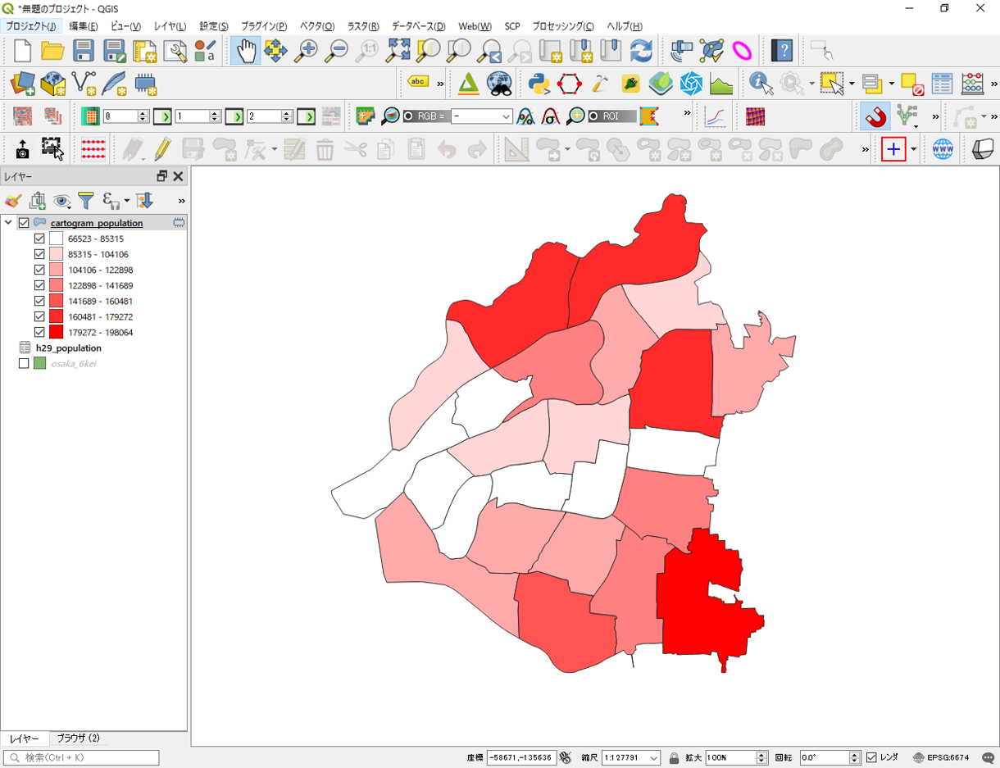

# 課題:視覚的伝達
　この実習は、値の分類や視覚化に関するものです。以下の手順とGISオープン教材の[領域分析]の教材を参考に、完成例のような地図が作成できれば、実習完了となります。実習で利用するデータの一部は、[既存データの地図データと属性データ]の教材を参考にダウンロードしてください。GIS初学者は、本教材を進める前に[GISの基本概念]の教材を確認しておいてください。

### 実習用データ
　実習をはじめる前に、[政府統計局e-stat]から、任意の地域の境界（世界測地系の平面直角座標系のもの）データをダウンロードしてください。

**Menu**
--------
- [課題1_属性データの分類](#課題1_属性データの分類)
- [課題2_カルトグラム](#課題2_カルトグラム)
-----------------

## 課題1_属性データの分類
　[e-Stat]から、ダウンロードした境界データ（行政界のデータ）を利用し、人口密度の分布図を作成してください。作成する地図は、データに対して適切な分類が行われているものとします。

### 手順
1. QGISでe-statのデータを読み込み、属性テーブルから人口密度を計算する。
2. プロパティを開き、値を分類する。
3. プリントコンポーザーを開き、地図をレイアウトする。

-----------------

## 課題2_カルトグラム  
　政府統計の総合窓口(e-Stat)から、ダウンロードした境界データ（行政界のデータ）を用いて、人口のカルトグラム(統計データに基づいて面積や距離を変形させた地図)を作成してください。

### 完成例

### 手順
1. [e-stat]のページから、「平成22年国勢調査（小地域）」を選択し（統計表は任意で指定する）、市区町村の境界データ（世界測地系平面直角座標系・Shape形式）をダウンロードする。
2. QGISでレイヤをデータを読み込み、画面左側に表示されるレイヤの一覧から対象のデータの上で右クリックし属性テーブルを開く。属性テーブルにJINKOの項目があるかを確認する。JINKOの値に0があると計算できないため、対象のテーブルを削除するか、値を1とする。
3. QGISの「プラグインの管理とインストール」から「Cartogram」プラグインをインストールする。
4. Cartogramプラグインを起動し、JINKOの値を用いてカルトグラムを作成する。
5. レイヤのプロパティを開き値を色分けする（人口ごとに色分けする/正確に分類する場合は、分類数の設定にはスタージェスの公式等を用いると良い）。
6. 地図をレイアウトする。

-----------------

#### 完成例で使用したデータ
本ページで使用しているデータの出典については、該当する教材よりご確認ください。
[利用規約]:../../../policy.md
[その他のライセンスについて]:../../license.md
[よくある質問とエラー]:../../questions/questions.md

[GISの基本概念]:../../00/00.md
[QGISビギナーズマニュアル]:../../QGIS/QGIS.md
[GRASSビギナーズマニュアル]:../../GRASS/GRASS.md
[リモートセンシングとその解析]:../../06/06.md
[既存データの地図データと属性データ]:../../07/07.md
[空間データ]:../../08/08.md
[空間データベース]:../../09/09.md
[空間データの統合・修正]:../../10/10.md
[基本的な空間解析]:../../11/11.md
[ネットワーク分析]:../../12/12.md
[領域分析]:../../13/13.md
[点データの分析]:../../14/14.md
[ラスタデータの分析]:../../15/15.md
[傾向面分析]:../../16/16.md
[空間的自己相関]:../../17/17.md
[空間補間]:../../18/18.md
[空間相関分析]:../../19/19.md
[空間分析におけるスケール]:../../20/20.md
[視覚的伝達]:../../21/21.md
[参加型GISと社会貢献]:../../26/26.md

[地理院地図]:https://maps.gsi.go.jp
[e-Stat]:https://www.e-stat.go.jp/
[国土数値情報]:http://nlftp.mlit.go.jp/ksj/
[基盤地図情報]:http://www.gsi.go.jp/kiban/
[地理院タイル]:http://maps.gsi.go.jp/development/ichiran.html

[課題ページ_QGISビギナーズマニュアル]:../../tasks/t_qgis_entry.md
[課題ページ_GRASSビギナーズマニュアル]:../../tasks/t_grass_entry.md
[課題ページ_リモートセンシングとその解析]:../../tasks/t_06.md
[課題ページ_既存データの地図データと属性データ]:../../tasks/t_07.md
[課題ページ_空間データ]:../../tasks/t_08.md
[課題ページ_空間データベース]:../../tasks/t_09.md
[課題ページ_空間データの統合・修正]:../../tasks/t_10.md
[課題ページ_基本的な空間解析]:../../tasks/t_11.md
[課題ページ_ネットワーク分析]:../../tasks/t_12.md
[課題ページ_基本的な空間解析]:../../tasks/t_13.md
[課題ページ_点データの分析]:../../tasks/t_14.md
[課題ページ_ラスタデータの分析]:../../tasks/t_15.md
[課題ページ_空間補間]:../../tasks/t_18.md
[課題ページ_視覚的伝達]:../../tasks/t_21.md
[課題ページ_参加型GISと社会貢献]:../../tasks/t_26.md
