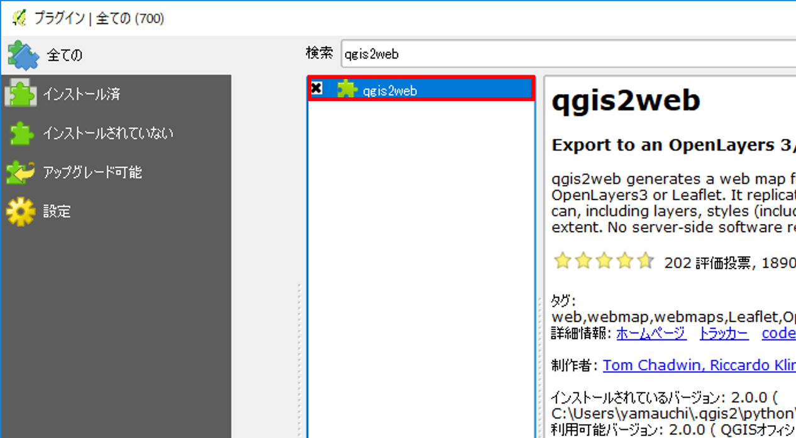
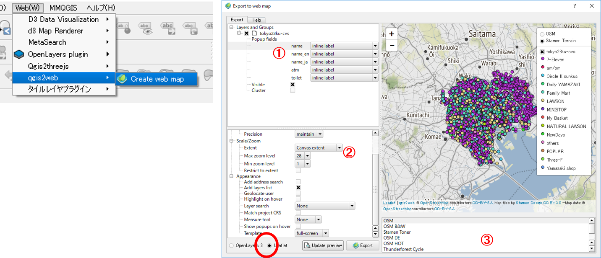
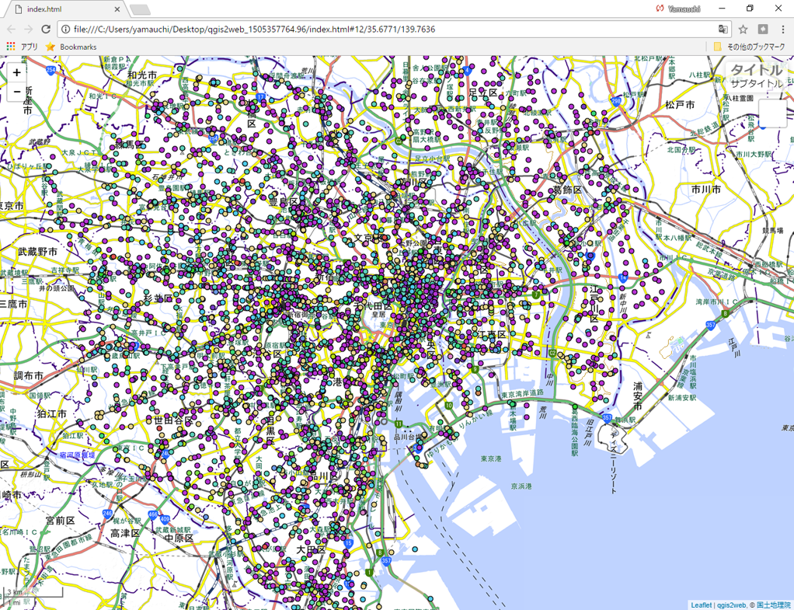

# Leaflet入門
本教材は、QGISのプラグインであるQGIS2WEBを用いて、LeafletでWEB地図を作成するための実習用教材です。以下の教材に従って、[完成例](https://yamauchi-inochu.github.io/leaf-test/index.html)のようなWEB地図が作成できれば実習完了です。この実習には、Atom等のテキストエディタが必要です。

本教材を使用する際は、[利用規約]をご確認いただき、これらの条件に同意された場合にのみご利用下さい。


**Menu**
------
* [Leafletとは？](#Leafletとは)
* [レイヤのスタイル調整とプラグインのインポート](#レイヤのスタイル調整とプラグインのインポート)
* [qgis2webを起動する](#qgis2leafを起動する)
* [index.htmlを編集する](#index.htmlを編集する)
* [Leafletのダウンロードと使い方](#Leafletのダウンロードと使い方)

**使用データ**
実習をはじめる前に以下のデータをダウンロードしてください。

* [東京23区のコンビニエンスストア (c) OpenStreetMap Contributors](https://raw.githubusercontent.com/gis-oer/datasets/master/vector/tokyo23ku-cvs.zip)
> OpenStreetMapから取得したデータを加工し利用

---

## Leafletとは？
Leafletは、WEB地図の作成のためのオープンソースJavaScriptライブラリです。シンプルなコーディングで容易に、モバイルやデスクトップの表示に対応したWEB地図が作成できます。全体のファイルサイズが軽いことや様々な地図表現（マーカやタイル読み込み）ができることが特徴です。Leafletに関する詳しい解説は、以下のリンクを参照してください。

> [Leaflet公式](http://Leafletjs.com/)
> [Wikipedia](https://ja.wikipedia.org/wiki/Leaflet)


[▲メニューへもどる]

## レイヤのスタイル調整とプラグインのインポート
QGISに実習用データを読み込み、スタイルを調整する。次に、プラグインの管理とインストールから、「QGIS2WEB」を検索し、インストールする。


[▲メニューへもどる]

## QGIS2webを起動する
`Web(W)>qgis2web`をクリックする。以下のような設定を行い、`Update preview`をした後、`Export`をクリックする。


①　レイヤをクリックしたときのポップアップの設定を行う。②　ズームレベルや計測機能などを設定する。ここで、ファイルの出力先を変更しておくと良い。　③　Basemapを選択する（複数選択は、 Ctrlキーを押しながら行う）

ローカルで、index.htmlファイルを開き中身を確認する。


[▲メニューへもどる]

## index.htmlを編集する
以下では、エクスポートしたindex.htmlを編集し、ベースマップ、スケール、タイトルを追加する手法について解説します。各機能の詳しい解説は、[完成例](https://yamauchi-inochu.github.io/leaf-test/index.html)のコードを参考にしてください。

### ベースマップ（地理院地図）の追加
index.htmlを開き文を開き、var basemap1の直後に以下を付け加える。

```JavaScript
var basemap2 = L.tileLayer('https://cyberjapandata.gsi.go.jp/xyz/std/{z}/{x}/{y}.png', {
    attribution: '&copy; <a href="https://maps.gsi.go.jp/development/ichiran.html#std">国土地理院</a>',
    maxZoom: 18
});

```
var baseMapsに'GSImap':basemap2を付け加える。

```JavaScript
var baseMaps = {'OSM': basemap0, 'Stamen Terrain': basemap1,'GSImap':basemap2};
```

### スケールの追加
レイヤのスタイル設定の後に、以下を記載する

```JavaScript
L.control.scale().addTo(map);//スケールを挿入
```

### タイトルの追加
スケールを追加した直後に、以下を記述する。

```JavaScript
var title = new L.Control();//タイトルを追加(以下の記述は、QGIS2leafを参考にした)
title.onAdd = function (map) {
  this._div = L.DomUtil.create('div', 'info');
  this.update();
  return this._div;
};
title.update = function () {
  this._div.innerHTML = '<h2>タイトル</h2>サブタイトル'
};
title.addTo(map);
```

### 表示の確認
index.htmlをブラウザで開き、編集内容を確認する。


[▲メニューへもどる]

## Leafletのダウンロードと使い方
以下では、QGISのプラグインを使わずに、Leafletを用いて簡単なWEB地図を作成する手法について解説します。

※ この教材を作成するにあたって、[Leaflet](https://leafletjs.com/)のTutorials、Docsを参考にした。

### 導入
Leafletを利用する手法はいくつかあるが、以下では、ダウンロード版を用いて解説している。[Leafletのページ](https://leafletjs.com/)から、Leafletのzipファイルをダウンロードし、解凍したフォルダ内に以下の内容でindex.htmlを作成する。


```html
<!DOCTYPE html>
<html>
<head>
	<title></title>
  <meta charset="utf-8" />
	<meta name="viewport" content="width=device-width, initial-scale=1.0">
	<link rel="shortcut icon" type="image/x-icon" href="docs/images/favicon.ico"/>
  <link rel="stylesheet" href="./Leaflet.css" />
  <script src="./Leaflet.js"></script>
</head>
<body>
  <!--表示する地図の範囲を記載-->
  <div id="map0" style="width: 500px; height: 500px;"></div>
  <script>
  </script>
</body>

</html>
```

### 背景地図の表示
作成したindex.htmlの<body>内を以下のように、編集して地図を読み込む。以下では背景地図として国土地理院の地理院タイル（標準地図）を利用した。


```html
<body>
  <div id="map0" style="width: 500px; height: 500px;"></div>
  <script>
    var map1 = L.tileLayer('https://cyberjapandata.gsi.go.jp/xyz/std/{z}/{x}/{y}.png', {
    maxZoom: 18,
    attribution: "<a href='https://maps.gsi.go.jp/development/ichiran.html' target='_blank'>地理院タイル</a>"
    });
//map0に表示する地図の緯度経度、ズームレベル、タイルを設定する
    var map = L.map('map0',{
      center:[36.0, 138.7],
      zoom:13,
      layers:[map1]
});
</script>
</body>

```

複数の背景地図を読み込み、切り替えて表示するには以下のようにする。

```html
<script>

//地図1の設定
var map1 = L.tileLayer('https://cyberjapandata.gsi.go.jp/xyz/std/{z}/{x}/{y}.png', {
maxZoom: 18,
attribution: "<a href='https://maps.gsi.go.jp/development/ichiran.html' target='_blank'>地理院タイル</a>"
});

//地図2の設定
var map2 = L.tileLayer('https://cyberjapandata.gsi.go.jp/xyz/ort/{z}/{x}/{y}.jpg', {
maxZoom: 18,
attribution: "<a href='https://maps.gsi.go.jp/development/ichiran.html' target='_blank'>地理院タイル</a>"
});

//地図1をベースマップに設定する
var map = L.map('map0',{
	center:[36.0, 138.7],
	zoom:13,
	layers:[map1]
});

var maps = {
"標準地図": map1,
"写真（2007～）":map2
};

// 地図1と地図2を切り替え表示するためのウィンドウを追加する
L.control.layers(maps).addTo(map);

</script>
```

### 点（マーカー）、線、面データの作成
以下では座標値をもつ点、線、面のデータを記述し、地図上に表示する手法について解説しています。

```html
<script>

//点（マーカー）の追加（ポップアップの追加）
L.marker([36.0, 138.7]).bindPopup('この地点の座標は、36.0, 138.7です').addTo(map);

//複数点の追加
L.marker([36.0, 138.7]).bindPopup('この地点の座標は、36.0, 138.7です').addTo(map);
L.marker([36.0, 138.9]).bindPopup('この地点の座標は、36.0, 138.9です').addTo(map);
L.marker([36.05, 138.9]).bindPopup('この地点の座標は、36.05, 138.9です').addTo(map);
L.marker([36.05, 138.7]).bindPopup('この地点の座標は、36.05, 138.7です').addTo(map);


//面の追加(塗りつぶし色、透過度を指定)
L.polygon([
    [36.0, 138.7],
    [36.0, 138.9],
		[36.05, 138.9],
		[36.05, 138.7]
], {color:'pink',fillOpacity:0.5}).bindPopup('これは、ポリゴンです。').addTo(map);

//線の追加(線の色、太さを指定)、面と線の描画順に注意する
L.polyline([
    [36.0, 138.7],
    [36.05, 138.8],
    [36.0, 138.9],
		[36.0, 138.7]
], {color: 'yellow',weight: 3.0}).bindPopup('これは、ラインです。').addTo(map);

</script>
```

上のコードを利用して、グループ化したMarkerと他のレイヤを、チェックリストから選択表示できるようにする。

```JavaScript
//L.layerGroup()でマーカーをグループ化する
var markers = L.layerGroup();

L.marker([36.0, 138.7]).bindPopup('この地点の座標は、36.0, 138.7です').addTo(markers);
L.marker([36.0, 138.9]).bindPopup('この地点の座標は、36.0, 138.8です').addTo(markers);
L.marker([36.05, 138.9]).bindPopup('この地点の座標は、36.0, 138.9です').addTo(markers);
L.marker([36.05, 138.7]).bindPopup('この地点の座標は、36.0, 138.9です').addTo(markers);


var polygon =
  L.polygon([
    [36.0, 138.7],
    [36.0, 138.9],
		[36.05, 138.9],
		[36.05, 138.7]
], {color:'pink',fillOpacity:0.5}).bindPopup('これは、ポリゴンです。');

var polyline =
  L.polyline([
    [36.0, 138.7],
    [36.05, 138.8],
    [36.0, 138.9],
		[36.0, 138.7]
], {color: 'yellow',weight: 3}).bindPopup('これは、ラインです。');

//layersに最初に表示するレイヤを設定する
var map = L.map('map0',{
	center:[36.0, 138.7],
	zoom:13,
	layers:[map1,markers,polyline,polygon]
});


var layers = {
	"ポイント": markers,
	"ライン":polyline,
	"ポリゴン":polygon
};


var basemaps = {
"標準地図": map1,
"写真（2007～）":map2
};

//レイヤを選択して表示できるようにする
L.control.layers(basemaps,layers).addTo(map);

```

### スケールの表示
スケールは、以下のように記述することで表示できます。

```Javascript
L.control.scale({imperial: false}).addTo(map);

```

### 外部ファイルの追加
jQueryを利用して、GeoJSONのファイルを読み込む。

```Javascript
//GeoJSONの読み込みポイント
//クリックすると属性が表示されるようにする
$.getJSON("tokyo23ku-cvs.geojson", function (data) {
    L.geoJson(data).bindPopup(function (layer) {
    return layer.feature.properties.name;
}).addTo(map)
});
```
[サンプルページ](https://yamauchi-inochu.github.io/leaflet-sample/geojson.html)

[▲メニューへもどる]

#### ライセンスに関する注意事項
本教材で利用しているキャプチャ画像の出典やクレジットについては、[その他のライセンスについて]よりご確認ください。

[その他のライセンスについて]:../../license.md
[▲メニューへもどる]:./Leaflet.md#Menu
[利用規約]:../../../policy.md
[利用規約]:../../../policy.md
[その他のライセンスについて]:../../license.md
[よくある質問とエラー]:../../questions/questions.md

[GISの基本概念]:../../00/00.md
[QGISビギナーズマニュアル]:../../QGIS/QGIS.md
[GRASSビギナーズマニュアル]:../../GRASS/GRASS.md
[リモートセンシングとその解析]:../../06/06.md
[既存データの地図データと属性データ]:../../07/07.md
[空間データ]:../../08/08.md
[空間データベース]:../../09/09.md
[空間データの統合・修正]:../../10/10.md
[基本的な空間解析]:../../11/11.md
[ネットワーク分析]:../../12/12.md
[領域分析]:../../13/13.md
[点データの分析]:../../14/14.md
[ラスタデータの分析]:../../15/15.md
[傾向面分析]:../../16/16.md
[空間的自己相関]:../../17/17.md
[空間補間]:../../18/18.md
[空間相関分析]:../../19/19.md
[空間分析におけるスケール]:../../20/20.md
[視覚的伝達]:../../21/21.md
[参加型GISと社会貢献]:../../26/26.md

[地理院地図]:https://maps.gsi.go.jp
[e-Stat]:https://www.e-stat.go.jp/
[国土数値情報]:http://nlftp.mlit.go.jp/ksj/
[基盤地図情報]:http://www.gsi.go.jp/kiban/
[地理院タイル]:http://maps.gsi.go.jp/development/ichiran.html

[課題ページ_QGISビギナーズマニュアル]:../../tasks/t_qgis_entry.md
[課題ページ_GRASSビギナーズマニュアル]:../../tasks/t_grass_entry.md
[課題ページ_リモートセンシングとその解析]:../../tasks/t_06.md
[課題ページ_既存データの地図データと属性データ]:../../tasks/t_07.md
[課題ページ_空間データ]:../../tasks/t_08.md
[課題ページ_空間データベース]:../../tasks/t_09.md
[課題ページ_空間データの統合・修正]:../../tasks/t_10.md
[課題ページ_基本的な空間解析]:../../tasks/t_11.md
[課題ページ_ネットワーク分析]:../../tasks/t_12.md
[課題ページ_基本的な空間解析]:../../tasks/t_13.md
[課題ページ_点データの分析]:../../tasks/t_14.md
[課題ページ_ラスタデータの分析]:../../tasks/t_15.md
[課題ページ_空間補間]:../../tasks/t_18.md
[課題ページ_視覚的伝達]:../../tasks/t_21.md
[課題ページ_参加型GISと社会貢献]:../../tasks/t_26.md
